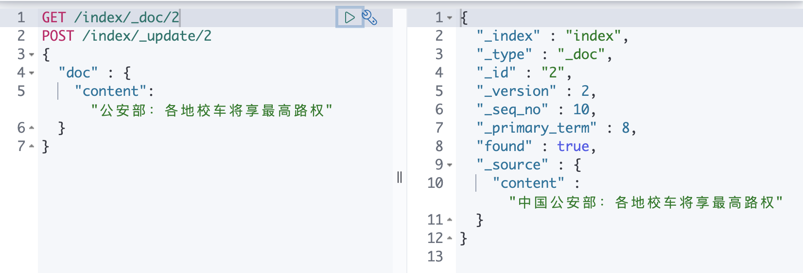

# elasticsearch

## Docker-compose 安装

### elasticsearch

1. env

```bash
### ELASTICSEARCH #########################################

ELASTICSEARCH_HOST_HTTP_PORT=9200
ELASTICSEARCH_HOST_TRANSPORT_PORT=9300
ELASTICSEARCH_HEAD_HTTP_PORT=9100
### ELK Stack ##################################################
ELK_VERSION=7.9.1
```

2. Dockerfile

```bash
ARG ELK_VERSION

FROM docker.elastic.co/elasticsearch/elasticsearch:${ELK_VERSION}
#这里自定义配置文件是因为后面用elasticsearch-head 9100访问9200有跨域问题，
COPY elasticsearch.yml /usr/share/elasticsearch/config/elasticsearch.yml

EXPOSE 9200 9300
```

3. elasticsearch.yml

```bash
cluster.name: "docker-cluster"
network.host: 0.0.0.0
#跨域问题解决
http.cors.enabled: true 
http.cors.allow-origin: "*"
```

3. Docker-compose.yml

```bash
## ElasticSearch ########################################
    elasticsearch:
      build:
        context: ./elasticsearch
        args:
          - ELK_VERSION=${ELK_VERSION}
      volumes:
        - elasticsearch:/usr/share/elasticsearch/data
      environment:
        - cluster.name=godock-cluster
        - node.name=godock-node
        - bootstrap.memory_lock=true
        - "ES_JAVA_OPTS=-Xms128m -Xmx128m"
        - cluster.initial_master_nodes=godock-node
      ulimits:
        memlock:
          soft: -1
          hard: -1
        nofile:
          soft: 65536
          hard: 65536
      ports:
        - "${ELASTICSEARCH_HOST_HTTP_PORT}:9200"
        - "${ELASTICSEARCH_HOST_TRANSPORT_PORT}:9300"
      networks:
        - frontend
        - backend
```


###  Elasticsearch-head

1. env

```bash
### ELASTICSEARCH-HEAD #########################################
ELASTICSEARCH_HEAD_HTTP_PORT=9100
### ELK Stack ##################################################
ELK_VERSION=7.9.1
```

2. Dockerfile

```bash
FROM mobz/elasticsearch-head:5

EXPOSE 9100
```

3. Docker-compose.yml

```bash
## ElasticSearch-head########################################
    elasticsearch-head:
      build:
        context: ./elasticsearch-head
      ports:
        - "${ELASTICSEARCH_HEAD_HTTP_PORT}:9100"
      networks:
        - frontend
```

### 

4. 错误处理

点击创建索引，查看数据等，406报错，需要修改/usr/src/app/_site/vendor.js 

运行docker cp /usr/src/app/_site/vendor.js  ./vendor.js 本地修改vendor.js后，修改dockerfile重新build

### 核心概念

**集群、节点、索引、类型、文档、分片、映射都是什么？**

> ES是面向文档的

| Relational DB | Elasticsearch |
| ------------- | ------------- |
| Database      | 索引 / index |
| Tables        | 类型 / types |
| Rows          | 文档 / Documents |
| column | Fields |

#### 文档

索引和搜索数据的最小单位是文档，几个重要特性：

- 自我包含 文档同时包含字段和对应的值(key:value)
- 可以是层次性的
- 结构灵活

#### 索引

类似数据库，是一个非常大的文档的集合，被分片存在ES中。

#### 节点和分片

一个ES的集群至少有一个node, 一个node对应于一个ES的进程，创建一个索引的时候，为默认有五个分片（primary shard），一个分片有一个备份分片（replica shar）: 高可用的设计

实际上一个分片是一个Lucene索引，一个包含倒排索引的目录。

倒排索引使得ES在不搜索全部文档的情况下，得到哪些文档包含搜索的关键字。

#### 倒排索引

ES使用的是倒排索引的结构，==Lucene倒排索引==作为底层。此结构试用与快速的全文检索。

一个索引由文档中所有不重复的列表构成，对于每一个词，都有一个包含它的文档列表。


#### IK分词器

##### 安装

https://github.com/medcl/elasticsearch-analysis-ik

```bash
# elasticsearch-analysis-ik
RUN sh -c '/bin/echo -e "y" | ./bin/elasticsearch-plugin install https://github.com/medcl/elasticsearch-analysis-ik/releases/download/v7.9.1/elasticsearch-analysis-ik-7.9.1.zip'
```

##### 使用

###### id_max_word / id_smart

ik分词器有两种模式，id_smart(最少切分)和ik_max_word（最大切分）


###### 自定义

```bash
[root@00fb71007280 analysis-ik]# cd config/analysis-ik
[root@00fb71007280 analysis-ik]# ls
IKAnalyzer.cfg.xml  extra_single_word.dic       extra_single_word_low_freq.dic  main.dic         quantifier.dic  suffix.dic
extra_main.dic      extra_single_word_full.dic  extra_stopword.dic              preposition.dic  stopword.dic    surname.dic
[root@00fb71007280 analysis-ik]# vi IKAnalyzer.cfg.xml
<?xml version="1.0" encoding="UTF-8"?>
<!DOCTYPE properties SYSTEM "http://java.sun.com/dtd/properties.dtd">
<properties>
        <comment>IK Analyzer �~I��~U�~E~M置</comment>
        <!--�~T��~H��~O�以�~\��~Y�~G~L�~E~M置�~G�己�~Z~D�~I��~U�~W�~E� -->
        <entry key="ext_dict"></entry>
         <!--�~T��~H��~O�以�~\��~Y�~G~L�~E~M置�~G�己�~Z~D�~I��~U�~A~\止�~M�~W�~E�-->
        <entry key="ext_stopwords"></entry>
        <!--�~T��~H��~O�以�~\��~Y�~G~L�~E~M置�~\�~K�~I��~U�~W�~E� -->
        <!-- <entry key="remote_ext_dict">words_location</entry> -->
        <!--�~T��~H��~O�以�~\��~Y�~G~L�~E~M置�~\�~K�~I��~U�~A~\止�~M�~W�~E�-->
        <!-- <entry key="remote_ext_stopwords">words_location</entry> -->
</properties>
:set encoding=utf-8 # 有乱码解决

# 添加custom.dic
<?xml version="1.0" encoding="UTF-8"?>
<!DOCTYPE properties SYSTEM "http://java.sun.com/dtd/properties.dtd">
<properties>
        <comment>IK Analyzer 扩展配置</comment>
        <!--用户可以在这里配置自己的扩展字典 -->
        <entry key="ext_dict">custom.dic</entry>
         <!--用户可以在这里配置自己的扩展停止词字典-->
        <entry key="ext_stopwords"></entry>
        <!--用户可以在这里配置远程扩展字典 -->
        <!-- <entry key="remote_ext_dict">words_location</entry> -->
        <!--用户可以在这里配置远程扩展停止词字典-->
        <!-- <entry key="remote_ext_stopwords">words_location</entry> -->
</properties>

[root@00fb71007280 analysis-ik]# vi custom.dic
马旭
:wq


```


重启ES和Kibana


重新搜索


#### index的结构

```json
{
  "index" : {
    "aliases" : { },
    "mappings" : {
      "properties" : {
        "age" : {
          "type" : "long"
        },
        "body" : {
          "type" : "text",
          "fields" : {
            "keyword" : {
              "type" : "keyword",
              "ignore_above" : 256
            }
          }
        },
        "content" : {
          "type" : "text",
          "fields" : {
            "keyword" : {
              "type" : "keyword",
              "ignore_above" : 256
            }
          }
        },
        "email" : {
          "type" : "text",
          "fields" : {
            "keyword" : {
              "type" : "keyword",
              "ignore_above" : 256
            }
          }
        },
        "name" : {
          "type" : "text",
          "fields" : {
            "keyword" : {
              "type" : "keyword",
              "ignore_above" : 256
            }
          }
        }
      }
    },
    "settings" : {
      "index" : {
        "creation_date" : "1629063857046",
        "number_of_shards" : "1",
        "number_of_replicas" : "1",
        "uuid" : "ICizR5liQQ2xfESl1DH4Yg",
        "version" : {
          "created" : "7090199"
        },
        "provided_name" : "index"
      }
    }
  }
}
```


#### REST风格

##### PUT

### 

##### GET


##### POST

更新前




##### DELETE


#### 常用查询

检索结果排序，分页，指定字段查询：


# 基础入门

根据文档学习ES

https://www.elastic.co/guide/cn/elasticsearch/guide/current/cluster-health.html

## 关于

github地址：https://github.com/elastic/elasticsearch

Java 编写，内部使用 Lucene 做索引与搜索，提供一套简单一致的 RESTful API。

Elasticsearch 不仅仅是 Lucene，并且也不仅仅只是一个全文搜索引擎。 它可以被下面这样准确的形容：

- 一个分布式的实时文档存储，*每个字段* 可以被索引与搜索
- 一个分布式实时分析搜索引擎
- 能胜任上百个服务节点的扩展，并支持 PB 级别的结构化或者非结构化数据

### 与ES交互

和 Elasticsearch 的交互方式取决于你是否使用 Java

#### java

**节点客户端（Node client）**

节点客户端作为一个非数据节点加入到本地集群中。换句话说，它本身不保存任何数据，但是它知道数据在集群中的哪个节点中，并且可以把请求转发到正确的节点。

**传输客户端（Transport client）**

轻量级的传输客户端可以将请求发送到远程集群。它本身不加入集群，但是它可以将请求转发到集群中的一个节点上。

#### RESTfulAPI with JSON over HTTP

https://www.elastic.co/guide/en/elasticsearch/client/index.html

### 面向文档

Elasticsearch 是 *面向文档* 的，意味着它存储整个对象或 *文档*。Elasticsearch 不仅存储文档，而且 *索引* 每个文档的内容，使之可以被检索。在 Elasticsearch 中，我们对文档进行索引、检索、排序和过滤—而不是对行列数据。这是一种完全不同的思考数据的方式，也是 Elasticsearch 能支持复杂全文检索的原因。

ES使用JSON作为文档的序列化格式。

### 轻量搜索

#### _search

```bash
GET /index/_search

{
  "took" : 0,
  "timed_out" : false,
  "_shards" : {
    "total" : 1,
    "successful" : 1,
    "skipped" : 0,
    "failed" : 0
  },
  "hits" : {
    "total" : {
      "value" : 5,
      "relation" : "eq"
    },
    "max_score" : 1.0,
    "hits" : [
      {
        "_index" : "index",
        "_type" : "_doc",
        "_id" : "6",
        "_score" : 1.0,
        "_source" : {
          "content" : "美国留给伊拉克的是个烂摊子吗"
        }
      },
      {
        "_index" : "index",
        "_type" : "_doc",
        "_id" : "10",
        "_score" : 1.0,
        "_source" : {
          "name" : "中国公安部：各地校车将享最高路权",
          "age" : 18,
          "email" : "maxu0410@163.com"
        }
      },
      {
        "_index" : "index",
        "_type" : "_doc",
        "_id" : "3",
        "_score" : 1.0,
        "_source" : {
          "content" : "中韩渔警冲突调查：韩警平均每天扣1艘中国渔船",
          "name" : "马旭invokerx",
          "age" : 232
        }
      },
      {
        "_index" : "index",
        "_type" : "_doc",
        "_id" : "4",
        "_score" : 1.0,
        "_source" : {
          "content" : "中国驻洛杉矶领事馆遭亚裔男子枪击 嫌犯已自首",
          "name" : "胡娅楠",
          "age" : 21
        }
      },
      {
        "_index" : "index",
        "_type" : "_doc",
        "_id" : "2",
        "_score" : 1.0,
        "_source" : {
          "doc" : {
            "content" : "哈哈哈：各地校车将享最高路权"
          },
          "name" : "马旭",
          "age" : 21,
          "content" : "学习新文化，摒弃酒文化"
        }
      }
    ]
  }
}

```

#### API/_search?q=

### 表达式搜索

```bash
GET /index/_search
{
    "query" : {
        "match" : {
            “FIELD" : “text"
        }
    }
}
```

## 索引模块

https://www.elastic.co/guide/en/elasticsearch/reference/current/index-modules.html#index-modules

索引模块是为每个索引创建的模块，控制与索引有关的所有方面。

### 索引设置

索引级别的设置可以根据每个索引进行设置。设置可以是静态或动态的

*static*

只能创建的时候或者在一个已关闭的索引上设置。

关闭索引：POST /my-index-000001/_close

*dynamic*

动态索引的更新可以通过update-index-setting的API进行。

> 在一个关闭的索引上改变静态或动态的索引设置可能会导致不正确的设置，如果不删除并重新创建索引，就不可能纠正。

#### 静态索引

下面是所有不与任何特定索引模块相关的静态索引设置的列表。

**index.number_of_shards**

索引的主分片数量，此设置只能在创建索引是设置。

> 每个索引的分片数量被限制在1024个。这个限制是一个安全限制，以防止意外创建的索引由于资源分配而破坏集群的稳定。这个限制可以通过在集群的每个节点上指定导出ES_JAVA_OPTS="-Des.index.max_number_of_shards=128 "系统属性来修改。

**index.number_of_routing_shards**

与index.number_of_shards一起使用，Integer value. 将用于将索引切分成主分片。

ES在拆分索引建立分片时使用此值。

一个5分片的索引，当index.number_of_routing_shards = 30，可以被分割成2或3的系数

这个设置的默认值取决于索引中主分片的数量。默认值的设计是允许你按2的系数分割，最多可分割1024个分片。

> 在Elasticsearch 7.0.0及以后的版本中，这个设置会影响文档在分片之间的分布。当重新索引一个具有自定义路由的旧索引时，你必须明确地设置index.number_of_routing_shards以保持相同的文档分布。

**index.codec**

压缩设置，默认LZ4,可改为DEFLATE,但是存储性能会变慢。

**index.routing_partition_size**

默认为1，创建索引时可设置。必须小于number_of_shards。

**index.soft_deletes.enabled**

默认为true.默认开启软删除。

**index.soft_deletes.retention_lease.period**

此参数指示过期前的最大保留期。分片历史保留租约确保软删除在Lucene索引的合并过程中被保留。如果一个软删除在它被复制到跟随者之前就被合并掉了，那么下面的过程会因为领导者的历史不完整而失败。默认为12h。

**index.load_fixed_bitset_filters_eagerly**

true | false. 标识是否为嵌套查询预先加载缓存的过滤器。

**index.hidden**

true | false (default false)

标识索引是否默认隐藏，当设置为false时，使用通配符表达式时，默认不返回隐藏的索引。

**index.shard.check_on_startup**

>  Expert users only. This setting enables some very expensive processing at shard startup and is only ever useful while diagnosing a problem in your cluster. If you do use it, you should do so only temporarily and remove it once it is no longer needed.
>
> 仅限专家用户。这个设置可以在分片启动时进行一些非常昂贵的处理，只有在诊断集群中的问题时才有用。如果你真的使用它，你应该只是暂时使用，一旦不再需要它，就把它删除

#### 动态索引

**index.number_of_replicas**

默认为1

**index.auto_expand_replicas**

基于集群的节点数量，自动扩大复制的数量。

设置方式：0-5 |0-all

默认false

请注意，自动扩展的复制数量只考虑分配过滤规则，但忽略了其他分配规则，如每个节点的总碎片，如果适用的规则阻止所有的复制被分配，这可能导致集群健康状况变成黄色。

如果上界设置为all, [shard allocation awareness](https://www.elastic.co/guide/en/elasticsearch/reference/current/modules-cluster.html#shard-allocation-awareness)和 [`cluster.routing.allocation.same_shard.host`](https://www.elastic.co/guide/en/elasticsearch/reference/current/modules-cluster.html#cluster-routing-allocation-same-shard-host) 对于这个索引无效

**index.search.idle.after**

默认 30s

标识一个分片在多长时间内不接受搜索or get 请求，直到被认为是搜索空闲

**index.refresh_interval**

默认 1s

索引刷新的时间间隔，以使得索引的最新变化在搜索中可见。

设置 -1 为disable

如果没有明确设置此参数，**index.search.idle.after**这么长的时间内没有搜索，该分片将不会后台刷新。

这种行为旨在自动优化默认情况下的批量索引，当没有进行搜索时。为了选择不使用这种行为，应该设置一个明确的1s值作为刷新间隔时间。

**index.max_result_window**

默认10000

搜索结果会占用内存和时间，与结果的size成正比，此参数限制结果的内存大小。

**index.max_inner_result_window**

默认100

设置索引最大的hits的数量。

**index.max_rescore_window**

默认10000

用于rescore请求的结果的最大值设置。

**index.max_docvalue_fields_search**

默认100

最大的字段查询的数量

**index.max_script_fields**

默认32

一个查询中允许的最大的script_fields数量。

**index.max_ngram_diff**

默认1

NGramTokenizer和NGramTokenFilter允许的min_gram和max_gram之间的最大差异。

**index.max_shingle_diff**

默认3

shingle token过滤器的max_shingle_size和min_shingle_size之间的最大允许差异。

**index.max_refresh_listeners**
索引的每个分片上可用的刷新监听器的最大数量。这些监听器用于实现refresh=wait_for。
**index.analyze.max_token_count**

默认为10000

使用_analyze API可以产生的最大数量的令牌。

**index.highlight.max_analyzed_offset**

对一个高亮请求进行分析的最大字符数。这个设置只适用于在没有偏移量或term vectors情况下请求高亮显示的文本。

默认值是1000000。
**index.max_terms_count**
在term查询中可以使用的terms的最大数量

默认为65536。

**index.max_regex_length**

在Regexp查询中可以使用的最大长度的regex。默认为1000。

**index.query.default_field**

默认为*，匹配所有符合term-level查询的字段，不包括metadata字段。

- [More like this](https://www.elastic.co/guide/en/elasticsearch/reference/current/query-dsl-mlt-query.html)
- [Multi-match](https://www.elastic.co/guide/en/elasticsearch/reference/current/query-dsl-multi-match-query.html)
- [Query string](https://www.elastic.co/guide/en/elasticsearch/reference/current/query-dsl-query-string-query.html)
- [Simple query string](https://www.elastic.co/guide/en/elasticsearch/reference/current/query-dsl-simple-query-string-query.html)

**index.routing.allocation.enable**

控制这个索引的分片分配, 可设置的值

- all （默认）允许对所有分片进行分片分配
- none 不允许分配分片。
- primaries 只允许对主要分片进行分片分配。
- new_primaries 只允许为新创建的主分片分配分片。

**index.routing.rebalance.enable**

为这个索引启用分片再平衡。它可以被设置为

- all (默认) - 允许对所有分片进行分片再平衡。
- primaries - 只允许对主要分片进行分片再平衡。
- replicas - 只允许对副本分片进行分片再平衡。
- none - 不允许进行分片再平衡。

**index.gc_deletes**

一个被删除的文档的版本号对进一步的版本操作保持可用的时间长度。默认为60s。

**index.default_pipeline**

该索引的默认摄入节点管道。如果设置了默认管道，而该管道不存在，索引请求将失败。可以使用管道参数覆盖默认值。特殊的管道名称_none表示不应运行摄取管道。

**index.final_pipeline**

该索引的最终摄取节点管道。如果设置了最终管道，而该管道不存在，索引请求将失败。最终管道总是在请求管道（如果指定）和默认管道（如果存在）之后运行。特殊的管道名称_none表示将不运行任何摄取管道。

### [Analysis](https://www.elastic.co/guide/en/elasticsearch/reference/current/analysis.html)

Text analysis is the process of converting unstructured text, like the body of an email or a product description, into a structured format that’s optimized for search.

文本分析是将非结构化文本（例如电子邮件正文或产品说明）转换为针对搜索进行优化的结构化格式的过程。

索引分析模块充当分析器的可配置注册表，可以用于将字符串field转换位individual terms:

添加到倒排索引使得doc可被搜索；

由高级查询用于生成搜索词；

有关请查看 TEXT analysis  https://www.elastic.co/guide/en/elasticsearch/reference/current/analysis.html

### Index Shard Allocation

索引分片分配

该模块提供每个索引设置来控制分片到节点的分配：

- [Shard allocation filtering](https://www.elastic.co/guide/en/elasticsearch/reference/current/shard-allocation-filtering.html): 控制将哪些分片分配给哪些节点。
- [Delayed allocation](https://www.elastic.co/guide/en/elasticsearch/reference/current/delayed-allocation.html): 由于节点断开导致未分配的分片延迟分配。
- [Total shards per node](https://www.elastic.co/guide/en/elasticsearch/reference/current/allocation-total-shards.html): 对每个节点来自同一索引的分片数量的强制限制。
- [Data tier allocation](https://www.elastic.co/guide/en/elasticsearch/reference/current/data-tier-shard-filtering.html): 控制索引到数据层的分配。

#### Index-level shard allocation filtering

使用分片分配filter来控制特定索引的分片如何分配。

索引级别的shard allocation filter 与 [cluster-wide allocation filtering](https://www.elastic.co/guide/en/elasticsearch/reference/current/modules-cluster.html#cluster-shard-allocation-filtering) and [allocation awareness](https://www.elastic.co/guide/en/elasticsearch/reference/current/modules-cluster.html#shard-allocation-awareness) 结合使用

分片分配过滤器可以基于自定义节点属性或内置的 __name、___host_ip、__publish_ip、___ip、__host、___id、_tier 和 _tier_preference 属性。[Index lifecycle management](https://www.elastic.co/guide/en/elasticsearch/reference/current/index-lifecycle-management.html) 使用基于自定义节点属性的过滤器来确定在阶段之间移动时如何重新分配分片。

cluster.routing.allocation 设置是动态的，允许将实时索引从一组节点移动到另一组节点。 仅在不破坏其他路由约束的情况下重新定位分片，例如永远不要在同一节点上分配主分片和副本分片。

例如，您可以使用自定义节点属性来指示节点的性能特征，并使用分片分配过滤将特定索引的分片路由到最合适的硬件类别。

##### 开启索引级别的分片分配过滤器

基于自定义节点属性进行过滤:

1. 在每个节点的 `elasticsearch.yml` 配置文件中使用自定义节点属性指定过滤器特征。 例如，如果你有 `small`、`medium` 和 `big` 节点，你可以添加一个 `size` 属性来根据节点大小进行过滤。

```yaml
node.attr.size: medium
```

您还可以在启动节点时设置自定义属性：

```sh
`./bin/elasticsearch -Enode.attr.size=medium
```

2. 向索引添加路由分配过滤器。 index.routing.allocation 设置支持三种类型的过滤器：include、exclude 和 require。 例如，要告诉 Elasticsearch 将测试索引中的分片分配给big节点或medium节点，请使用 index.routing.allocation.include：

```console
PUT test/_settings
{
  "index.routing.allocation.include.size": "big,medium"
}
```

如果您指定多个过滤器，则节点必须同时满足以下条件才能将分片重定位到该节点：

- 如果指定了任何 `require` 类型的条件，则必须满足所有条件
- 如果指定了任何 `exclude` 类型的条件，则可能不满足任何条件
- 如果指定了任何 `include` 类型的条件，则必须至少满足其中之一

例如，要将 `test` 索引移动到 `rack1` 中的 `big` 节点，您可以指定：

```console
PUT test/_settings
{
  "index.routing.allocation.require.size": "big",
  "index.routing.allocation.require.rack": "rack1"
}
```

##### 索引分片分配过滤器设置

- **`index.routing.allocation.include.{attribute}`**

  将索引分配给其 `{attribute}` 至少具有逗号分隔值之一的节点。

- **`index.routing.allocation.require.{attribute}`**

  将索引分配给其 `{attribute}` 具有 *all* 逗号分隔值的节点。

- **`index.routing.allocation.exclude.{attribute}`**

  将索引分配给其 `{attribute}` 具有 *none* 逗号分隔值的节点。

索引分配设置支持以下内置属性：

| `_name`       | Match nodes by node name                                     |
| ------------- | ------------------------------------------------------------ |
| `_host_ip`    | Match nodes by host IP address (IP associated with hostname) |
| `_publish_ip` | Match nodes by publish IP address                            |
| `_ip`         | Match either `_host_ip` or `_publish_ip`                     |
| `_host`       | Match nodes by hostname                                      |
| `_id`         | Match nodes by node id                                       |
| `_tier`       | Match nodes by the node’s [data tier](https://www.elastic.co/guide/en/elasticsearch/reference/current/data-tiers.html) role. For more details see [data tier allocation filtering](https://www.elastic.co/guide/en/elasticsearch/reference/current/data-tier-shard-filtering.html) |

>  `_tier` 过滤基于 [node](https://www.elastic.co/guide/en/elasticsearch/reference/current/modules-node.html) 角色。 只有一部分角色是 [数据层](https://www.elastic.co/guide/en/elasticsearch/reference/current/data-tiers.html) 角色，以及通用的 [数据角色](www.elastic.co/guide/en/elasticsearch/reference/current/modules-node.html#data-node)将匹配任何层过滤。

您可以在指定属性值时使用通配符，例如：

```console
PUT test/_settings
{
  "index.routing.allocation.include._ip": "192.168.2.*"
}
```

#### 节点断开时分片延迟分配

当node从集群中断开，master将做如下反映：

- 将replica shard提升为主分片以替换node上的分片
- 分配replica shard以替换丢失的副本（如果节点足够）
- 在其余节点之间均匀的重新平衡分片

这些操作旨在通过确保尽快完全复制每个分片来保护集群免受数据丢失。

​	即使我们在节点级别和集群级别限制并发恢复，这种“分片洗牌”仍然会给集群带来很多额外的负载，如果丢失的节点可能很快就会返回，这可能是不必要的。 想象一下这个场景：

- 节点5失去了网络连接。
- 主站将Node 5上的每个主站的复制分片提升为主站。
- 主站将新的副本分配给集群中的其他节点。
- 每个新的副本都会在网络上对主分片进行完整的复制。
- 更多的分片被移到不同的节点上，以重新平衡集群。
- 节点5在几分钟后返回。
- 主站通过向节点5分配分片来重新平衡集群。

如果 master 只等待了几分钟，那么丢失的分片就可以以最小的网络流量重新分配给节点 5。 对于已自动[sync-flushed](https://www.elastic.co/guide/en/elasticsearch/reference/current/indices-synced-flush-api.html)的空闲分片（未接收索引请求的分片），此过程会更快

由于节点离开而变为未分配的副本分片的分配可以通过 `index.unassigned.node_left.delayed_timeout` 动态设置延迟，默认为 `1m`。

This setting can be updated on a live index (or on all indices):

```console
PUT _all/_settings
{
  "settings": {
    "index.unassigned.node_left.delayed_timeout": "5m"
  }
}
```

启用延迟分配后，上述场景变为如下所示：

- 节点 5 失去网络连接。
- 主节点为节点 5 上的每个主节点提升一个副本分片为主节点。
- master 记录一条消息，指出未分配的分片的分配已被延迟，以及延迟了多长时间。
- 集群保持黄色，因为有未分配的副本分片。
- 节点 5 在几分钟后返回，在 `timeout` 到期之前。
- 丢失的副本被重新分配到节点 5（同步刷新的分片几乎立即恢复）。

此设置不会影响将副本提升为主要副本，也不会影响之前未分配的副本的分配。 特别是，延迟分配在完全集群重新启动后不会生效。 此外，在主故障转移情况下，已用延迟时间被遗忘（即重置为完整的初始延迟）。

##### 取消分片重定位

如果延迟分配超时，主节点会将丢失的分片分配给另一个将开始恢复的节点。 如果丢失的节点重新加入集群，并且其分片仍与主分片具有相同的同步 ID，则分片重定位将被取消，而同步的分片将用于恢复。

出于这个原因，默认超时`timeout`设置为一分钟：即使分片重定位开始，取消恢复以支持同步分片也很便宜。

##### 监控延迟的未分配分片

可以使用 [cluster health API](https://www.elastic.co/guide/en/elasticsearch/reference/current/cluster-health.html) 查看由于此超时设置而延迟分配的分片数：

```console
GET _cluster/health 
```

|      | This request will return a `delayed_unassigned_shards` value. |
| ---- | ------------------------------------------------------------ |
|      |                                                              |

##### 永久删除节点

如果节点不会返回并且您希望 Elasticsearch 立即分配丢失的分片，只需将超时更新为零：

```console
PUT _all/_settings
{
  "settings": {
    "index.unassigned.node_left.delayed_timeout": "0"
  }
}
```

You can reset the timeout as soon as the missing shards have started to recover.

[« Delaying allocation when a node leaves](https://www.elastic.co/guide/en/elasticsearch/reference/current/delayed-allocation.html)[Total shards per node »](https://www.elastic.co/guide/en/elasticsearch/reference/current/allocation-total-shards.html)


#### 索引恢复优先级

尽可能按优先级顺序恢复未分配的分片。 索引按优先级排序如下：

- 可选的 `index.priority` 设置（先高后低）
- 索引创建日期（先高后低）
- 索引名称（先高后低）

这意味着，默认情况下，较新的索引将在较旧的索引之前恢复。

使用每个索引动态更新的 `index.priority` 设置来自定义索引优先级顺序。 例如：

```console
PUT index_1

PUT index_2

PUT index_3
{
  "settings": {
    "index.priority": 10
  }
}

PUT index_4
{
  "settings": {
    "index.priority": 5
  }
}
```

在上面的例子中：

- `index_3` 将首先恢复，因为它具有最高的 `index.priority`。
- `index_4` 将被下一个恢复，因为它具有下一个最高优先级。
- `index_2` 将被恢复，因为它是最近创建的。
- `index_1` 将最后恢复。

此设置接受一个整数，并且可以使用 [更新索引设置 API](https://www.elastic.co/guide/en/elasticsearch/reference/current/indices-update-settings.html) 在实时索引上更新 )：

```console
PUT index_4/_settings
{
  "index.priority": 1
}
```

#### 每个节点的总分片

集群级分片分配器尝试将单个索引的分片分布在尽可能多的节点上。 但是，根据您拥有的分片和索引的数量以及它们的大小，可能无法始终均匀地分布分片。

以下 *dynamic* 设置允许您指定每个节点允许的单个索引的分片总数的硬限制：

- **`index.routing.allocation.total_shards_per_node`**

  将分配给单个节点的最大分片数（副本和主分片）。 默认为unbounded。

您还可以限制节点可以拥有的分片数量，而不管索引如何：

- **`cluster.routing.allocation.total_shards_per_node`**

  ([Dynamic](https://www.elastic.co/guide/en/elasticsearch/reference/current/settings.html#dynamic-cluster-setting)) 分配给每个节点的最大主分片和副本分片数。 默认为“-1”（无限制）。Elasticsearch 在分片分配期间检查此设置。 例如，一个集群的 `cluster.routing.allocation.total_shards_per_node` 

  设置为 `100` 和三个具有以下分片分配的节点：Node A: 100 shardsNode B: 98 shardsNode C: 1 shard如果节点 C 发生故障，Elasticsearch 重新分配其 分片到节点 B。将分片重新分配到节点 A 将超出节点 A 的分片限制。

这些设置施加了硬限制，这可能导致某些分片未被分配。

#### 索引级数据层分配过滤

您可以使用索引级别的分配设置来控制将索引分配到哪个 [数据层](https://www.elastic.co/guide/en/elasticsearch/reference/current/data-tiers.html)。 数据层分配器是一个[分片分配过滤器](https://www.elastic.co/guide/en/elasticsearch/reference/current/shard-allocation-filtering.html)，它使用两个内置节点属性：` _tier` 和 `_tier_preference`。

这些层属性是使用数据节点角色设置的：

- [data_content](https://www.elastic.co/guide/en/elasticsearch/reference/current/modules-node.html#data-content-node)
- [data_hot](https://www.elastic.co/guide/en/elasticsearch/reference/current/modules-node.html#data-hot-node)
- [data_warm](https://www.elastic.co/guide/en/elasticsearch/reference/current/modules-node.html#data-warm-node)
- [data_cold](https://www.elastic.co/guide/en/elasticsearch/reference/current/modules-node.html#data-cold-node)
- [data_frozen](https://www.elastic.co/guide/en/elasticsearch/reference/current/modules-node.html#data-frozen-node)

[data](https://www.elastic.co/guide/en/elasticsearch/reference/current/modules-node.html#data-node) 的角色不是有效的数据层，不能用于数据层过滤；冻结层专门存储 [部分安装的索引](https://www.elastic.co/guide/en/elasticsearch/reference/current/searchable-snapshots.html#partially-mounted)。

数据层分配设置

- **`index.routing.allocation.include._tier`**

  将索引分配给一个节点，该节点的 `node.roles` 配置至少具有以下逗号分隔值之一。

  ```bash
  deprecated::[7.13, Filtering based on `include._tier`, `require._tier` and `exclude._tier` is deprecated, use <<tier-preference-allocation-filter,_tier_preference>> instead]
  ```

- **`index.routing.allocation.require._tier`**

  将索引分配给一个节点，其 `node.roles` 配置具有 *all* 逗号分隔值。

  ```bash
  deprecated::[7.13, Filtering based on `include._tier`, `require._tier` and `exclude._tier` is deprecated, use <<tier-preference-allocation-filter,_tier_preference>> instead]
  ```

- **`index.routing.allocation.exclude._tier`**

  将索引分配给其 `node.roles` 配置具有 *none* 逗号分隔值的节点。

  ```bash
  deprecated::[7.13, Filtering based on `include._tier`, `require._tier` and `exclude._tier` is deprecated, use <<tier-preference-allocation-filter,_tier_preference>> instead]
  ```

- **`index.routing.allocation.include._tier_preference`**

  将索引分配给列表中具有可用节点的第一层。 如果首选层中没有可用节点，这可以防止索引保持未分配状态。 例如，如果您将`index.routing.allocation.include._tier_preference` 设置为`data_warm,data_hot`，则如果存在具有`data_warm` 角色的节点，则将索引分配给暖层。 如果暖层中没有节点，但存在具有 data_hot 角色的节点，则将索引分配给热层。

### 索引块

索引块限制了对某个索引可用的操作类型。 这些索引块有不同的风格，允许阻止写入、读取或元数据操作。 

这些区块可以使用动态索引设置进行设置/删除，也可以使用专门的API进行添加，对于写区块来说，一旦成功返回给用户，索引的所有分片都能正确核算区块，例如 添加写入块后，所有对索引的动态写入都已完成。

#### 索引block设置

The following *dynamic* index settings determine the blocks present on an index:


- **`index.blocks.read_only`**

  Set to `true` to make the index and index metadata read only, `false` to allow writes and metadata changes.

  设置为 `true` 使索引和索引元数据只读，设置为 `false` 以允许写入和元数据更改。

- **`index.blocks.read_only_allow_delete`**

  类似于`index.blocks.read_only`，但也允许删除索引以腾出更多资源。[基于磁盘的分片分配器](https://www.elastic.co/guide/en/elasticsearch/reference/current/modules-cluster.html#disk-based-shard-allocation) 可以自动添加和删除这个块。从索引中删除文档以释放资源--而不是删除索引本身--可以随着时间的推移增加索引的大小。当`index.blocks.read_only_allow_delete`被设置为`true'时，不允许删除文档。然而，删除索引本身会释放只读索引块，并使资源几乎立即可用。

  当磁盘利用率低于高水位时，Elasticsearch会自动添加和删除只读索引块，[cluster.routing.allocation.disk.watermark.flood_stage](https://www.elastic.co/guide/en/elasticsearch/reference/current/modules-cluster.html#cluster-routing-flood-stage).

- **`index.blocks.read`**

  设置为 `true` 以禁用对索引的读取操作。

- **`index.blocks.write`**

- 设置为`true`以禁用对索引的数据写入操作。 与 `read_only` 不同，此设置不会影响metadata。 例如，您可以使用 `write` block关闭索引，但不能使用 `read_only` block关闭索引。

- **`index.blocks.metadata`**

  设置为`true`以禁用索引metadata读取和写入。

#### 添加索引block的API

Adds an index block to an index.

```console
PUT /my-index-000001/_block/write
```

##### 请求方式

```
PUT /<index>/_block/<block>
```

##### 参数

- **`<index>`**

  - （可选，字符串）用于限制请求的索引名称的逗号分隔列表或通配符表达式。要将块添加到所有索引，请使用 `_all` 或 `*`。
  - 要禁止使用 `_all` 或通配符表达式向索引添加块，请将 `action.corruption_requires_name` 集群设置更改为 `true`。 您可以在 `elasticsearch.yml` 文件中或使用  [cluster update settings](https://www.elastic.co/guide/en/elasticsearch/reference/current/cluster-update-settings.html) 更新此设置 应用程序接口。

- **`<block>`**

  （必需，字符串）要添加到索引的块类型。`<block>`**`metadata`的有效值**禁用元数据更改，例如关闭索引。**`read`**禁用读取操作。`read_only`禁用写操作和元数据更改。**`write`**禁用写操作。 但是，仍然允许metadata更改。

##### 查询参数

- **`allow_no_indices`**

  - 可选，boolean; 如果为 `false` ,请求将会返回error，如果请求有任何通配符表达式、index alias或者`_all` value仅针对缺失或者关闭的索引的话。
  - 即使请求针对其他开放索引，此行为也适用。 例如，如果索引以“foo”开头但没有索引以“bar”开头，则针对 `foo*,bar*` 的请求将返回错误。默认为 `true`。

- **`expand_wildcards`**

  - （可选，字符串）通配符模式可以匹配的索引类型。 
  - 如果请求可以针对数据流，则此参数确定通配符表达式是否匹配隐藏的数据流。 
  - 支持逗号分隔值，例如 `open,hidden`。 
    - 有效值为：
      - **`all`**匹配任何数据流或索引，包括 [hidden](https://www.elastic.co/guide/en/elasticsearch/reference/current/multi-index.html#hidden ) ones.
      - **`open`**匹配打开的、非隐藏的索引。 也匹配任何非隐藏的数据流。
      - **`closed`**匹配关闭的、非隐藏的索引。 还匹配任何非隐藏数据流。 数据流无法关闭。
      - **`hidden`**匹配隐藏数据流和隐藏索引。 必须与 `open`、`closed` 或两者结合使用。
      - **`none`**不接受通配符模式。默认为 `open`。

- **`ignore_unavailable`**

  - (Optional, Boolean) 默认false
  -  If `true`, 丢失或者关闭的索引将不会在response中

- **`master_timeout`**

  - (Optional, [time units](https://www.elastic.co/guide/en/elasticsearch/reference/current/common-options.html#time-units)) 等待连接到主节点的时间。 如果在超时到期之前没有收到响应，则请求失败并返回错误。 默认为“30s”。

- **`timeout`**

  （可选，[时间单位](https://www.elastic.co/guide/en/elasticsearch/reference/current/common-options.html#time-units)）等待响应的时间。 如果在超时到期之前没有收到响应，则请求失败并返回错误。 默认为“30s”。

##### 示例

The following example shows how to add an index block:

```console
PUT /my-index-000001/_block/write
```

The API returns following response:

```console-result
{
  "acknowledged" : true,
  "shards_acknowledged" : true,
  "indices" : [ {
    "name" : "my-index-000001",
    "blocked" : true
  } ]
}
```

### 映射 Mapper

The mapper module acts as a registry for the type mapping definitions added to an index either when creating it or by using the update mapping API. It also handles the dynamic mapping support for types that have no explicit mappings pre defined. For more information about mapping definitions, check out the [mapping section](https://www.elastic.co/guide/en/elasticsearch/reference/current/mapping.html).

Mapper模块充当在创建索引或使用update mapping API 时添加到索引的类型映射定义的注册表。 它还处理对没有预定义显式映射的类型的动态映射支持。 有关映射定义的更多信息，请查看 [映射部分](https://www.elastic.co/guide/en/elasticsearch/reference/current/mapping.html)。

### 合并 Merge

Elasticsearch 中的一个分片是一个 Lucene 索引，一个 Lucene 索引被分解成segments。段是存储索引数据的索引中的内部存储元素，并且是不可变的。较小的段会定期合并为较大的段以保持索引大小并清除删除。

Merge process use auto-throttling来平衡merging和其他活动（如搜索）之间硬件资源的使用。

#### 合并 scheduling

The merge scheduler（ConcurrentMergeScheduler）在需要时控制合并操作的执行。合并在单独的线程中运行，当达到最大线程数时，将等待进一步合并，直到合并线程可用。

合并调度器支持以下动态设置：

**index.merge.scheduler.max_thread_count**
单个分片上可以同时合并的最大线程数。默认为`Math.max(1, Math.min(4, <<node.processors, node.processors>> / 2))` ，它适用于良好的固态磁盘 (SSD)。如果您的索引位于旋转盘片驱动器上，请将其减少到 1。

###  Similarity模块

A similarity (scoring / ranking model) defines how matching documents are scored. Similarity is per field, meaning that via the mapping one can define a different similarity per field.

此module定义如何对doc在matching的时候进行scored. Similarity 针对的是每个字段，所以通过mapping, 可以对doc的每个字段定义不同的similarity

Configuring a custom similarity is considered an expert feature and the builtin similarities are most likely sufficient as is described in [`similarity`](https://www.elastic.co/guide/en/elasticsearch/reference/current/similarity.html).

自定义此项为专家技能。默认的就够了

#### 配置similarity

大多数现有或自定义相似性都有配置选项，可以通过索引设置进行配置，如下所示。 创建索引或更新索引设置时可以提供索引选项。

```console
PUT /index
{
  "settings": {
    "index": {
      "similarity": {
        "my_similarity": {
          "type": "DFR",
          "basic_model": "g",
          "after_effect": "l",
          "normalization": "h2",
          "normalization.h2.c": "3.0"
        }
      }
    }
  }
}
```

Here we configure the DFR similarity so it can be referenced as `my_similarity` in mappings as is illustrate in the below example:

在这里，我们配置了 DFR 相似性，因此可以在映射中将其引用为“my_similarity”，如下面的示例所示：

```console
PUT /index/_mapping
{
  "properties" : {
    "title" : { "type" : "text", "similarity" : "my_similarity" }
  }
}
```

#### 可用的similarities

##### BM25 similarity (**default**)

TF/IDF based similarity that has built-in tf normalization and is supposed to work better for short fields (like names). See [Okapi_BM25](https://en.wikipedia.org/wiki/Okapi_BM25) for more details. This similarity has the following options:

基于内置的tf normailization，对于短一点的字段工作的更好

| `k1`                | Controls non-linear term frequency normalization (saturation). The default value is `1.2`. |
| ------------------- | ------------------------------------------------------------ |
| `b`                 | Controls to what degree document length normalizes tf values. The default value is `0.75`. |
| `discount_overlaps` | Determines whether overlap tokens (Tokens with 0 position increment) are ignored when computing norm. By default this is true, meaning overlap tokens do not count when computing norms. |

Type name: `BM25`

##### DFR similarity

Similarity that implements the [divergence from randomness](https://lucene.apache.org/core/8_9_0/core/org/apache/lucene/search/similarities/DFRSimilarity.html) framework. This similarity has the following options:

| `basic_model`   | Possible values: [`g`](https://lucene.apache.org/core/8_9_0/core/org/apache/lucene/search/similarities/BasicModelG.html), [`if`](https://lucene.apache.org/core/8_9_0/core/org/apache/lucene/search/similarities/BasicModelIF.html), [`in`](https://lucene.apache.org/core/8_9_0/core/org/apache/lucene/search/similarities/BasicModelIn.html) and [`ine`](https://lucene.apache.org/core/8_9_0/core/org/apache/lucene/search/similarities/BasicModelIne.html). |
| --------------- | ------------------------------------------------------------ |
| `after_effect`  | Possible values: [`b`](https://lucene.apache.org/core/8_9_0/core/org/apache/lucene/search/similarities/AfterEffectB.html) and [`l`](https://lucene.apache.org/core/8_9_0/core/org/apache/lucene/search/similarities/AfterEffectL.html). |
| `normalization` | Possible values: [`no`](https://lucene.apache.org/core/8_9_0/core/org/apache/lucene/search/similarities/Normalization.NoNormalization.html), [`h1`](https://lucene.apache.org/core/8_9_0/core/org/apache/lucene/search/similarities/NormalizationH1.html), [`h2`](https://lucene.apache.org/core/8_9_0/core/org/apache/lucene/search/similarities/NormalizationH2.html), [`h3`](https://lucene.apache.org/core/8_9_0/core/org/apache/lucene/search/similarities/NormalizationH3.html) and [`z`](https://lucene.apache.org/core/8_9_0/core/org/apache/lucene/search/similarities/NormalizationZ.html). |

All options but the first option need a normalization value.

Type name: `DFR`

##### DFI similarity

Similarity that implements the [divergence from independence](https://trec.nist.gov/pubs/trec21/papers/irra.web.nb.pdf) model. This similarity has the following options:

| `independence_measure` | Possible values [`standardized`](https://lucene.apache.org/core/8_9_0/core/org/apache/lucene/search/similarities/IndependenceStandardized.html), [`saturated`](https://lucene.apache.org/core/8_9_0/core/org/apache/lucene/search/similarities/IndependenceSaturated.html), [`chisquared`](https://lucene.apache.org/core/8_9_0/core/org/apache/lucene/search/similarities/IndependenceChiSquared.html). |
| ---------------------- | ------------------------------------------------------------ |
|                        |                                                              |

When using this similarity, it is highly recommended **not** to remove stop words to get good relevance. Also beware that terms whose frequency is less than the expected frequency will get a score equal to 0.

使用这种相似度时，强烈建议**不要**去除停用词以获得良好的相关性。 还要注意频率低于预期频率的术语将获得等于 0 的分数。

Type name: `DFI`

##### IB similarity.[edit](https://github.com/elastic/elasticsearch/edit/7.14/docs/reference/index-modules/similarity.asciidoc)

[Information based model](https://lucene.apache.org/core/8_9_0/core/org/apache/lucene/search/similarities/IBSimilarity.html) . The algorithm is based on the concept that the information content in any symbolic *distribution* sequence is primarily determined by the repetitive usage of its basic elements. For written texts this challenge would correspond to comparing the writing styles of different authors. This similarity has the following options:

即任何符号*分布*序列中的信息内容主要由其基本元素的重复使用决定。 对于书面文本，此挑战对应于比较不同作者的写作风格。 

| `distribution`  | Possible values: [`ll`](https://lucene.apache.org/core/8_9_0/core/org/apache/lucene/search/similarities/DistributionLL.html) and [`spl`](https://lucene.apache.org/core/8_9_0/core/org/apache/lucene/search/similarities/DistributionSPL.html). |
| --------------- | ------------------------------------------------------------ |
| `lambda`        | Possible values: [`df`](https://lucene.apache.org/core/8_9_0/core/org/apache/lucene/search/similarities/LambdaDF.html) and [`ttf`](https://lucene.apache.org/core/8_9_0/core/org/apache/lucene/search/similarities/LambdaTTF.html). |
| `normalization` | Same as in `DFR` similarity.                                 |

Type name: `IB`

##### LM Dirichlet similarity.[edit](https://github.com/elastic/elasticsearch/edit/7.14/docs/reference/index-modules/similarity.asciidoc)

[LM Dirichlet similarity](https://lucene.apache.org/core/8_9_0/core/org/apache/lucene/search/similarities/LMDirichletSimilarity.html) . This similarity has the following options:

| `mu` | Default to `2000`. |
| ---- | ------------------ |
|      |                    |

The scoring formula in the paper assigns negative scores to terms that have fewer occurrences than predicted by the language model, which is illegal to Lucene, so such terms get a score of 0.

论文中的评分公式给出现次数少于语言模型预测的词项分配负分，这对 Lucene 来说是非法的，因此此类词项的评分为 0。

Type name: `LMDirichlet`

##### LM Jelinek Mercer similarity.[edit](https://github.com/elastic/elasticsearch/edit/7.14/docs/reference/index-modules/similarity.asciidoc)

[LM Jelinek Mercer similarity](https://lucene.apache.org/core/8_9_0/core/org/apache/lucene/search/similarities/LMJelinekMercerSimilarity.html) . The algorithm attempts to capture important patterns in the text, while leaving out noise. This similarity has the following options:

| `lambda` | The optimal value depends on both the collection and the query. The optimal value is around `0.1` for title queries and `0.7` for long queries. Default to `0.1`. When value approaches `0`, documents that match more query terms will be ranked higher than those that match fewer terms. |
| -------- | ------------------------------------------------------------ |
|          |                                                              |

Type name: `LMJelinekMercer`

##### Scripted similarity

A similarity that allows you to use a script in order to specify how scores should be computed. For instance, the below example shows how to reimplement TF-IDF:

```console
PUT /index
{
  "settings": {
    "number_of_shards": 1,
    "similarity": {
      "scripted_tfidf": {
        "type": "scripted",
        "script": {
          "source": "double tf = Math.sqrt(doc.freq); double idf = Math.log((field.docCount+1.0)/(term.docFreq+1.0)) + 1.0; double norm = 1/Math.sqrt(doc.length); return query.boost * tf * idf * norm;"
        }
      }
    }
  },
  "mappings": {
    "properties": {
      "field": {
        "type": "text",
        "similarity": "scripted_tfidf"
      }
    }
  }
}

PUT /index/_doc/1
{
  "field": "foo bar foo"
}

PUT /index/_doc/2
{
  "field": "bar baz"
}

POST /index/_refresh

GET /index/_search?explain=true
{
  "query": {
    "query_string": {
      "query": "foo^1.7",
      "default_field": "field"
    }
  }
}
```

Which yields:

```console-result
{
  "took": 12,
  "timed_out": false,
  "_shards": {
    "total": 1,
    "successful": 1,
    "skipped": 0,
    "failed": 0
  },
  "hits": {
    "total": {
        "value": 1,
        "relation": "eq"
    },
    "max_score": 1.9508477,
    "hits": [
      {
        "_shard": "[index][0]",
        "_node": "OzrdjxNtQGaqs4DmioFw9A",
        "_index": "index",
        "_type": "_doc",
        "_id": "1",
        "_score": 1.9508477,
        "_source": {
          "field": "foo bar foo"
        },
        "_explanation": {
          "value": 1.9508477,
          "description": "weight(field:foo in 0) [PerFieldSimilarity], result of:",
          "details": [
            {
              "value": 1.9508477,
              "description": "score from ScriptedSimilarity(weightScript=[null], script=[Script{type=inline, lang='painless', idOrCode='double tf = Math.sqrt(doc.freq); double idf = Math.log((field.docCount+1.0)/(term.docFreq+1.0)) + 1.0; double norm = 1/Math.sqrt(doc.length); return query.boost * tf * idf * norm;', options={}, params={}}]) computed from:",
              "details": [
                {
                  "value": 1.0,
                  "description": "weight",
                  "details": []
                },
                {
                  "value": 1.7,
                  "description": "query.boost",
                  "details": []
                },
                {
                  "value": 2,
                  "description": "field.docCount",
                  "details": []
                },
                {
                  "value": 4,
                  "description": "field.sumDocFreq",
                  "details": []
                },
                {
                  "value": 5,
                  "description": "field.sumTotalTermFreq",
                  "details": []
                },
                {
                  "value": 1,
                  "description": "term.docFreq",
                  "details": []
                },
                {
                  "value": 2,
                  "description": "term.totalTermFreq",
                  "details": []
                },
                {
                  "value": 2.0,
                  "description": "doc.freq",
                  "details": []
                },
                {
                  "value": 3,
                  "description": "doc.length",
                  "details": []
                }
              ]
            }
          ]
        }
      }
    ]
  }
}
```


While scripted similarities provide a lot of flexibility, there is a set of rules that they need to satisfy. Failing to do so could make Elasticsearch silently return wrong top hits or fail with internal errors at search time:

- Returned scores must be positive.
- All other variables remaining equal, scores must not decrease when `doc.freq` increases.
- All other variables remaining equal, scores must not increase when `doc.length` increases.

You might have noticed that a significant part of the above script depends on statistics that are the same for every document. It is possible to make the above slightly more efficient by providing an `weight_script` which will compute the document-independent part of the score and will be available under the `weight` variable. When no `weight_script` is provided, `weight` is equal to `1`. The `weight_script` has access to the same variables as the `script` except `doc` since it is supposed to compute a document-independent contribution to the score.

The below configuration will give the same tf-idf scores but is slightly more efficient:

```console
PUT /index
{
  "settings": {
    "number_of_shards": 1,
    "similarity": {
      "scripted_tfidf": {
        "type": "scripted",
        "weight_script": {
          "source": "double idf = Math.log((field.docCount+1.0)/(term.docFreq+1.0)) + 1.0; return query.boost * idf;"
        },
        "script": {
          "source": "double tf = Math.sqrt(doc.freq); double norm = 1/Math.sqrt(doc.length); return weight * tf * norm;"
        }
      }
    }
  },
  "mappings": {
    "properties": {
      "field": {
        "type": "text",
        "similarity": "scripted_tfidf"
      }
    }
  }
}
```


Copy as curl[View in Console](http://localhost:5601/app/kibana#/dev_tools/console?load_from=https://www.elastic.co/guide/en/elasticsearch/reference/current/snippets/89.console) 

Type name: `scripted`

##### Default Similarity

By default, Elasticsearch will use whatever similarity is configured as `default`.

You can change the default similarity for all fields in an index when it is [created](https://www.elastic.co/guide/en/elasticsearch/reference/current/indices-create-index.html):

```console
PUT /index
{
  "settings": {
    "index": {
      "similarity": {
        "default": {
          "type": "boolean"
        }
      }
    }
  }
}
```


If you want to change the default similarity after creating the index you must [close](https://www.elastic.co/guide/en/elasticsearch/reference/current/indices-open-close.html) your index, send the following request and [open](https://www.elastic.co/guide/en/elasticsearch/reference/current/indices-open-close.html) it again afterwards:

```console
POST /index/_close?wait_for_active_shards=0

PUT /index/_settings
{
  "index": {
    "similarity": {
      "default": {
        "type": "boolean"
      }
    }
  }
}

POST /index/_open
```

### 慢查询

#### 搜索慢日志

Shard level slow search log allows to log slow search (query and fetch phases) into a dedicated log file.

Thresholds can be set for both the query phase of the execution, and fetch phase, here is a sample:

分片级慢速搜索日志允许将慢速搜索（查询和获取阶段）记录到专用日志文件中。

可以为执行的查询阶段和获取阶段设置阈值，这是一个示例：

```yaml
index.search.slowlog.threshold.query.warn: 10s
index.search.slowlog.threshold.query.info: 5s
index.search.slowlog.threshold.query.debug: 2s
index.search.slowlog.threshold.query.trace: 500ms

index.search.slowlog.threshold.fetch.warn: 1s
index.search.slowlog.threshold.fetch.info: 800ms
index.search.slowlog.threshold.fetch.debug: 500ms
index.search.slowlog.threshold.fetch.trace: 200ms
```

可动态设置，通过API

All of the above settings are *dynamic* and can be set for each index using the [update indices settings](https://www.elastic.co/guide/en/elasticsearch/reference/current/indices-update-settings.html) API. For example:

```console
PUT /my-index-000001/_settings
{
  "index.search.slowlog.threshold.query.warn": "10s",
  "index.search.slowlog.threshold.query.info": "5s",
  "index.search.slowlog.threshold.query.debug": "2s",
  "index.search.slowlog.threshold.query.trace": "500ms",
  "index.search.slowlog.threshold.fetch.warn": "1s",
  "index.search.slowlog.threshold.fetch.info": "800ms",
  "index.search.slowlog.threshold.fetch.debug": "500ms",
  "index.search.slowlog.threshold.fetch.trace": "200ms"
}
```

默认未启用 （-1）

By default thresholds are disabled (set to `-1`).

The logging is done on the shard level scope, meaning the execution of a search request within a specific shard. It does not encompass the whole search request, which can be broadcast to several shards in order to execute. Some of the benefits of shard level logging is the association of the actual execution on the specific machine, compared with request level.

The search slow log file is configured in the `log4j2.properties` file.

日志记录在分片级别范围内完成，这意味着在特定分片内执行搜索请求。 它不包含整个搜索请求，可以将其广播到多个分片以执行。 与请求级别相比，分片级别日志记录的一些好处是将特定机器上的实际执行关联起来。

搜索慢日志文件在`log4j2.properties`文件中配置

#### 识别搜索慢日志来源

Identifying search slow log origin

It is often useful to identify what triggered a slow running query. If a call was initiated with an `X-Opaque-ID` header, then the user ID is included in Search Slow logs as an additional **id** field (scroll to the right).

确定是什么触发了缓慢运行的查询通常很有用。 如果使用 `X-Opaque-ID` 标头发起呼叫，则用户 ID 将作为附加 **id** 字段包含在搜索慢日志中（向右滚动）。

```txt
[2030-08-30T11:59:37,786][WARN ][i.s.s.query              ] [node-0] [index6][0] took[78.4micros], took_millis[0], total_hits[0 hits], stats[], search_type[QUERY_THEN_FETCH], total_shards[1], source[{"query":{"match_all":{"boost":1.0}}}], id[MY_USER_ID],
```


The user ID is also included in JSON logs.

```js
{
  "type": "index_search_slowlog",
  "timestamp": "2030-08-30T11:59:37,786+02:00",
  "level": "WARN",
  "component": "i.s.s.query",
  "cluster.name": "distribution_run",
  "node.name": "node-0",
  "message": "[index6][0]",
  "took": "78.4micros",
  "took_millis": "0",
  "total_hits": "0 hits",
  "stats": "[]",
  "search_type": "QUERY_THEN_FETCH",
  "total_shards": "1",
  "source": "{\"query\":{\"match_all\":{\"boost\":1.0}}}",
  "id": "MY_USER_ID",
  "cluster.uuid": "Aq-c-PAeQiK3tfBYtig9Bw",
  "node.id": "D7fUYfnfTLa2D7y-xw6tZg"
}
```


#### 索引慢日志

The indexing slow log, similar in functionality to the search slow log. The log file name ends with `_index_indexing_slowlog.log`. Log and the thresholds are configured in the same way as the search slowlog. Index slowlog sample:

索引慢日志，功能类似于搜索慢日志。 日志文件名以`_index_indexing_slowlog.log` 结尾。 日志和阈值的配置方式与搜索慢日志相同。 索引慢日志示例：

```yaml
index.indexing.slowlog.threshold.index.warn: 10s
index.indexing.slowlog.threshold.index.info: 5s
index.indexing.slowlog.threshold.index.debug: 2s
index.indexing.slowlog.threshold.index.trace: 500ms
index.indexing.slowlog.source: 1000
```


All of the above settings are *dynamic* and can be set for each index using the [update indices settings](https://www.elastic.co/guide/en/elasticsearch/reference/current/indices-update-settings.html) API. For example:

```console
PUT /my-index-000001/_settings
{
  "index.indexing.slowlog.threshold.index.warn": "10s",
  "index.indexing.slowlog.threshold.index.info": "5s",
  "index.indexing.slowlog.threshold.index.debug": "2s",
  "index.indexing.slowlog.threshold.index.trace": "500ms",
  "index.indexing.slowlog.source": "1000"
}
```

By default Elasticsearch will log the first 1000 characters of the _source in the slowlog. You can change that with `index.indexing.slowlog.source`. Setting it to `false` or `0` will skip logging the source entirely, while setting it to `true` will log the entire source regardless of size. The original `_source` is reformatted by default to make sure that it fits on a single log line. If preserving the original document format is important, you can turn off reformatting by setting `index.indexing.slowlog.reformat` to `false`, which will cause the source to be logged "as is" and can potentially span multiple log lines.

The index slow log file is configured by default in the `log4j2.properties` file:

默认情况下，Elasticsearch 将在慢日志中记录 _source 的前 1000 个字符。 你可以用 `index.indexing.slowlog.source` 改变它。 将其设置为 `false` 或 `0` 将完全跳过记录源，而将其设置为 `true` 将记录整个源，无论大小。 默认情况下，原始的 `_source` 被重新格式化以确保它适合单个日志行。 如果保留原始文档格式很重要，您可以通过将 `index.indexing.slowlog.reformat` 设置为 `false` 来关闭重新格式化，这将导致源“按原样”记录，并且可能跨越多个日志行。

索引慢日志文件默认配置在`log4j2.properties`文件中：

```properties
appender.index_indexing_slowlog_rolling.type = RollingFile
appender.index_indexing_slowlog_rolling.name = index_indexing_slowlog_rolling
appender.index_indexing_slowlog_rolling.fileName = ${sys:es.logs.base_path}${sys:file.separator}${sys:es.logs.cluster_name}_index_indexing_slowlog.log
appender.index_indexing_slowlog_rolling.layout.type = PatternLayout
appender.index_indexing_slowlog_rolling.layout.pattern = [%d{ISO8601}][%-5p][%-25c] [%node_name]%marker %.-10000m%n
appender.index_indexing_slowlog_rolling.filePattern = ${sys:es.logs.base_path}${sys:file.separator}${sys:es.logs.cluster_name}_index_indexing_slowlog-%i.log.gz
appender.index_indexing_slowlog_rolling.policies.type = Policies
appender.index_indexing_slowlog_rolling.policies.size.type = SizeBasedTriggeringPolicy
appender.index_indexing_slowlog_rolling.policies.size.size = 1GB
appender.index_indexing_slowlog_rolling.strategy.type = DefaultRolloverStrategy
appender.index_indexing_slowlog_rolling.strategy.max = 4

logger.index_indexing_slowlog.name = index.indexing.slowlog.index
logger.index_indexing_slowlog.level = trace
logger.index_indexing_slowlog.appenderRef.index_indexing_slowlog_rolling.ref = index_indexing_slowlog_rolling
logger.index_indexing_slowlog.additivity = false
```


#### 慢日志级别

You can mimic the search or indexing slow log level by setting appropriate threshold making "more verbose" loggers to be switched off. If for instance we want to simulate index.indexing.slowlog.level = INFO then all we need to do is to set index.indexing.slowlog.threshold.index.debug and index.indexing.slowlog.threshold.index.trace to -1

您可以通过设置适当的阈值来模拟搜索或索引慢日志级别，从而关闭“更详细”的记录器。 例如，如果我们想模拟 index.indexing.slowlog.level = INFO 那么我们需要做的就是将 index.indexing.slowlog.threshold.index.debug 和 index.indexing.slowlog.threshold.index.trace 设置为 - 1

### 存储

The store module allows you to control how index data is stored and accessed on disk.

This is a low-level setting. Some store implementations have poor concurrency or disable optimizations for heap memory usage. We recommend sticking to the defaults.

store 模块允许您控制索引数据在磁盘上的存储和访问方式。

这是一个低级设置。 一些存储实现具有较差的并发性或禁用堆内存使用的优化。 我们建议坚持使用默认值。

#### 文件系统存储类别

There are different file system implementations or *storage types*. By default, Elasticsearch will pick the best implementation based on the operating environment.

The storage type can also be explicitly set for all indices by configuring the store type in the `config/elasticsearch.yml` file:

```yaml
index.store.type: hybridfs
```

It is a *static* setting that can be set on a per-index basis at index creation time:

```console
PUT /my-index-000001
{
  "settings": {
    "index.store.type": "hybridfs"
  }
}
```

This is an expert-only setting and may be removed in the future.

The following sections lists all the different storage types supported.

- **`fs`**

  Default file system implementation. This will pick the best implementation depending on the operating environment, which is currently `hybridfs` on all supported systems but is subject to change.

- **`simplefs`**

  The Simple FS type is a straightforward implementation of file system storage (maps to Lucene `SimpleFsDirectory`) using a random access file. This implementation has poor concurrent performance (multiple threads will bottleneck) and disables some optimizations for heap memory usage.

- **`niofs`**

  The NIO FS type stores the shard index on the file system (maps to Lucene `NIOFSDirectory`) using NIO. It allows multiple threads to read from the same file concurrently. It is not recommended on Windows because of a bug in the SUN Java implementation and disables some optimizations for heap memory usage.

- **`mmapfs`**

  The MMap FS type stores the shard index on the file system (maps to Lucene `MMapDirectory`) by mapping a file into memory (mmap). Memory mapping uses up a portion of the virtual memory address space in your process equal to the size of the file being mapped. Before using this class, be sure you have allowed plenty of [virtual address space](https://www.elastic.co/guide/en/elasticsearch/reference/current/vm-max-map-count.html).

- **`hybridfs`**

  The `hybridfs` type is a hybrid of `niofs` and `mmapfs`, which chooses the best file system type for each type of file based on the read access pattern. Currently only the Lucene term dictionary, norms and doc values files are memory mapped. All other files are opened using Lucene `NIOFSDirectory`. Similarly to `mmapfs` be sure you have allowed plenty of [virtual address space](https://www.elastic.co/guide/en/elasticsearch/reference/current/vm-max-map-count.html).

You can restrict the use of the `mmapfs` and the related `hybridfs` store type via the setting `node.store.allow_mmap`. This is a boolean setting indicating whether or not memory-mapping is allowed. The default is to allow it. This setting is useful, for example, if you are in an environment where you can not control the ability to create a lot of memory maps so you need disable the ability to use memory-mapping.

您可以通过设置 `node.store.allow_mmap` 限制使用 `mmapfs` 和相关的 `hybridfs` 存储类型。 这是一个布尔设置，指示是否允许内存映射。 默认是允许的。 此设置很有用，例如，如果您处于无法控制创建大量内存映射的能力的环境中，因此您需要禁用使用内存映射的能力。

#### 数据预加载

Preloading data into the file system cache

This is an expert setting, the details of which may change in the future.

专业设置，后续可能变更，在未来。

By default, Elasticsearch completely relies on the operating system file system cache for caching I/O operations. It is possible to set `index.store.preload` in order to tell the operating system to load the content of hot index files into memory upon opening. This setting accept a comma-separated list of files extensions: all files whose extension is in the list will be pre-loaded upon opening. This can be useful to improve search performance of an index, especially when the host operating system is restarted, since this causes the file system cache to be trashed. However note that this may slow down the opening of indices, as they will only become available after data have been loaded into physical memory.

This setting is best-effort only and may not work at all depending on the store type and host operating system.

默认情况下，Elasticsearch 完全依赖操作系统文件系统缓存来缓存 I/O 操作。 可以设置 `index.store.preload` 以告诉操作系统在打开时将热索引文件的内容加载到内存中。 此设置接受以逗号分隔的文件扩展名列表：所有扩展名在列表中的文件将在打开时预加载。 这对于提高索引的搜索性能很有用，尤其是在主机操作系统重新启动时，因为这会导致文件系统缓存被破坏。 但是请注意，这可能会减慢索引的打开速度，因为它们只有在数据加载到物理内存后才可用。

此设置只是尽力而为，可能根本不起作用，具体取决于存储类型和主机操作系统。

The `index.store.preload` is a static setting that can either be set in the `config/elasticsearch.yml`:

```yaml
index.store.preload: ["nvd", "dvd"]
```


or in the index settings at index creation time:

```console
PUT /my-index-000001
{
  "settings": {
    "index.store.preload": ["nvd", "dvd"]
  }
}
```

The default value is the empty array, which means that nothing will be loaded into the file-system cache eagerly. For indices that are actively searched, you might want to set it to `["nvd", "dvd"]`, which will cause norms and doc values to be loaded eagerly into physical memory. These are the two first extensions to look at since Elasticsearch performs random access on them.

A wildcard can be used in order to indicate that all files should be preloaded: `index.store.preload: ["*"]`. Note however that it is generally not useful to load all files into memory, in particular those for stored fields and term vectors, so a better option might be to set it to `["nvd", "dvd", "tim", "doc", "dim"]`, which will preload norms, doc values, terms dictionaries, postings lists and points, which are the most important parts of the index for search and aggregations.

Note that this setting can be dangerous on indices that are larger than the size of the main memory of the host, as it would cause the filesystem cache to be trashed upon reopens after large merges, which would make indexing and searching *slower*.

默认值为空数组，这意味着不会急切地将任何内容加载到文件系统缓存中。对于主动搜索的索引，您可能希望将其设置为 `["nvd", "dvd"]`，这将导致规范和文档值急切地加载到物理内存中。这是 Elasticsearch 对它们执行随机访问后首先要考虑的两个扩展。

可以使用通配符来指示应该预加载所有文件：`index.store.preload: ["*"]`。但是请注意，将所有文件加载到内存中通常没有用，特别是那些用于存储字段和术语向量的文件，因此更好的选择可能是将其设置为 `["nvd", "dvd", "tim", " doc", "dim"]`，它将预加载规范、文档值、术语词典、发布列表和点，这些是搜索和聚合索引中最重要的部分。

请注意，此设置对于大于主机主内存大小的索引可能很危险，因为它会导致文件系统缓存在大型合并后重新打开时被丢弃，这会使索引和搜索 * 变慢 *。

### 事务日志

Translog

Changes to Lucene are only persisted to disk during a Lucene commit, which is a relatively expensive operation and so cannot be performed after every index or delete operation. Changes that happen after one commit and before another will be removed from the index by Lucene in the event of process exit or hardware failure.

Lucene commits are too expensive to perform on every individual change, so each shard copy also writes operations into its *transaction log* known as the *translog*. All index and delete operations are written to the translog after being processed by the internal Lucene index but before they are acknowledged. In the event of a crash, recent operations that have been acknowledged but not yet included in the last Lucene commit are instead recovered from the translog when the shard recovers.

对 Lucene 的更改仅在 Lucene 提交期间持久保存到磁盘，这是一项相对昂贵的操作，因此无法在每次索引或删除操作后执行。在进程退出或硬件故障的情况下，在一次提交之后和另一次提交之前发生的更改将被 Lucene 从索引中删除。

Lucene 提交太昂贵，无法对每个单独的更改执行，因此每个分片副本也会将操作写入其*事务日志*，称为 *translog*。所有的索引和删除操作都是在被内部Lucene索引处理后，在没有被确认之前写入translog的。在发生崩溃的情况下，当分片恢复时，已确认但尚未包含在最后一次 Lucene 提交中的最近操作将从 translog 中恢复。

An Elasticsearch [flush](https://www.elastic.co/guide/en/elasticsearch/reference/current/indices-flush.html) is the process of performing a Lucene commit and starting a new translog generation. Flushes are performed automatically in the background in order to make sure the translog does not grow too large, which would make replaying its operations take a considerable amount of time during recovery. The ability to perform a flush manually is also exposed through an API, although this is rarely needed.

Elasticsearch [flush](https://www.elastic.co/guide/en/elasticsearch/reference/current/indices-flush.html) 是执行 Lucene 提交并开始新的 translog 生成的过程。刷新是在后台自动执行的，以确保 translog 不会变得太大，这将使得在恢复期间重放其操作需要相当长的时间。手动执行刷新的能力也通过 API 公开，尽管很少需要。

#### 事务日志设置

The data in the translog is only persisted to disk when the translog is `fsync`ed and committed. In the event of a hardware failure or an operating system crash or a JVM crash or a shard failure, any data written since the previous translog commit will be lost.

By default, `index.translog.durability` is set to `request` meaning that Elasticsearch will only report success of an index, delete, update, or bulk request to the client after the translog has been successfully `fsync`ed and committed on the primary and on every allocated replica. If `index.translog.durability` is set to `async` then Elasticsearch `fsync`s and commits the translog only every `index.translog.sync_interval` which means that any operations that were performed just before a crash may be lost when the node recovers.

translog中的数据只有在translog被 "fsync "和提交时才会被持久化到磁盘。在硬件故障、操作系统崩溃、JVM崩溃或分片失败的情况下，自上一次翻译日志提交以来写入的任何数据都将丢失。

默认情况下，`index.translog.duration`被设置为`request`，这意味着Elasticsearch只有在主副本和每个分配的副本上成功地 "fsync "和提交translog后，才会向客户端报告索引、删除、更新或批量请求的成功。如果`index.translog.duration`被设置为`async`，那么Elasticsearch每隔`index.translog.sync_interval`就会对translog进行fsync和提交，这意味着任何在崩溃前进行的操作在节点恢复时可能会丢失。

The following [dynamically updatable](https://www.elastic.co/guide/en/elasticsearch/reference/current/indices-update-settings.html) per-index settings control the behaviour of the translog:

- **`index.translog.sync_interval`**

  How often the translog is `fsync`ed to disk and committed, regardless of write operations. Defaults to `5s`. Values less than `100ms` are not allowed.

- **`index.translog.durability`**

  Whether or not to `fsync` and commit the translog after every index, delete, update, or bulk request. This setting accepts the following parameters:**`request`**(default) `fsync` and commit after every request. In the event of hardware failure, all acknowledged writes will already have been committed to disk.**`async`**`fsync` and commit in the background every `sync_interval`. In the event of a failure, all acknowledged writes since the last automatic commit will be discarded.

- **`index.translog.flush_threshold_size`**

  The translog stores all operations that are not yet safely persisted in Lucene (i.e., are not part of a Lucene commit point). Although these operations are available for reads, they will need to be replayed if the shard was stopped and had to be recovered. This setting controls the maximum total size of these operations, to prevent recoveries from taking too long. Once the maximum size has been reached a flush will happen, generating a new Lucene commit point. Defaults to `512mb`.

#### Translog retention

##### 7.4.0弃用

Translog retention settings are deprecated in favor of [soft deletes](https://www.elastic.co/guide/en/elasticsearch/reference/current/index-modules-history-retention.html). These settings are effectively ignored since 7.4 and will be removed in a future version.

If an index is not using [soft deletes](https://www.elastic.co/guide/en/elasticsearch/reference/current/index-modules-history-retention.html) to retain historical operations then Elasticsearch recovers each replica shard by replaying operations from the primary’s translog. This means it is important for the primary to preserve extra operations in its translog in case it needs to rebuild a replica. Moreover it is important for each replica to preserve extra operations in its translog in case it is promoted to primary and then needs to rebuild its own replicas in turn. The following settings control how much translog is retained for peer recoveries.

- **`index.translog.retention.size`**

  This controls the total size of translog files to keep for each shard. Keeping more translog files increases the chance of performing an operation based sync when recovering a replica. If the translog files are not sufficient, replica recovery will fall back to a file based sync. Defaults to `512mb`. This setting is ignored, and should not be set, if soft deletes are enabled. Soft deletes are enabled by default in indices created in Elasticsearch versions 7.0.0 and later.

- **`index.translog.retention.age`**

  This controls the maximum duration for which translog files are kept by each shard. Keeping more translog files increases the chance of performing an operation based sync when recovering replicas. If the translog files are not sufficient, replica recovery will fall back to a file based sync. Defaults to `12h`. This setting is ignored, and should not be set, if soft deletes are enabled. Soft deletes are enabled by default in indices created in Elasticsearch versions 7.0.0 and later.

#### History retention

Elasticsearch sometimes needs to replay some of the operations that were performed on a shard. For instance, if a replica is briefly offline then it may be much more efficient to replay the few operations it missed while it was offline than to rebuild it from scratch. Similarly, cross-cluster replication works by performing operations on the leader cluster and then replaying those operations on the follower cluster.

At the Lucene level there are really only two write operations that Elasticsearch performs on an index: a new document may be indexed, or an existing document may be deleted. Updates are implemented by atomically deleting the old document and then indexing the new document. A document indexed into Lucene already contains all the information needed to replay that indexing operation, but this is not true of document deletions. To solve this, Elasticsearch uses a feature called *soft deletes* to preserve recent deletions in the Lucene index so that they can be replayed.

Elasticsearch only preserves certain recently-deleted documents in the index because a soft-deleted document still takes up some space. Eventually Elasticsearch will fully discard these soft-deleted documents to free up that space so that the index does not grow larger and larger over time. Fortunately Elasticsearch does not need to be able to replay every operation that has ever been performed on a shard, because it is always possible to make a full copy of a shard on a remote node. However, copying the whole shard may take much longer than replaying a few missing operations, so Elasticsearch tries to retain all of the operations it expects to need to replay in future.

Elasticsearch keeps track of the operations it expects to need to replay in future using a mechanism called *shard history retention leases*. Each shard copy that might need operations to be replayed must first create a shard history retention lease for itself. For example, this shard copy might be a replica of a shard or it might be a shard of a follower index when using cross-cluster replication. Each retention lease keeps track of the sequence number of the first operation that the corresponding shard copy has not received. As the shard copy receives new operations, it increases the sequence number contained in its retention lease to indicate that it will not need to replay those operations in future. Elasticsearch discards soft-deleted operations once they are not being held by any retention lease.

If a shard copy fails then it stops updating its shard history retention lease, which means that Elasticsearch will preserve all new operations so they can be replayed when the failed shard copy recovers. However, retention leases only last for a limited amount of time. If the shard copy does not recover quickly enough then its retention lease may expire. This protects Elasticsearch from retaining history forever if a shard copy fails permanently, because once a retention lease has expired Elasticsearch can start to discard history again. If a shard copy recovers after its retention lease has expired then Elasticsearch will fall back to copying the whole index since it can no longer simply replay the missing history. The expiry time of a retention lease defaults to `12h` which should be long enough for most reasonable recovery scenarios.

Soft deletes are enabled by default on indices created in recent versions, but they can be explicitly enabled or disabled at index creation time. If soft deletes are disabled then peer recoveries can still sometimes take place by copying just the missing operations from the translog [as long as those operations are retained there](https://www.elastic.co/guide/en/elasticsearch/reference/current/index-modules-translog.html#index-modules-translog-retention). Cross-cluster replication will not function if soft deletes are disabled.

#### History retention settings

- **`index.soft_deletes.enabled`**

  [7.6.0] Deprecated in 7.6.0. Creating indices with soft-deletes disabled is deprecated and will be removed in future Elasticsearch versions.Indicates whether soft deletes are enabled on the index. Soft deletes can only be configured at index creation and only on indices created on or after Elasticsearch 6.5.0. Defaults to `true`.

- **`index.soft_deletes.retention_lease.period`**

  The maximum period to retain a shard history retention lease before it is considered expired. Shard history retention leases ensure that soft deletes are retained during merges on the Lucene index. If a soft delete is merged away before it can be replicated to a follower the following process will fail due to incomplete history on the leader. Defaults to `12h`.

### 索引排序

When creating a new index in Elasticsearch it is possible to configure how the Segments inside each Shard will be sorted. By default Lucene does not apply any sort. The `index.sort.*` settings define which fields should be used to sort the documents inside each Segment.

在 Elasticsearch 中创建新索引时，可以配置如何对每个 Shard 内的 Segment 进行排序。 默认情况下，Lucene 不应用任何排序。 `index.sort.*` 设置定义了应该使用哪些字段对每个 Segment 内的文档进行排序。

nested fields are not compatible with index sorting because they rely on the assumption that nested documents are stored in contiguous doc ids, which can be broken by index sorting. An error will be thrown if index sorting is activated on an index that contains nested fields.

嵌套字段与索引排序不兼容，因为它们依赖于嵌套文档存储在连续 doc id 中的假设，这可能会被索引排序破坏。 如果在包含嵌套字段的索引上激活索引排序，则会引发错误。

For instance the following example shows how to define a sort on a single field:

例如，以下示例显示了如何在单个字段上定义排序：

```console
PUT my-index-000001
{
  "settings": {
    "index": {
      "sort.field": "date", 
      "sort.order": "desc"  
    }
  },
  "mappings": {
    "properties": {
      "date": {
        "type": "date"
      }
    }
  }
}
```

|      | This index is sorted by the `date` field |
| ---- | ---------------------------------------- |
|      | … in descending order.                   |

也可以按多个字段对索引进行排序：

```console
PUT my-index-000001
{
  "settings": {
    "index": {
      "sort.field": [ "username", "date" ], 
      "sort.order": [ "asc", "desc" ]       
    }
  },
  "mappings": {
    "properties": {
      "username": {
        "type": "keyword",
        "doc_values": true
      },
      "date": {
        "type": "date"
      }
    }
  }
}
```

|      | This index is sorted by `username` first then by `date`      |
| ---- | ------------------------------------------------------------ |
|      | … in ascending order for the `username` field and in descending order for the `date` field. |

Index sorting supports the following settings:

- **`index.sort.field`**

  The list of fields used to sort the index. Only `boolean`, `numeric`, `date` and `keyword` fields with `doc_values` are allowed here.

- **`index.sort.order`**

  The sort order to use for each field. The order option can have the following values:`asc`: For ascending order`desc`: For descending order.

- **`index.sort.mode`**

  Elasticsearch supports sorting by multi-valued fields. The mode option controls what value is picked to sort the document. The mode option can have the following values:`min`: Pick the lowest value.`max`: Pick the highest value.

- **`index.sort.missing`**

  The missing parameter specifies how docs which are missing the field should be treated. The missing value can have the following values:`_last`: Documents without value for the field are sorted last.`_first`: Documents without value for the field are sorted first.

Index sorting can be defined only once at index creation. It is not allowed to add or update a sort on an existing index. Index sorting also has a cost in terms of indexing throughput since documents must be sorted at flush and merge time. You should test the impact on your application before activating this feature.

索引排序支持以下设置：

- **`index.sort.field`**

  用于对索引进行排序的字段列表。此处仅允许带有`boolean`, `numeric`, `date` and `keyword` fields with `doc_values` 的字段。

- **`index.sort.order`**

  用于每个字段的排序顺序。 order 选项可以有以下值：`asc`：升序`desc`：降序。

- **`index.sort.mode`**

  Elasticsearch 支持按多值字段排序。 mode 选项控制选择什么值来对文档进行排序。模式选项可以有以下值：`min`：选择最低值。`max`：选择最高值。

- **`index.sort.missing`**

  missing 参数指定应如何处理缺少该字段的文档。缺失值可以有以下值：`_last`：没有字段值的文档排在最后。`_first`：首先对没有字段值的文档进行排序。

索引排序只能在创建索引时定义一次。不允许在现有索引上添加或更新排序。索引排序在索引吞吐量方面也有成本，因为必须在刷新和合并时对文档进行排序。在激活此功能之前，您应该测试对您的应用程序的影响。

#### 提前终止搜索Request

By default in Elasticsearch a search request must visit every document that matches a query to retrieve the top documents sorted by a specified sort. Though when the index sort and the search sort are the same it is possible to limit the number of documents that should be visited per segment to retrieve the N top ranked documents globally. For example, let’s say we have an index that contains events sorted by a timestamp field:

默认情况下，在 Elasticsearch 中，搜索请求必须访问与查询匹配的每个文档，以检索按指定排序排序的顶级文档。 虽然当索引排序和搜索排序相同时，可以限制每个段应该访问的文档数量以检索全局排名前 N 的文档。 例如，假设我们有一个包含按时间戳字段排序的事件的索引：

```console
PUT events
{
  "settings": {
    "index": {
      "sort.field": "timestamp",
      "sort.order": "desc" 
    }
  },
  "mappings": {
    "properties": {
      "timestamp": {
        "type": "date"
      }
    }
  }
}
```

|      | This index is sorted by timestamp in descending order (most recent first) |
| ---- | ------------------------------------------------------------ |
|      |                                                              |

You can search for the last 10 events with:

```console
GET /events/_search
{
  "size": 10,
  "sort": [
    { "timestamp": "desc" }
  ]
}
```

Elasticsearch will detect that the top docs of each segment are already sorted in the index and will only compare the first N documents per segment. The rest of the documents matching the query are collected to count the total number of results and to build aggregations.

If you’re only looking for the last 10 events and have no interest in the total number of documents that match the query you can set `track_total_hits` to false:

Elasticsearch 将检测每个段的顶部文档已经在索引中排序，并且只会比较每个段的前 N 个文档。 收集与查询匹配的其余文档以计算结果总数并构建聚合。

如果您只查找最近 10 个事件并且对与查询匹配的文档总数不感兴趣，您可以将 `track_total_hits` 设置为 false：

```console
GET /events/_search
{
  "size": 10,
  "sort": [ 
      { "timestamp": "desc" }
  ],
  "track_total_hits": false
}
```

|      | The index sort will be used to rank the top documents and each segment will early terminate the collection after the first 10 matches. |
| ---- | ------------------------------------------------------------ |
|      |                                                              |

This time, Elasticsearch will not try to count the number of documents and will be able to terminate the query as soon as N documents have been collected per segment.

这一次，Elasticsearch 不会尝试计算文档的数量，并且一旦每个段收集了 N 个文档，就能够终止查询。

```console-result
{
  "_shards": ...
   "hits" : {  
      "max_score" : null,
      "hits" : []
  },
  "took": 20,
  "timed_out": false
}
```


|      | The total number of hits matching the query is unknown because of early termination. |
| ---- | ------------------------------------------------------------ |
|      |                                                              |

Aggregations will collect all documents that match the query regardless of the value of `track_total_hits`

无论“track_total_hits”的值如何，聚合都将收集与查询匹配的所有文档

#### 利用索引排序提高关联查询的效率

Index sorting can be useful in order to organize Lucene doc ids (not to be conflated with `_id`) in a way that makes conjunctions (a AND b AND …) more efficient. In order to be efficient, conjunctions rely on the fact that if any clause does not match, then the entire conjunction does not match. By using index sorting, we can put documents that do not match together, which will help skip efficiently over large ranges of doc IDs that do not match the conjunction.

This trick only works with low-cardinality fields. A rule of thumb is that you should sort first on fields that both have a low cardinality and are frequently used for filtering. The sort order (`asc` or `desc`) does not matter as we only care about putting values that would match the same clauses close to each other.

For instance if you were indexing cars for sale, it might be interesting to sort by fuel type, body type, make, year of registration and finally mileage.

索引排序对于组织 Lucene doc ids（不要与 `_id` 混为一谈）很有用，使连接（a AND b AND ...）更有效。 为了高效，连词依赖于这样一个事实：如果任何子句不匹配，那么整个连词也不匹配。 通过使用索引排序，我们可以将不匹配的文档放在一起，这将有助于有效地跳过与连接不匹配的大范围文档 ID。

此技巧仅适用于低基数字段。 一条经验法则是，您应该首先对基数较低且经常用于过滤的字段进行排序。 排序顺序（`asc` 或 `desc`）并不重要，因为我们只关心将匹配相同子句的值彼此靠近。

例如，如果您正在为出售的汽车编制索引，那么按燃料类型、车身类型、品牌、注册年份和最后里程进行排序可能会很有趣。

### 索引压力

Indexing documents into Elasticsearch introduces system load in the form of memory and CPU load. Each indexing operation includes coordinating, primary, and replica stages. These stages can be performed across multiple nodes in a cluster.

Indexing pressure can build up through external operations, such as indexing requests, or internal mechanisms, such as recoveries and cross-cluster replication. If too much indexing work is introduced into the system, the cluster can become saturated. This can adversely impact other operations, such as search, cluster coordination, and background processing.

To prevent these issues, Elasticsearch internally monitors indexing load. When the load exceeds certain limits, new indexing work is rejected

将文档索引到 Elasticsearch 中会以内存和 CPU 负载的形式引入系统负载。 每个索引操作包括协调、主要和副本阶段。 这些阶段可以跨集群中的多个节点执行。

索引压力可以通过外部操作（例如索引请求）或内部机制（例如恢复和跨集群复制）累积。 如果在系统中引入过多的索引工作，集群可能会变得饱和。 这会对其他操作产生不利影响，例如搜索、集群协调和后台处理。

为了防止这些问题，Elasticsearch 在内部监控索引负载。 当负载超过一定限制时，拒绝新的索引工作

#### 索引阶段

External indexing operations go through three stages: coordinating, primary, and replica. See [Basic write model](https://www.elastic.co/guide/en/elasticsearch/reference/current/docs-replication.html#basic-write-model).

#### 内存限制

The `indexing_pressure.memory.limit` node setting restricts the number of bytes available for outstanding indexing requests. This setting defaults to 10% of the heap.

At the beginning of each indexing stage, Elasticsearch accounts for the bytes consumed by an indexing request. This accounting is only released at the end of the indexing stage. This means that upstream stages will account for the request overheard until all downstream stages are complete. For example, the coordinating request will remain accounted for until primary and replica stages are complete. The primary request will remain accounted for until each in-sync replica has responded to enable replica retries if necessary.

A node will start rejecting new indexing work at the coordinating or primary stage when the number of outstanding coordinating, primary, and replica indexing bytes exceeds the configured limit.

A node will start rejecting new indexing work at the replica stage when the number of outstanding replica indexing bytes exceeds 1.5x the configured limit. This design means that as indexing pressure builds on nodes, they will naturally stop accepting coordinating and primary work in favor of outstanding replica work.

The `indexing_pressure.memory.limit` setting’s 10% default limit is generously sized. You should only change it after careful consideration. Only indexing requests contribute to this limit. This means there is additional indexing overhead (buffers, listeners, etc) which also require heap space. Other components of Elasticsearch also require memory. Setting this limit too high can deny operating memory to other operations and components.

`indexing_pressure.memory.limit`节点设置限制了未完成索引请求的可用字节数。这个设置的默认值是堆的10%。

在每个索引阶段的开始，Elasticsearch会对索引请求所消耗的字节数进行核算。这种核算只有在索引阶段结束时才会释放。这意味着，上游阶段将核算过往的请求，直到所有下游阶段完成。例如，协调请求将保持核算，直到主要和复制阶段完成。主请求将保持核算，直到每个同步的副本响应，以便在必要时启用副本重试。

当未完成的协调、主要和副本索引字节数超过配置的限制时，节点将在协调或主要阶段开始拒绝新的索引工作。

当未完成的副本索引字节数超过配置限制的1.5倍时，节点将在副本阶段开始拒绝新的索引工作。这种设计意味着，随着节点上索引压力的增加，它们会自然而然地停止接受协调和主要工作，而选择未完成的副本工作。

`indexing_pressure.memory.limit`设置的10%的默认限制是很大的。你应该在仔细考虑之后再进行更改。只有索引请求对这个限制有贡献。这意味着有额外的索引开销（缓冲区、监听器等），这些开销也需要堆空间。Elasticsearch的其他组件也需要内存。把这个限制设置得太高，会使其他操作和组件无法获得操作内存。

#### 监控

You can use the [node stats API](https://www.elastic.co/guide/en/elasticsearch/reference/current/cluster-nodes-stats.html#cluster-nodes-stats-api-response-body-indexing-pressure) to retrieve indexing pressure metrics.

#### 索引压力设置

- **`indexing_pressure.memory.limit` \**[](https://www.elastic.co/cloud/elasticsearch-service/signup?baymax=docs-body&elektra=docs)\****

  Number of outstanding bytes that may be consumed by indexing requests. When this limit is reached or exceeded, the node will reject new coordinating and primary operations. When replica operations consume 1.5x this limit, the node will reject new replica operations. Defaults to 10% of the heap.

  索引请求可能消耗的未完成字节数。 当达到或超过此限制时，节点将拒绝新的协调和主要操作。 当副本操作消耗此限制的 1.5 倍时，节点将拒绝新的副本操作。 默认为堆的 10%。

## 映射

Mapping is the process of defining how a document, and the fields it contains, are stored and indexed.

Each document is a collection of fields, which each have their own [data type](https://www.elastic.co/guide/en/elasticsearch/reference/current/mapping-types.html). When mapping your data, you create a mapping definition, which contains a list of fields that are pertinent to the document. A mapping definition also includes [metadata fields](https://www.elastic.co/guide/en/elasticsearch/reference/current/mapping-fields.html), like the `_source` field, which customize how a document’s associated metadata is handled.

Use *dynamic mapping* and *explicit mapping* to define your data. Each method provides different benefits based on where you are in your data journey. For example, explicitly map fields where you don’t want to use the defaults, or to gain greater control over which fields are created. You can then allow Elasticsearch to add other fields dynamically.

Before 7.0.0, the mapping definition included a type name. Elasticsearch 7.0.0 and later no longer accept a *default* mapping. See [*Removal of mapping types*](https://www.elastic.co/guide/en/elasticsearch/reference/current/removal-of-types.html).

**Experiment with mapping options**

[Define runtime fields in a search request](https://www.elastic.co/guide/en/elasticsearch/reference/current/runtime-search-request.html) to experiment with different mapping options, and also fix mistakes in your index mapping values by overriding values in the mapping during the search request.

映射是定义文档及其包含的字段如何存储和索引的过程。

每个文档都是一个字段集合，每个字段都有自己的[数据类型](https://www.elastic.co/guide/en/elasticsearch/reference/current/mapping-types.html)。映射数据时，您创建一个映射定义，其中包含与文档相关的字段列表。映射定义还包括 [元数据字段](https://www.elastic.co/guide/en/elasticsearch/reference/current/mapping-fields.html)，如 `_source` 字段，它自定义文档的关联方式元数据被处理。

使用*动态映射* 和*显式映射* 来定义您的数据。每种方法根据您在数据旅程中所处的位置提供不同的好处。例如，明确映射您不想使用默认值的字段，或者更好地控制创建哪些字段。然后，您可以允许 Elasticsearch 动态添加其他字段。

在 7.0.0 之前，映射定义包括类型名称。 Elasticsearch 7.0.0 及更高版本不再接受 *default* 映射。请参阅[*删除映射类型*](https://www.elastic.co/guide/en/elasticsearch/reference/current/removal-of-types.html)。

**使用映射选项进行实验**

[在搜索请求中定义运行时字段](https://www.elastic.co/guide/en/elasticsearch/reference/current/runtime-search-request.html) 尝试不同的映射选项，并修复错误 通过在搜索请求期间覆盖映射中的值来创建索引映射值。

### 动态映射

[Dynamic mapping](https://www.elastic.co/guide/en/elasticsearch/reference/current/dynamic-field-mapping.html) allows you to experiment with and explore data when you’re just getting started. Elasticsearch adds new fields automatically, just by indexing a document. You can add fields to the top-level mapping, and to inner [`object`](https://www.elastic.co/guide/en/elasticsearch/reference/current/object.html) and [`nested`](https://www.elastic.co/guide/en/elasticsearch/reference/current/nested.html) fields.

Use [dynamic templates](https://www.elastic.co/guide/en/elasticsearch/reference/current/dynamic-templates.html) to define custom mappings that are applied to dynamically added fields based on the matching condition.

[动态映射](https://www.elastic.co/guide/en/elasticsearch/reference/current/dynamic-field-mapping.html) 允许您在刚开始时试验和探索数据。 Elasticsearch 自动添加新字段，只需索引文档即可。 您可以将字段添加到顶级映射，以及内部 [`object`](https://www.elastic.co/guide/en/elasticsearch/reference/current/object.html) 和 [`nested`] (https://www.elastic.co/guide/en/elasticsearch/reference/current/nested.html) 字段。

使用[动态模板](https://www.elastic.co/guide/en/elasticsearch/reference/current/dynamic-templates.html) 来定义自定义映射，这些映射会根据匹配条件应用于动态添加的字段。

Elasticsearch最重要的特点之一是，它试图摆脱你的束缚，让你尽快开始探索你的数据。要为一个文档建立索引，你不必先创建一个索引，定义一个映射类型，并定义你的字段--你只需为一个文档建立索引，索引、类型和字段就会自动显示。

```console
PUT data/_doc/1 
{ "count": 5 }
```

|      | Creates the `data` index, the `_doc` mapping type, and a field called `count` with data type `long`. |
| ---- | ------------------------------------------------------------ |
|      | 上面的请求自动创建一个data index, mapping type 是`_doc`,以及一个数据类型为`long`的`count`字段 |

自动检测和添加新字段被称为*动态映射*。动态映射规则可以根据你的目的来定制：

- **[动态字段映射](https://www.elastic.co/guide/en/elasticsearch/reference/current/dynamic-field-mapping.html)**

  管理动态字段检测的规则。

- **[动态模板](https://www.elastic.co/guide/en/elasticsearch/reference/current/dynamic-templates.html)**

  自定义规则来配置动态添加字段的映射。

[索引模板](https://www.elastic.co/guide/en/elasticsearch/reference/current/index-templates.html)允许你配置新索引的默认映射、设置和别名，无论是自动创建还是明确创建。

#### 动态字段映射

当Elasticsearch检测到文档中的一个新字段时，它*动态地*将该字段添加到类型映射中。[`dynamic`](https://www.elastic.co/guide/en/elasticsearch/reference/current/dynamic.html)参数控制这种行为。

你可以通过将`dynamic`参数设置为`true`或`runtime`来明确指示Elasticsearch根据传入的文档动态地创建字段。当启用动态字段映射时，Elasticsearch使用下表中的规则来决定如何为每个字段映射数据类型。

下表中的字段数据类型是Elasticsearch动态检测的唯一[字段数据类型](https://www.elastic.co/guide/en/elasticsearch/reference/current/mapping-types.html)。你必须明确地映射所有其他的数据类型。

| **JSON data type**                                           | **`"dynamic":"true"`**                             | **`"dynamic":"runtime"`**                          |
| ------------------------------------------------------------ | -------------------------------------------------- | -------------------------------------------------- |
| `null`                                                       | No field added                                     | No field added                                     |
| `true` or `false`                                            | `boolean`                                          | `boolean`                                          |
| `double`                                                     | `float`                                            | `double`                                           |
| `integer`                                                    | `long`                                             | `long`                                             |
| `object`                                                     | `object`                                           | No field added                                     |
| `array`                                                      | Depends on the first non-`null` value in the array | Depends on the first non-`null` value in the array |
| `string` that passes [date detection](https://www.elastic.co/guide/en/elasticsearch/reference/current/dynamic-field-mapping.html#date-detection) | `date`                                             | `date`                                             |
| `string` that passes [numeric detection](https://www.elastic.co/guide/en/elasticsearch/reference/current/dynamic-field-mapping.html#numeric-detection) | `float` or `long`                                  | `double` or `long`                                 |
| `string` that doesn’t pass `date` detection or `numeric` detection | `text` with a `.keyword` sub-field                 | `keyword`                                          |
|                                                              |                                                    |                                                    |

你可以在文档和[`object`](https://www.elastic.co/guide/en/elasticsearch/reference/current/object.html)层面禁用动态映射。将`dynamic`参数设置为`false`会忽略新的字段，如果Elasticsearch遇到未知的字段，`strict`会拒绝该文档。

使用[更新映射API](https://www.elastic.co/guide/en/elasticsearch/reference/current/indices-put-mapping.html)来更新现有字段的`dynamic`设置。

你可以为[日期检测](https://www.elastic.co/guide/en/elasticsearch/reference/current/dynamic-field-mapping.html#date-detection)和[数字检测](https://www.elastic.co/guide/en/elasticsearch/reference/current/dynamic-field-mapping.html#numeric-detection)定制动态字段映射规则。要定义可以应用于其他动态字段的自定义映射规则，请使用[`dynamic_templates`](https://www.elastic.co/guide/en/elasticsearch/reference/current/dynamic-templates.html)。

##### 日期检测

如果启用了`date_detection`（默认），则会检查新的字符串字段以查看其内容是否与`dynamic_date_formats`中指定的任何日期模式匹配。 如果找到匹配项，则会添加一个具有相应格式的新 [`date`](https://www.elastic.co/guide/en/elasticsearch/reference/current/date.html) 字段。

默认的 `dynamic_date_formats` :

[ [`"strict_date_optional_time"`](https://www.elastic.co/guide/en/elasticsearch/reference/current/mapping-date-format.html#strict-date-time),`"yyyy/MM/dd HH:mm:ss Z||yyyy/MM/dd Z"`]

例子:

```console
PUT my-index-000001/_doc/1
{
  "create_date": "2015/09/02"
}

GET my-index-000001/_mapping 
```

|      | The `create_date` field has been added as a [`date`](https://www.elastic.co/guide/en/elasticsearch/reference/current/date.html) field with the [`format`](https://www.elastic.co/guide/en/elasticsearch/reference/current/mapping-date-format.html): `"yyyy/MM/dd HH:mm:ss Z||yyyy/MM/dd Z"`. |
| ---- | ------------------------------------------------------------ |
|      |                                                              |

##### 禁用日期检测

禁用通过对如下进行设置：`date_detection` to `false`:

```console
PUT my-index-000001
{
  "mappings": {
    "date_detection": false
  }
}

PUT my-index-000001/_doc/1 
{
  "create": "2015/09/02"
}
```

|      | The `create_date` field has been added as a [`text`](https://www.elastic.co/guide/en/elasticsearch/reference/current/text.html) field. |
| ---- | ------------------------------------------------------------ |
|      |                                                              |

##### 自定义日期检测

自定义 `dynamic_date_formats` 以支持您自己的 [日期格式](https://www.elastic.co/guide/en/elasticsearch/reference/current/mapping-date-format.html)：

```console
PUT my-index-000001
{
  "mappings": {
    "dynamic_date_formats": ["MM/dd/yyyy"]
  }
}

PUT my-index-000001/_doc/1
{
  "create_date": "09/25/2015"
}
```

##### 数值检测

虽然 JSON 支持原生浮点和整数数据类型，但某些应用程序或语言有时可能会将数字呈现为字符串。 通常正确的解决方案是显式映射这些字段，但可以启用数字检测（默认情况下禁用）以自动执行此操作：

```console
PUT my-index-000001
{
  "mappings": {
    "numeric_detection": true
  }
}

PUT my-index-000001/_doc/1
{
  "my_float":   "1.0", 
  "my_integer": "1" 
}
```

|      | The `my_float` field is added as a [`float`](https://www.elastic.co/guide/en/elasticsearch/reference/current/number.html) field. |
| ---- | ------------------------------------------------------------ |
|      | The `my_integer` field is added as a [`long`](https://www.elastic.co/guide/en/elasticsearch/reference/current/number.html) field. |

#### 动态映射模板

动态模板允许您更好地控制 Elasticsearch 如何在默认的[动态字段映射规则](https://www.elastic.co/guide/en/elasticsearch/reference/current/dynamic-field-mapping.html)之外映射您的数据 . 您可以通过将动态参数设置为 `true` 或 `runtime` 来启用动态映射。 然后，您可以使用动态模板来定义自定义映射，这些映射可以根据匹配条件应用于动态添加的字段：

- [`match_mapping_type`](https://www.elastic.co/guide/en/elasticsearch/reference/current/dynamic-templates.html#match-mapping-type) 对 Elasticsearch 检测到的数据类型进行操作
- [`match` 和 `unmatch`](https://www.elastic.co/guide/en/elasticsearch/reference/current/dynamic-templates.html#match-unmatch) 使用模式匹配字段名称
- [`path_match` 和 `path_unmatch`](https://www.elastic.co/guide/en/elasticsearch/reference/current/dynamic-templates.html#path-match-unmatch) 在完整的虚线路径上操作字段
- 如果动态模板没有定义`match_mapping_type`、`match` 或`path_match`，它将不会匹配任何字段。您仍然可以在 [批量请求](https://www.elastic.co/guide/en/elasticsearch/reference/current/indices-update-settings.html#bulk) 的 `dynamic_template`部分中按名称引用模板）。

使用 `{name}` 和 `{dynamic_type}` [模板变量](https://www.elastic.co/guide/en/elasticsearch/reference/current/dynamic-templates.html#template-variables)映射规范作为占位符。

动态字段映射仅在字段包含具体值 — 不是 `null` 或空数组时添加。如果在 `dynamic_template` 中使用 `null_value` 选项，它只会在第一个具有该字段具体值的文档被索引后应用。

Dynamic templates are specified as an array of named objects:

动态模板被指定为一个命名对象的数组

```js
  "dynamic_templates": [
    {
      "my_template_name": { 
        ... match conditions ... 
        "mapping": { ... } 
      }
    },
    ...
  ]
```


|      | The template name can be any string value.                   |
| ---- | ------------------------------------------------------------ |
|      | The match conditions can include any of : `match_mapping_type`, `match`, `match_pattern`, `unmatch`, `path_match`, `path_unmatch`. |
|      | The mapping that the matched field should use.               |

##### 验证动态模板

如果提供的映射包含一个无效的映射片段，会返回一个验证错误。验证发生在索引时应用动态模板时，以及在大多数情况下，动态模板被更新时。提供一个无效的映射片段可能导致动态模板的更新或验证在某些情况下失败。

- 如果没有指定`match_mapping_type`，但模板对至少一个预定义的映射类型有效，映射片段被认为是有效的。然而，如果匹配模板的字段被索引为不同的类型，则在索引时返回一个验证错误。例如，配置一个没有`match_mapping_type`的动态模板被认为是有效的字符串类型，但如果匹配动态模板的字段被索引为long，在索引时将返回验证错误。建议将`match_mapping_type`配置为预期的JSON类型或在映射片段中配置所需的`type`。
- 如果在映射片段中使用`{name}`占位符，更新动态模板时将跳过验证。这是因为字段名在当时是未知的。相反，在索引时应用模板时，会进行验证。

模板是按顺序处理的--第一个匹配的模板获胜。当通过[update mapping](https://www.elastic.co/guide/en/elasticsearch/reference/current/indices-put-mapping.html) API放入新的动态模板时，所有现有的模板都会被覆盖。这允许动态模板在最初添加后被重新排序或删除。


##### 映射 runtime 字段

******(7.9.1测试的时候设置不了runtime)**

If you want Elasticsearch to dynamically map new fields of a certain type as runtime fields, set `"dynamic":"runtime"` in the index mappings. These fields are not indexed, and are loaded from `_source` at query time.

Alternatively, you can use the default dynamic mapping rules and then create dynamic templates to map specific fields as runtime fields. You set `"dynamic":"true"` in your index mapping, and then create a dynamic template to map new fields of a certain type as runtime fields.

Let’s say you have data where each of the fields start with `ip_`. Based on the [dynamic mapping rules](https://www.elastic.co/guide/en/elasticsearch/reference/current/dynamic-templates.html#match-mapping-type), Elasticsearch maps any `string` that passes `numeric` detection as a `float` or `long`. However, you can create a dynamic template that maps new strings as runtime fields of type `ip`.

The following request defines a dynamic template named `strings_as_ip`. When Elasticsearch detects new `string` fields matching the `ip*` pattern, it maps those fields as runtime fields of type `ip`. Because `ip` fields aren’t mapped dynamically, you can use this template with either `"dynamic":"true"` or `"dynamic":"runtime"`.

如果你想让Elasticsearch动态地将某种类型的新字段映射为runtime字段，在索引映射中设置`"dynamic": "runtime"`。这些字段不会被索引，而是在查询时从`_source`加载。

另外，你可以使用默认的动态映射规则，然后创建动态模板，将特定字段映射为runtime字段。你在索引mapping中设置`"dynamic": "true"`，然后创建一个动态模板，将某一类型的新字段映射为runtime字段。

假设你有数据，其中每个字段以`ip_`开头。基于[动态映射规则](https://www.elastic.co/guide/en/elasticsearch/reference/current/dynamic-templates.html#match-mapping-type)，Elasticsearch将任何通过`numeric`检测的`string`映射为`float`或`long`。然而，你可以创建一个动态模板，将新的字符串映射为`ip`类型的runtime字段。

下面的请求定义了一个名为`strings_as_ip`的动态模板。当Elasticsearch检测到新的`string`字段与`ip*`模式匹配时，它将这些字段映射为`ip`类型的运行时字段。因为`ip`字段不是动态映射的，你可以用`"dynamic": "true"`或`"dynamic": "runtime"`使用这个模板。

```console
PUT my-index-000001/
{
  "mappings": {
    "dynamic_templates": [
      {
        "strings_as_ip": {
          "match_mapping_type": "string",
          "match": "ip*",
          "runtime": {
            "type": "ip"
          }
        }
      }
    ]
  }
}
```

See [this example](https://www.elastic.co/guide/en/elasticsearch/reference/current/dynamic-templates.html#text-only-mappings-strings) for how to use dynamic templates to map `string` fields as either indexed fields or runtime fields.

##### `match_mapping_type`

`match_mapping_type`是由JSON解析器检测的数据类型。因为JSON不区分 "long "和 "integer "或 "double "和 "float"，它总是选择更广泛的数据类型，如 "long "用于整数，"double "用于浮点数字。

Elasticsearch会自动检测以下数据类型。

| **JSON data type**                                           | **`"dynamic":"true"`**                             | **`"dynamic":"runtime"`**                          |
| ------------------------------------------------------------ | -------------------------------------------------- | -------------------------------------------------- |
| `null`                                                       | No field added                                     | No field added                                     |
| `true` or `false`                                            | `boolean`                                          | `boolean`                                          |
| `double`                                                     | `float`                                            | `double`                                           |
| `integer`                                                    | `long`                                             | `long`                                             |
| `object`                                                     | `object`                                           | No field added                                     |
| `array`                                                      | Depends on the first non-`null` value in the array | Depends on the first non-`null` value in the array |
| `string` that passes [date detection](https://www.elastic.co/guide/en/elasticsearch/reference/current/dynamic-field-mapping.html#date-detection) | `date`                                             | `date`                                             |
| `string` that passes [numeric detection](https://www.elastic.co/guide/en/elasticsearch/reference/current/dynamic-field-mapping.html#numeric-detection) | `float` or `long`                                  | `double` or `long`                                 |
| `string` that doesn’t pass `date` detection or `numeric` detection | `text` with a `.keyword` sub-field                 | `keyword`                                          |
|                                                              |                                                    |                                                    |

使用通配符（`*`）来匹配所有数据类型。

例如，如果我们想把所有整数字段映射为`integer`而不是`long`，把所有`string`字段映射为`text`和`keyword`，我们可以使用以下模板。

```console
PUT my-index-000001
{
  "mappings": {
    "dynamic_templates": [
      {
        "integers": {
          "match_mapping_type": "long",
          "mapping": {
            "type": "integer"
          }
        }
      },
      {
        "strings": {
          "match_mapping_type": "string",
          "mapping": {
            "type": "text",
            "fields": {
              "raw": {
                "type":  "keyword",
                "ignore_above": 256
              }
            }
          }
        }
      }
    ]
  }
}

PUT my-index-000001/_doc/1
{
  "my_integer": 5, 
  "my_string": "Some string" 
}
```

|      | The `my_integer` field is mapped as an `integer`.            |
| ---- | ------------------------------------------------------------ |
|      | The `my_string` field is mapped as a `text`, with a `keyword` [multi-field](https://www.elastic.co/guide/en/elasticsearch/reference/current/multi-fields.html). |

##### `match` and `unmatch`

`match`参数使用一个模式来匹配字段名，而`unmatch`使用一个模式来排除`match`匹配的字段。

`match_pattern`参数调整了`match`参数的行为，以支持完整的Java正则表达式对字段名的匹配，而不是简单的通配符。例如:

```js
  "match_pattern": "regex",
  "match": "^profit_\d+$"
```

下面的例子匹配所有名称以`long_`开头的`string`字段（以`_text`结尾的字段除外），并将其映射为`long`字段。

```console
PUT my-index-000001
{
  "mappings": {
    "dynamic_templates": [
      {
        "longs_as_strings": {
          "match_mapping_type": "string",
          "match":   "long_*",
          "unmatch": "*_text",
          "mapping": {
            "type": "long"
          }
        }
      }
    ]
  }
}

PUT my-index-000001/_doc/1
{
  "long_num": "5", 
  "long_text": "foo" 
}
```

|      | The `long_num` field is mapped as a `long`.              |
| ---- | -------------------------------------------------------- |
|      | The `long_text` field uses the default `string` mapping. |

##### `path_match` and `path_unmatch`

The `path_match` and `path_unmatch` parameters work in the same way as `match` and `unmatch`, but operate on the full dotted path to the field, not just the final name, e.g. `some_object.*.some_field`.

This example copies the values of any fields in the `name` object to the top-level `full_name` field, except for the `middle` field:

`path_match`和`path_unmatch`参数的工作方式与`match`和`unmatch`相同，但是对字段的完整点状路径进行操作，而不仅仅是最终名称，例如`some_object.*.some_field`。

这个例子将`name`对象中任何字段的值复制到顶层的`full_name`字段，除了`middle`字段。

```console

PUT my-index-000001
{
  "mappings": {
    "dynamic_templates": [
      {
        "full_name": {
          "path_match":   "name.*",
          "path_unmatch": "*.middle",
          "mapping": {
            "type":       "text",
            "copy_to":    "full_name"
          }
        }
      }
    ]
  }
}

PUT my-index-000001/_doc/1
{
  "name": {
    "first":  "John",
    "middle": "Winston",
    "last":   "Lennon"
  }
}
```

注意`path_match`和`path_unmatch`参数除了匹配叶子字段外还匹配对象路径。作为一个例子，对下面的文件进行索引会导致一个错误，因为`path_match`的设置也匹配对象字段`name.title`，它不能被映射为文本。

```json
PUT my-index-000001/_doc/2
{
  "name": {
    "first":  "Paul",
    "last":   "McCartney",
    "title": {
      "value": "Sir",
      "category": "order of chivalry"
    }
  }
}
# 返回结果报错
{
  "error" : {
    "root_cause" : [
      {
        "type" : "mapper_parsing_exception",
        "reason" : "failed to parse field [name.title] of type [text] in document with id '2'. Preview of field's value: '{category=order of chivalry, value=Sir}'"
      }
    ],
    "type" : "mapper_parsing_exception",
    "reason" : "failed to parse field [name.title] of type [text] in document with id '2'. Preview of field's value: '{category=order of chivalry, value=Sir}'",
    "caused_by" : {
      "type" : "illegal_state_exception",
      "reason" : "Can't get text on a START_OBJECT at 5:14"
    }
  },
  "status" : 400
}
```

##### 模板变量

`{name}` 和 `{dynamic_type}` 占位符在 `mapping` 中被替换为字段名称和检测到的动态类型。 以下示例将所有字符串字段设置为使用与该字段同名的 [`analyzer`](https://www.elastic.co/guide/en/elasticsearch/reference/current/analyzer.html)，并禁用 [`doc_values`](https://www.elastic.co/guide/en/elasticsearch/reference/current/doc-values.html) 适用于所有非字符串字段：

```console
PUT my-index-000001
{
  "mappings": {
    "dynamic_templates": [
      {
        "named_analyzers": {
          "match_mapping_type": "string",
          "match": "*",
          "mapping": {
            "type": "text",
            "analyzer": "{name}"
          }
        }
      },
      {
        "no_doc_values": {
          "match_mapping_type":"*",
          "mapping": {
            "type": "{dynamic_type}",
            "doc_values": false
          }
        }
      }
    ]
  }
}

PUT my-index-000001/_doc/1
{
  "english": "Some English text", 
  "count":   5 
}
```

|      | The `english` field is mapped as a `string` field with the `english` analyzer. |
| ---- | ------------------------------------------------------------ |
|      | The `count` field is mapped as a `long` field with `doc_values` disabled. |

##### 示例

Here are some examples of potentially useful dynamic templates:

###### 结构化搜索

当您设置 `"dynamic":"true"` 时，Elasticsearch 会将字符串字段映射为带有 `keyword` 子字段的 `text` 字段。 如果您只索引结构化内容并且对全文搜索不感兴趣，您可以让 Elasticsearch 仅将您的字段映射为“关键字”字段。 但是，您必须搜索与搜索这些字段时索引的完全相同的值。

```console
PUT my-index-000001
{
  "mappings": {
    "dynamic_templates": [
      {
        "strings_as_keywords": {
          "match_mapping_type": "string",
          "mapping": {
            "type": "keyword"
          }
        }
      }
    ]
  }
}
```

###### `text`-only 映射 for strings

与前面的示例相反，如果您只关心字符串字段上的全文搜索并且不打算运行聚合、排序或精确搜索，您可以告诉指示 Elasticsearch 将字符串映射为 `text`：

```console
PUT my-index-000001
{
  "mappings": {
    "dynamic_templates": [
      {
        "strings_as_text": {
          "match_mapping_type": "string",
          "mapping": {
            "type": "text"
          }
        }
      }
    ]
  }
}
```

或者，您可以创建一个动态模板，将您的字符串字段映射为映射的runtime部分中的 `keyword` 字段。 当 Elasticsearch 检测到 `string` 类型的新字段时，这些字段将被创建为 `keyword` 类型的runtime字段。

尽管您的 `string` 字段不会被索引，但它们的值存储在 `_source` 中，可用于搜索请求、聚合、过滤和排序。

例如，以下请求创建了一个动态模板，以将 `string` 字段映射为 `keyword` 类型的运行时字段。 尽管 `runtime` 定义为空，新的 `string` 字段会根据[动态映射规则](https://www.elastic.co/guide/en/elasticsearch/reference/）映射为 `keyword` 运行时字段 current/dynamic-field-mapping.html#dynamic-field-mapping-types)，Elasticsearch 使用它来向映射添加字段类型。 任何未通过日期检测或数字检测的“字符串”都会自动映射为`keyword`：

```console
PUT my-index-000001
{
  "mappings": {
    "dynamic_templates": [
      {
        "strings_as_keywords": {
          "match_mapping_type": "string",
          "runtime": {}
        }
      }
    ]
  }
}
```

You index a simple document:

```console
PUT my-index-000001/_doc/1
{
  "english": "Some English text",
  "count":   5
}
```

When you view the mapping, you’ll see that the `english` field is a runtime field of type `keyword`:

```console
GET my-index-000001/_mapping
```

```console-result
{
  "my-index-000001" : {
    "mappings" : {
      "dynamic_templates" : [
        {
          "strings_as_keywords" : {
            "match_mapping_type" : "string",
            "runtime" : { }
          }
        }
      ],
      "runtime" : {
        "english" : {
          "type" : "keyword"
        }
      },
      "properties" : {
        "count" : {
          "type" : "long"
        }
      }
    }
  }
}
```

###### 禁用norms

Norms是索引时的计分因素。如果你不关心score，例如，如果你从不按分数对文档进行排序，就会出现这种情况，你可以在索引中禁用这些评分因素的存储，并节省一些空间。

```console
PUT my-index-000001
{
  "mappings": {
    "dynamic_templates": [
      {
        "strings_as_keywords": {
          "match_mapping_type": "string",
          "mapping": {
            "type": "text",
            "norms": false,
            "fields": {
              "keyword": {
                "type": "keyword",
                "ignore_above": 256
              }
            }
          }
        }
      }
    ]
  }
}
```

这个模板中出现的子`keyword`字段与动态映射的默认规则一致。 当然，如果您不需要它们，因为您不需要在此字段上执行精确搜索或聚合，您可以按照上一节所述将其删除。

###### Time series

使用 Elasticsearch 进行时间序列分析时，通常会有许多数字字段，您经常会根据这些字段进行聚合但从不进行过滤。 在这种情况下，您可以禁用对这些字段的索引以节省磁盘空间，并且还可以获得一些索引速度：

```console
PUT my-index-000001
{
  "mappings": {
    "dynamic_templates": [
      {
        "unindexed_longs": {
          "match_mapping_type": "long",
          "mapping": {
            "type": "long",
            "index": false
          }
        }
      },
      {
        "unindexed_doubles": {
          "match_mapping_type": "double",
          "mapping": {
            "type": "float", 
            "index": false
          }
        }
      }
    ]
  }
}
```

|      | Like the default dynamic mapping rules, doubles are mapped as floats, which are usually accurate enough, yet require half the disk space. |
| ---- | ------------------------------------------------------------ |
|      |                                                              |

### 显式映射

[显式映射](https://www.elastic.co/guide/en/elasticsearch/reference/current/explicit-mapping.html) 可以让您精确选择如何定义映射定义，例如：

- 哪些字符串字段应被视为全文字段。
- 哪些字段包含数字、日期或地理位置。
- 日期值的 [格式](https://www.elastic.co/guide/en/elasticsearch/reference/current/mapping-date-format.html)。
- 自定义规则来控制[动态添加的字段](https://www.elastic.co/guide/en/elasticsearch/reference/current/dynamic-mapping.html) 的映射。

使用 [runtime fields](https://www.elastic.co/guide/en/elasticsearch/reference/current/runtime-mapping-fields.html) 无需重新索引即可更改架构。 您可以结合使用runtime字段和索引字段来平衡资源使用和性能。 您的索引会更小，但搜索性能会更慢。

您对数据的了解比 Elasticsearch 可以猜测的要多，因此虽然动态映射对于开始很有用，但在某些时候您会想要指定自己的显式映射。

您可以在 [创建索引](https://www.elastic.co/guide/en/elasticsearch/reference/current/explicit-mapping.html#create-mapping) 和 [将字段添加到现有 索引](https://www.elastic.co/guide/en/elasticsearch/reference/current/explicit-mapping.html#add-field-mapping)。

#### 创建带显示映射的索引

You can use the [create index](https://www.elastic.co/guide/en/elasticsearch/reference/current/indices-create-index.html) API to create a new index with an explicit mapping.

```console
PUT /my-index-000001
{
  "mappings": {
    "properties": {
      "age":    { "type": "integer" },  
      "email":  { "type": "keyword"  }, 
      "name":   { "type": "text"  }     
    }
  }
}
```

|      | Creates `age`, an [`integer`](https://www.elastic.co/guide/en/elasticsearch/reference/current/number.html) field |
| ---- | ------------------------------------------------------------ |
|      | Creates `email`, a [`keyword`](https://www.elastic.co/guide/en/elasticsearch/reference/current/keyword.html) field |
|      | Creates `name`, a [`text`](https://www.elastic.co/guide/en/elasticsearch/reference/current/text.html) field |

#### 添加字段到mapping中

您可以使用 [更新映射](https://www.elastic.co/guide/en/elasticsearch/reference/current/indices-put-mapping.html) API 向现有索引添加一个或多个新字段。

以下示例添加了 `employee-id`，一个带有 [`index`](https://www.elastic.co/guide/en/elasticsearch/reference/current/mapping-index.html) 映射的 `keyword` 字段 `false` 的参数值。 这意味着“employee-id”字段的值已存储但未编入索引或可用于搜索。

```console
PUT /my-index-000001/_mapping
{
  "properties": {
    "employee-id": {
      "type": "keyword",
      "index": false
    }
  }
}
```

#### 更新字段的mapping

Except for supported [mapping parameters](https://www.elastic.co/guide/en/elasticsearch/reference/current/mapping-params.html), you can’t change the mapping or field type of an existing field. Changing an existing field could invalidate data that’s already indexed.

If you need to change the mapping of a field in a data stream’s backing indices, see [*Change mappings and settings for a data stream*](https://www.elastic.co/guide/en/elasticsearch/reference/current/data-streams-change-mappings-and-settings.html).

If you need to change the mapping of a field in other indices, create a new index with the correct mapping and [reindex](https://www.elastic.co/guide/en/elasticsearch/reference/current/docs-reindex.html) your data into that index.

Renaming a field would invalidate data already indexed under the old field name. Instead, add an [`alias`](https://www.elastic.co/guide/en/elasticsearch/reference/current/field-alias.html) field to create an alternate field name.

除了支持的[映射参数](https://www.elastic.co/guide/en/elasticsearch/reference/current/mapping-params.html)，您不能更改现有字段的映射或字段类型。 更改现有字段可能会使已编入索引的数据无效。

如果您需要更改数据流的后备索引中字段的映射，请参阅[*更改数据流的映射和设置*](https://www.elastic.co/guide/en/elasticsearch/reference/current /data-streams-change-mappings-and-settings.html)。

如果您需要更改其他索引中某个字段的映射，请使用正确的映射和 [reindex](https://www.elastic.co/guide/en/elasticsearch/reference/current/docs-reindex) 创建一个新索引, 您的数据进入该索引。

重命名字段会使已在旧字段名称下索引的数据无效。 相反，添加 [`alias`](https://www.elastic.co/guide/en/elasticsearch/reference/current/field-alias.html) 字段以创建备用字段名称。

#### 查看索引的mapping

You can use the [get mapping](https://www.elastic.co/guide/en/elasticsearch/reference/current/indices-get-mapping.html) API to view the mapping of an existing index.

```console
GET /my-index-000001/_mapping
```

The API returns the following response:

```console-result
{
  "my-index-000001" : {
    "mappings" : {
      "properties" : {
        "age" : {
          "type" : "integer"
        },
        "email" : {
          "type" : "keyword"
        },
        "employee-id" : {
          "type" : "keyword",
          "index" : false
        },
        "name" : {
          "type" : "text"
        }
      }
    }
  }
}
```

####查看mapping特定字段

If you only want to view the mapping of one or more specific fields, you can use the [get field mapping](https://www.elastic.co/guide/en/elasticsearch/reference/current/indices-get-field-mapping.html) API.

This is useful if you don’t need the complete mapping of an index or your index contains a large number of fields.

The following request retrieves the mapping for the `employee-id` field.

如果您不需要索引的完整映射或您的索引包含大量字段，这将非常有用。

以下请求检索“employee-id”字段的映射。

```console
GET /my-index-000001/_mapping/field/employee-id
```

The API returns the following response:

```console-result
{
  "my-index-000001" : {
    "mappings" : {
      "employee-id" : {
        "full_name" : "employee-id",
        "mapping" : {
          "employee-id" : {
            "type" : "keyword",
            "index" : false
          }
        }
      }
    }
  }
}
```

#### 防止映射爆炸的设置

在一个索引中定义太多的字段会导致映射爆炸，这可能会导致内存不足的错误和难以恢复的情况。

考虑一种情况，每一个新插入的文档都会引入新的字段，比如[动态映射](https://www.elastic.co/guide/en/elasticsearch/reference/current/dynamic-mapping.html)。每一个新的字段都被添加到索引映射中，随着映射的增长，这可能成为一个问题。

使用[映射限制设置 mapping limit settings](https://www.elastic.co/guide/en/elasticsearch/reference/current/mapping-settings-limit.html)来限制字段映射的数量（手动或动态创建），防止文档造成映射爆炸。

### Runtime fields

 *runtime field*是一个在查询时被评估的字段。runtime field使你能够。

- 将字段添加到现有的文件中，而无需重新索引你的数据
- 在不了解数据结构的情况下开始使用你的数据
- 在查询时覆盖从一个索引字段返回的值
- 为某一特定用途定义字段，而无需修改底层模式

你从搜索API中访问runtime field，就像其他字段一样，Elasticsearch对运行时字段的看法也是一样的。你可以在[索引映射](https://www.elastic.co/guide/en/elasticsearch/reference/7.14/runtime-mapping-fields.html)或[搜索请求](https://www.elastic.co/guide/en/elasticsearch/reference/7.14/runtime-search-request.html)中定义runtime field。你可以选择，这也是runtime field固有的灵活性的一部分。

使用`_search`API上的[`fields`](https://www.elastic.co/guide/en/elasticsearch/reference/7.14/search-fields.html)参数来[runtime field的值](https://www.elastic.co/guide/en/elasticsearch/reference/7.14/runtime-retrieving-fields.html)。runtime field不会显示在`_source`中，但`fields` API适用于所有字段，甚至那些没有作为原始`_source`的一部分发送的字段。

runtime field在处理日志数据时很有用（见[examples](https://www.elastic.co/guide/en/elasticsearch/reference/7.14/runtime-examples.html)），特别是当你不确定数据结构的时候。你的搜索速度会下降，但你的索引大小要小得多，你可以更快速地处理日志，而不必为它们建立索引。

- **Benefits**

Because runtime fields aren’t indexed, adding a runtime field doesn’t increase the index size. You define runtime fields directly in the index mapping, saving storage costs and increasing ingestion speed. You can more quickly ingest data into the Elastic Stack and access it right away. When you define a runtime field, you can immediately use it in search requests, aggregations, filtering, and sorting.

If you make a runtime field an indexed field, you don’t need to modify any queries that refer to the runtime field. Better yet, you can refer to some indices where the field is a runtime field, and other indices where the field is an indexed field. You have the flexibility to choose which fields to index and which ones to keep as runtime fields.

At its core, the most important benefit of runtime fields is the ability to add fields to documents after you’ve ingested them. This capability simplifies mapping decisions because you don’t have to decide how to parse your data up front, and can use runtime fields to amend the mapping at any time. Using runtime fields allows for a smaller index and faster ingest time, which combined use less resources and reduce your operating costs.

- **Incentives**

Runtime fields can replace many of the ways you can use scripting with the `_search` API. How you use a runtime field is impacted by the number of documents that the included script runs against. For example, if you’re using the `fields` parameter on the `_search` API to [retrieve the values of a runtime field](https://www.elastic.co/guide/en/elasticsearch/reference/7.14/runtime-retrieving-fields.html), the script runs only against the top hits just like script fields do.

You can use [script fields](https://www.elastic.co/guide/en/elasticsearch/reference/7.14/search-fields.html#script-fields) to access values in `_source` and return calculated values based on a script valuation. Runtime fields have these same capabilities, but provide greater flexibility because you can query and aggregate on runtime fields in a search request. Script fields can only fetch values.

Similarly, you could write a [script query](https://www.elastic.co/guide/en/elasticsearch/reference/7.14/query-dsl-script-query.html) that filters documents in a search request based on a script. Runtime fields provide a very similar feature that is more flexible. You write a script to create field values and they are available everywhere, such as [`fields`](https://www.elastic.co/guide/en/elasticsearch/reference/7.14/search-fields.html), [all queries](https://www.elastic.co/guide/en/elasticsearch/reference/7.14/query-dsl.html), and [aggregations](https://www.elastic.co/guide/en/elasticsearch/reference/7.14/search-aggregations.html).

You can also use scripts to [sort search results](https://www.elastic.co/guide/en/elasticsearch/reference/7.14/sort-search-results.html#script-based-sorting), but that same script works exactly the same in a runtime field.

If you move a script from any of these sections in a search request to a runtime field that is computing values from the same number of documents, the performance should be about the same. The performance for these features is largely dependent upon the calculations that the included script is running and how many documents the script runs against.

- **Compromises**

Runtime fields use less disk space and provide flexibility in how you access your data, but can impact search performance based on the computation defined in the runtime script.

To balance search performance and flexibility, index fields that you’ll frequently search for, aggregate and filter on, such as a timestamp. Elasticsearch automatically uses these indexed fields first when running a query, resulting in a fast response time. You can then use runtime fields to limit the number of fields that Elasticsearch needs to calculate values for. Using indexed fields in tandem with runtime fields provides flexibility in the data that you index and how you define queries for other fields.

Use the [asynchronous search API](https://www.elastic.co/guide/en/elasticsearch/reference/7.14/async-search.html) to run searches that include runtime fields. This method of search helps to offset the performance impacts of computing values for runtime fields in each document containing that field. If the query can’t return the result set synchronously, you’ll get results asynchronously as they become available.

Queries against runtime fields are considered expensive. If [`search.allow_expensive_queries`](https://www.elastic.co/guide/en/elasticsearch/reference/7.14/query-dsl.html#query-dsl-allow-expensive-queries) is set to `false`, expensive queries are not allowed and Elasticsearch will reject any queries against runtime fields.

- [Map a runtime field](https://www.elastic.co/guide/en/elasticsearch/reference/7.14/runtime-mapping-fields.html)
- [Define runtime fields in a search request](https://www.elastic.co/guide/en/elasticsearch/reference/7.14/runtime-search-request.html)
- [Override field values at query time](https://www.elastic.co/guide/en/elasticsearch/reference/7.14/runtime-override-values.html)
- [Retrieve a runtime field](https://www.elastic.co/guide/en/elasticsearch/reference/7.14/runtime-retrieving-fields.html)
- [Index a runtime field](https://www.elastic.co/guide/en/elasticsearch/reference/7.14/runtime-indexed.html)
- [Explore your data with runtime fields](https://www.elastic.co/guide/en/elasticsearch/reference/7.14/runtime-examples.html)

### 字段类型

每个字段都有一个*字段数据类型*，或*字段类型*。 此类型指示字段包含的数据类型（例如字符串或布尔值）及其预期用途。 例如，您可以将字符串索引到 `text` 和 `keyword` 字段。 然而，`text` 字段值被[analysis](https://www.elastic.co/guide/en/elasticsearch/reference/7.14/analysis.html)用于全文搜索，而`keyword`字符串保留为- 用于过滤和排序。

字段类型按 *family* 分组。 同一族中的类型支持相同的搜索功能，但可能具有不同的空间使用或性能特征。

目前，唯一的类型族是`keyword`，它由`keyword`、`constant_keyword` 和`wildcard` 字段类型组成。 其他类型系列只有一个字段类型。 例如，`boolean` 类型系列包含一种字段类型：`boolean`。

- **Common types**
  - **[`binary`](https://www.elastic.co/guide/en/elasticsearch/reference/7.14/binary.html)**

    Binary value encoded as a Base64 string.

  - [`boolean`](https://www.elastic.co/guide/en/elasticsearch/reference/7.14/boolean.html)

    `true` and `false` values.

  - **[Keywords](https://www.elastic.co/guide/en/elasticsearch/reference/7.14/keyword.html)**

    The keyword family, including `keyword`, `constant_keyword`, and `wildcard`.

  - **[Numbers](https://www.elastic.co/guide/en/elasticsearch/reference/7.14/number.html)**

    Numeric types, such as `long` and `double`, used to express amounts.

  - **Dates**

    Date types, including [`date`](https://www.elastic.co/guide/en/elasticsearch/reference/7.14/date.html) and [`date_nanos`](https://www.elastic.co/guide/en/elasticsearch/reference/7.14/date_nanos.html).

  - **[`alias`](https://www.elastic.co/guide/en/elasticsearch/reference/7.14/field-alias.html)**

    Defines an alias for an existing field.

- **object及关系类型**
  - **[`object`](https://www.elastic.co/guide/en/elasticsearch/reference/7.14/object.html)**

    JSON对象

  - **[`flattened`](https://www.elastic.co/guide/en/elasticsearch/reference/7.14/flattened.html)**

    整个 JSON 对象作为单个字段值。

  - **[`nested`](https://www.elastic.co/guide/en/elasticsearch/reference/7.14/nested.html)**

    一个 JSON 对象，保留其子字段之间的关系。

  - **[`join`](https://www.elastic.co/guide/en/elasticsearch/reference/7.14/parent-join.html)**

    为同一索引中的文档定义父/子关系

- **Structured 数据类型**
  - **[Range](https://www.elastic.co/guide/en/elasticsearch/reference/7.14/range.html)**

  范围类型，例如`long_range`、`double_range`,`date_range`,`ip_range`

  - **[`ip`](https://www.elastic.co/guide/en/elasticsearch/reference/7.14/ip.html)**

  IPv4 and IPv6 addresses.

  - **[`version`](https://www.elastic.co/guide/en/elasticsearch/reference/7.14/version.html)**

    Software versions. Supports [Semantic Versioning](https://semver.org/) precedence rules.

  - **[`murmur3`](https://www.elastic.co/guide/en/elasticsearch/plugins/7.14/mapper-murmur3.html)**

  计算并存储值的哈希值。

- **聚合数据类型**
  - **[`aggregate_metric_double`](https://www.elastic.co/guide/en/elasticsearch/reference/7.14/aggregate-metric-double.html)**

    Pre-aggregated metric values.

  - **[`histogram`](https://www.elastic.co/guide/en/elasticsearch/reference/7.14/histogram.html)**

    Pre-aggregated numerical values in the form of a histogram.

- **文本搜索类型**
  - **[`text` fields](https://www.elastic.co/guide/en/elasticsearch/reference/7.14/text.html)**

    文本类，包括 `text` 和 `match_only_text`。 经过分析的非结构化文本。

    The text family, including `text` and `match_only_text`. Analyzed, unstructured text.

  - **[`annotated-text`](https://www.elastic.co/guide/en/elasticsearch/plugins/7.14/mapper-annotated-text.html)**

    Text containing special markup. Used for identifying named entities.包含特殊标记的文本。 用于识别命名实体。

  - **[`completion`](https://www.elastic.co/guide/en/elasticsearch/reference/7.14/search-suggesters.html#completion-suggester)**

    Used for auto-complete suggestions.用于自动完成建议。

  - **[`search_as_you_type`](https://www.elastic.co/guide/en/elasticsearch/reference/7.14/search-as-you-type.html)**

    `text`-like type for as-you-type completion.

    类似text的类型，用于 as-you-type的补全建议

  - **[`token_count`](https://www.elastic.co/guide/en/elasticsearch/reference/7.14/token-count.html)**

    A count of tokens in a text.文本中标记的计数。

- 文档ranking**类型**
  - **[`dense_vector`](https://www.elastic.co/guide/en/elasticsearch/reference/7.14/dense-vector.html)**

    Records dense vectors of float values.记录float value的密集向量。

  - **[`sparse_vector`](https://www.elastic.co/guide/en/elasticsearch/reference/7.14/sparse-vector.html)**

    Records sparse vectors of float values.记录float value的稀疏向量。

  - **[`rank_feature`](https://www.elastic.co/guide/en/elasticsearch/reference/7.14/rank-feature.html)**

    Records a numeric feature to boost hits at query time.记录数字特征以在查询时提高命中率。

  - **[`rank_features`](https://www.elastic.co/guide/en/elasticsearch/reference/7.14/rank-features.html)**

    Records numeric features to boost hits at query time.记录数字特征以在查询时提高命中率。

- **空间数据类型**
  - **[`geo_point`](https://www.elastic.co/guide/en/elasticsearch/reference/7.14/geo-point.html)**

    Latitude and longitude points.经纬度

  - **[`geo_shape`](https://www.elastic.co/guide/en/elasticsearch/reference/7.14/geo-shape.html)**

    Complex shapes, such as polygons.复杂的形状，例如多边形。

  - **[`point`](https://www.elastic.co/guide/en/elasticsearch/reference/7.14/point.html)**

    Arbitrary cartesian points.任意笛卡尔点。

  - **[`shape`](https://www.elastic.co/guide/en/elasticsearch/reference/7.14/shape.html)**

    Arbitrary cartesian geometries.任意笛卡尔几何。

- **其他类型**
  - **[`percolator`](https://www.elastic.co/guide/en/elasticsearch/reference/7.14/percolator.html)**

    Indexes queries written in [Query DSL](https://www.elastic.co/guide/en/elasticsearch/reference/7.14/query-dsl.html).

    以 [Query DSL](https://www.elastic.co/guide/en/elasticsearch/reference/7.14/query-dsl.html) 编写的索引查询。

- **数组**

  In Elasticsearch, arrays do not require a dedicated field data type. Any field can contain zero or more values by default, however, all values in the array must be of the same field type. See [Arrays](https://www.elastic.co/guide/en/elasticsearch/reference/7.14/array.html).

  在 Elasticsearch 中，数组不需要专用的字段数据类型。 默认情况下，任何字段都可以包含零个或多个值，但是，数组中的所有值必须具有相同的字段类型。 请参阅 [数组](https://www.elastic.co/guide/en/elasticsearch/reference/7.14/array.html)。

- **Multi-fields**

  It is often useful to index the same field in different ways for different purposes. For instance, a `string` field could be mapped as a `text` field for full-text search, and as a `keyword` field for sorting or aggregations. Alternatively, you could index a text field with the [`standard` analyzer](https://www.elastic.co/guide/en/elasticsearch/reference/7.14/analysis-standard-analyzer.html), the [`english`](https://www.elastic.co/guide/en/elasticsearch/reference/7.14/analysis-lang-analyzer.html#english-analyzer) analyzer, and the [`french` analyzer](https://www.elastic.co/guide/en/elasticsearch/reference/7.14/analysis-lang-analyzer.html#french-analyzer).

  This is the purpose of *multi-fields*. Most field types support multi-fields via the [`fields`](https://www.elastic.co/guide/en/elasticsearch/reference/7.14/multi-fields.html) parameter.

  为不同的目的以不同的方式索引相同的字段通常很有用。 例如， `string` 字段可以映射为用于全文搜索的 `text`字段，以及用于排序或聚合的 `keyword` 字段。 或者，您可以使用 [`standard` 分析器](https://www.elastic.co/guide/en/elasticsearch/reference/7.14/analysis-standard-analyzer.html)、[`english `](https://www.elastic.co/guide/en/elasticsearch/reference/7.14/analysis-lang-analyzer.html#english-analyzer) 分析器，以及 [`french` 分析器](https:// www.elastic.co/guide/en/elasticsearch/reference/7.14/analysis-lang-analyzer.html#french-analyzer)。

  这就是*多字段*的目的。 大多数字段类型通过 [`fields`](https://www.elastic.co/guide/en/elasticsearch/reference/7.14/multi-fields.html) 参数支持多字段。

#### 聚合指标字段类型

存储 [度量聚合](https://www.elastic.co/guide/en/elasticsearch/reference/7.14/search-aggregations-metrics.html) 的预聚合数值。

 `aggregate_metric_double` 字段是包含一个或多个以下度量子字段的对象：`min`、`max`、`sum` 和 `value_count`。 

当您在 `aggregate_metric_double` 字段上运行某些指标聚合时，聚合使用相关子字段的值。 

例如，一个 [`min`](https://www.elastic.co/guide/en/elasticsearch/reference/7.14/search-aggregations-metrics-min-aggregation.html) 聚合在 `aggregate_metric_double` 字段上返回 所有`min`子字段的最小值。


 `aggregate_metric_double` 字段为每个度量子字段存储单个数字 [doc value](https://www.elastic.co/guide/en/elasticsearch/reference/7.14/doc-values.html)。 不支持数组。 `min`、`max` 和 `sum` 值为 `double` 数字。 `value_count` 是一个正的 `long` 数。 

```console
PUT my-index
{
  "mappings": {
    "properties": {
      "my-agg-metric-field": {
        "type": "aggregate_metric_double",
        "metrics": [ "min", "max", "sum", "value_count" ],
        "default_metric": "max"
      }
    }
  }
}
```

-  `aggregate_metric_double` 的参数
  - **`metrics`**

    (Required, array of strings) Array of metric sub-fields to store. Each value corresponds to a [metric aggregation](https://www.elastic.co/guide/en/elasticsearch/reference/7.14/search-aggregations-metrics.html). Valid values are [`min`](https://www.elastic.co/guide/en/elasticsearch/reference/7.14/search-aggregations-metrics-min-aggregation.html), [`max`](https://www.elastic.co/guide/en/elasticsearch/reference/7.14/search-aggregations-metrics-max-aggregation.html), [`sum`](https://www.elastic.co/guide/en/elasticsearch/reference/7.14/search-aggregations-metrics-sum-aggregation.html), and [`value_count`](https://www.elastic.co/guide/en/elasticsearch/reference/7.14/search-aggregations-metrics-valuecount-aggregation.html). You must specify at least one value.

    （必需，字符串数组）要存储的度量子字段数组。 每个值对应一个[度量聚合](https://www.elastic.co/guide/en/elasticsearch/reference/7.14/search-aggregations-metrics.html)。 有效值为 [`min`](https://www.elastic.co/guide/en/elasticsearch/reference/7.14/search-aggregations-metrics-min-aggregation.html), [`max`](https: //www.elastic.co/guide/en/elasticsearch/reference/7.14/search-aggregations-metrics-max-aggregation.html), [`sum`](https://www.elastic.co/guide/en /elasticsearch/reference/7.14/search-aggregations-metrics-sum-aggregation.html) 和 [`value_count`](https://www.elastic.co/guide/en/elasticsearch/reference/7.14/search-aggregations -metrics-valuecount-aggregation.html)。 您必须至少指定一个值。

  - **`default_metric`**

    (Required, string) Default metric sub-field to use for queries, scripts, and aggregations that don’t use a sub-field. Must be a value from the `metrics` array.

    （必需，字符串）用于不使用子字段的查询、脚本和聚合的默认指标子字段。 必须是来自 `metrics` 数组的值。

- 用法

  我们设计了 `aggregate_metric_double` 字段以用于以下聚合：

  - [`min`](https://www.elastic.co/guide/en/elasticsearch/reference/7.14/search-aggregations-metrics-min-aggregation.html) 聚合返回所有 `min` 的最小值子字段。
  - [`max`](https://www.elastic.co/guide/en/elasticsearch/reference/7.14/search-aggregations-metrics-max-aggregation.html) 聚合返回所有 `max` 的最大值子字段。
  - [`sum`](https://www.elastic.co/guide/en/elasticsearch/reference/7.14/search-aggregations-metrics-sum-aggregation.html) 聚合返回所有` sum` 子字段。
  - [`value_count`](https://www.elastic.co/guide/en/elasticsearch/reference/7.14/search-aggregations-metrics-valuecount-aggregation.html) 聚合返回所有` value_count` 子字段。
  - [`avg`](https://www.elastic.co/guide/en/elasticsearch/reference/7.14/search-aggregations-metrics-avg-aggregation.html) 聚合。没有 `avg` 子字段； `avg` 聚合的结果是使用 `sum` 和 `value_count` 指标计算的。要运行 `avg` 聚合，该字段必须同时包含 `sum` 和 `value_count` 指标子字段。

  如果您将 `aggregate_metric_double` 字段与其他聚合一起使用，则该字段使用 `default_metric` 值，其行为与 `double` 字段相同。 `default_metric` 也用于脚本和以下查询：
  - [`exists`](https://www.elastic.co/guide/en/elasticsearch/reference/7.14/query-dsl-exists-query.html)
  - [`range`](https://www.elastic.co/guide/en/elasticsearch/reference/7.14/query-dsl-range-query.html)
  - [`term`](https://www.elastic.co/guide/en/elasticsearch/reference/7.14/query-dsl-term-query.html)
  - [`terms`](https://www.elastic.co/guide/en/elasticsearch/reference/7.14/query-dsl-terms-query.html)

- 例子

The following [create index](https://www.elastic.co/guide/en/elasticsearch/reference/7.14/indices-create-index.html) API request creates an index with an `aggregate_metric_double` field named `agg_metric`. The request sets `max` as the field’s `default_metric`.

```console
PUT stats-index
{
  "mappings": {
    "properties": {
      "agg_metric": {
        "type": "aggregate_metric_double",
        "metrics": [ "min", "max", "sum", "value_count" ],
        "default_metric": "max"
      }
    }
  }
}
```

The following [index](https://www.elastic.co/guide/en/elasticsearch/reference/7.14/docs-index_.html) API request adds documents with pre-aggregated data in the `agg_metric` field.

```console
PUT stats-index/_doc/1
{
  "agg_metric": {
    "min": -302.50,
    "max": 702.30,
    "sum": 200.0,
    "value_count": 25
  }
}

PUT stats-index/_doc/2
{
  "agg_metric": {
    "min": -93.00,
    "max": 1702.30,
    "sum": 300.00,
    "value_count": 25
  }
}
```

You can run `min`, `max`, `sum`, `value_count`, and `avg` aggregations on a `agg_metric` field.

```console
POST stats-index/_search?size=0
{
  "aggs": {
    "metric_min": { "min": { "field": "agg_metric" } },
    "metric_max": { "max": { "field": "agg_metric" } },
    "metric_value_count": { "value_count": { "field": "agg_metric" } },
    "metric_sum": { "sum": { "field": "agg_metric" } },
    "metric_avg": { "avg": { "field": "agg_metric" } }
  }
}
```

The aggregation results are based on related metric sub-field values.

```console-result
{
...
  "aggregations": {
    "metric_min": {
      "value": -302.5
    },
    "metric_max": {
      "value": 1702.3
    },
    "metric_value_count": {
      "value": 50
    },
    "metric_sum": {
      "value": 500.0
    },
    "metric_avg": {
      "value": 10.0
    }
  }
}
```

Queries on a `aggregate_metric_double` field use the `default_metric` value.

```console
GET stats-index/_search
{
  "query": {
    "term": {
      "agg_metric": {
        "value": 702.30
      }
    }
  }
}
```

The search returns the following hit. The value of the `default_metric` field, `max`, matches the query value.

```console-result
{
  ...
    "hits": {
    "total": {
      "value": 1,
      "relation": "eq"
    },
    "max_score": 1.0,
    "hits": [
      {
        "_index": "stats-index",
        "_type": "_doc",
        "_id": "1",
        "_score": 1.0,
        "_source": {
          "agg_metric": {
            "min": -302.5,
            "max": 702.3,
            "sum": 200.0,
            "value_count": 25
          }
        }
      }
    ]
  }
}
```

#### Alias

`alias` 映射定义索引中字段的备用名称。别名可以代替[search](https://www.elastic.co/guide/en/elasticsearch/reference/7.14/search.html)请求中的目标字段，并选择其他API如[field capabilities](https://www.elastic.co/guide/en/elasticsearch/reference/7.14/search-field-caps.html)。

```console
PUT trips
{
  "mappings": {
    "properties": {
      "distance": {
        "type": "long"
      },
      "route_length_miles": {
        "type": "alias",
        "path": "distance" 
      },
      "transit_mode": {
        "type": "keyword"
      }
    }
  }
}

GET _search
{
  "query": {
    "range" : {
      "route_length_miles" : {
        "gte" : 39
      }
    }
  }
}
```

|      | The path to the target field. Note that this must be the full path, including any parent objects (e.g. `object1.object2.field`). |
| ---- | ------------------------------------------------------------ |
|      |                                                              |

Almost all components of the search request accept field aliases. In particular, aliases can be used in queries, aggregations, and sort fields, as well as when requesting `docvalue_fields`, `stored_fields`, suggestions, and highlights. Scripts also support aliases when accessing field values. Please see the section on [unsupported APIs](https://www.elastic.co/guide/en/elasticsearch/reference/7.14/field-alias.html#unsupported-apis) for exceptions.

搜索请求的几乎所有组件都接受字段别名。特别是，别名可用于查询、聚合和排序字段，以及请求 `docvalue_fields`、`stored_fields`、建议和突出显示时。访问字段值时，脚本还支持别名。有关例外情况，请参阅 [不支持的 API](https://www.elastic.co/guide/en/elasticsearch/reference/7.14/field-alias.html#unsupported-apis) 部分。

In some parts of the search request and when requesting field capabilities, field wildcard patterns can be provided. In these cases, the wildcard pattern will match field aliases in addition to concrete fields:

在搜索请求的某些部分和请求字段功能时，可以提供字段通配符模式。在这些情况下，除了具体字段外，通配符模式还将匹配字段别名：

```console
GET trips/_field_caps?fields=route_*,transit_mode
```

##### 别名的目标

别名的目标有一些限制：

- 目标必须是具体的字段，而不是对象或其他字段别名。
- 目标字段在创建别名时必须存在。
- 如果定义了嵌套对象，则字段别名必须与其目标具有相同的嵌套范围。

此外，一个字段别名只能有一个目标。这意味着不可能使用字段别名在单个子句中查询多个目标字段。

可以通过映射更新更改别名以引用新目标。一个已知的限制是，如果任何存储的过滤器查询包含字段别名，它们仍将引用其原始目标。更多信息可以在 [percolator 文档](https://www.elastic.co/guide/en/elasticsearch/reference/7.14/percolator.html) 中找到。

##### 不支持的 APIs

不支持写入字段别名：尝试在索引或更新请求中使用别名将导致失败。同样，别名不能用作 `copy_to` 或多字段的目标。

因为文档源中不存在别名，所以在执行源过滤时不能使用别名。例如，以下请求将为 `_source` 返回一个空结果：

```console
GET /_search
{
  "query" : {
    "match_all": {}
  },
  "_source": "route_length_miles"
}
```

目前只有搜索和字段功能 API 将接受和解析字段别名。其他接受字段名称的 API，例如 [术语向量](https://www.elastic.co/guide/en/elasticsearch/reference/7.14/docs-termvectors.html)，不能与字段别名一起使用。

最后，一些查询，例如`terms`、`geo_shape` 和`more_like_this`，允许从索引文档中获取查询信息。由于在获取文档时不支持字段别名，因此指定查找路径的查询部分不能通过别名引用字段。

#### Array

在 Elasticsearch 中，没有专门的 `array` 数据类型。 默认情况下，任何字段都可以包含零个或多个值，但是，数组中的所有值必须具有相同的数据类型。 例如：

- an array of strings: [ `"one"`, `"two"` ]
- an array of integers: [ `1`, `2` ]
- an array of arrays: [ `1`, [ `2`, `3` ]] which is the equivalent of [ `1`, `2`, `3` ]
- an array of objects: [ `{ "name": "Mary", "age": 12 }`, `{ "name": "John", "age": 10 }`]

##### objects数组

objects数组并不像您期望的那样工作：您不能独立于数组中的其他对象查询每个对象。如果您需要能够做到这一点，那么您应该使用 [`nested`](https://www.elastic.co/guide/en/elasticsearch/reference/7.14/nested.html) 数据类型而不是 [ `object`](https://www.elastic.co/guide/en/elasticsearch/reference/7.14/object.html) 数据类型。

这在 [Nested](https://www.elastic.co/guide/en/elasticsearch/reference/7.14/nested.html) 中有更详细的解释。

动态添加字段时，数组中的第一个值确定字段“类型”。所有后续值必须具有相同的数据类型，或者必须至少可以[强制](https://www.elastic.co/guide/en/elasticsearch/reference/7.14/coerce.html) 后续值到相同的数据类型。

*不*支持混合数据类型的数组：[`10`,`"some string"`]

一个数组可能包含 `null` 值，这些值被配置的 [`null_value`](https://www.elastic.co/guide/en/elasticsearch/reference/7.14/null-value.html) 替换或被跳过完全。空数组`[]` 被视为缺失字段 —— 没有值的字段。

在文档中使用数组不需要预先配置任何东西，它们是开箱即用的：

```console
PUT my-index-000001/_doc/1
{
  "message": "some arrays in this document...",
  "tags":  [ "elasticsearch", "wow" ], 
  "lists": [ 
    {
      "name": "prog_list",
      "description": "programming list"
    },
    {
      "name": "cool_list",
      "description": "cool stuff list"
    }
  ]
}

PUT my-index-000001/_doc/2 
{
  "message": "no arrays in this document...",
  "tags":  "elasticsearch",
  "lists": {
    "name": "prog_list",
    "description": "programming list"
  }
}

GET my-index-000001/_search
{
  "query": {
    "match": {
      "tags": "elasticsearch" 
    }
  }
}
```

|      | The `tags` field is dynamically added as a `string` field.   |
| ---- | ------------------------------------------------------------ |
|      | The `lists` field is dynamically added as an `object` field. |
|      | The second document contains no arrays, but can be indexed into the same fields. |
|      | The query looks for `elasticsearch` in the `tags` field, and matches both documents. |


###### **多值字段和倒排索引**

所有字段类型都支持开箱即用的多值字段这一事实是 Lucene 起源的结果。 Lucene 被设计成一个全文搜索引擎。 为了能够在一大块文本中搜索单个单词，Lucene 将文本标记为单个术语，并将每个术语单独添加到倒排索引中。

这意味着即使是简单的文本字段也必须能够默认支持多个值。 当添加其他数据类型时，例如数字和日期，它们使用与字符串相同的数据结构，因此免费获得多值。

#### [Binary](https://www.elastic.co/guide/en/elasticsearch/reference/7.14/binary.html)

The `binary` type accepts a binary value as a [Base64](https://en.wikipedia.org/wiki/Base64) encoded string. The field is not stored by default and is not searchable:

`二进制`类型接受一个二进制值作为[Base64](https://en.wikipedia.org/wiki/Base64)编码的字符串。该字段默认不被存储，也不能被搜索。

```console
PUT my-index-000001
{
  "mappings": {
    "properties": {
      "name": {
        "type": "text"
      },
      "blob": {
        "type": "binary"
      }
    }
  }
}

PUT my-index-000001/_doc/1
{
  "name": "Some binary blob",
  "blob": "U29tZSBiaW5hcnkgYmxvYg==" 
}
```

The Base64 encoded binary value must not have embedded newlines `\n`.

binary的参数

| [`doc_values`](https://www.elastic.co/guide/en/elasticsearch/reference/7.14/doc-values.html) | Should the field be stored on disk in a column-stride fashion, so that it can later be used for sorting, aggregations, or scripting? Accepts `true` or `false` (default).该字段是否应该以列步长方式存储在磁盘上，以便以后可以用于排序、聚合或脚本编写？ 接受 `true` 或 `false`（默认）。 |
| ------------------------------------------------------------ | ------------------------------------------------------------ |
| [`store`](https://www.elastic.co/guide/en/elasticsearch/reference/7.14/mapping-store.html) | Whether the field value should be stored and retrievable separately from the [`_source`](https://www.elastic.co/guide/en/elasticsearch/reference/7.14/mapping-source-field.html) field. Accepts `true` or `false` (default).字段值是否应与 [`_source`](https://www.elastic.co/guide/en/elasticsearch/reference/7.14/mapping-source-field.html) 字段分开存储和检索。 接受 `true` 或 `false`（默认）。 |

#### [Boolean](https://www.elastic.co/guide/en/elasticsearch/reference/7.14/boolean.html)

布尔字段接受 JSON `true` 和 `false` 值，但也可以接受解释为 true 或 false 的字符串：

| False values | `false`, `"false"`, `""` (empty string) |
| ------------ | --------------------------------------- |
| True values  | `true`, `"true"`                        |

For example:

```console
PUT my-index-000001
{
  "mappings": {
    "properties": {
      "is_published": {
        "type": "boolean"
      }
    }
  }
}

POST my-index-000001/_doc/1?refresh
{
  "is_published": "true" 
}

GET my-index-000001/_search
{
  "query": {
    "term": {
      "is_published": true 
    }
  }
}
```

|      | Indexing a document with `"true"`, which is interpreted as `true`. |
| ---- | ------------------------------------------------------------ |
|      | Searching for documents with a JSON `true`.                  |

像[`terms`聚合](https://www.elastic.co/guide/en/elasticsearch/reference/7.14/search-aggregations-bucket-terms-aggregation.html)这样的聚合使用`1`和`0` 对于`key`，以及`key_as_string` 的字符串`"true"` 和`"false"`。 在脚本中使用布尔字段时，返回 `true` 和 `false`：

```console
POST my-index-000001/_doc/1?refresh
{
  "is_published": true
}

POST my-index-000001/_doc/2?refresh
{
  "is_published": false
}

GET my-index-000001/_search
{
  "aggs": {
    "publish_state": {
      "terms": {
        "field": "is_published"
      }
    }
  },
  "sort": [ "is_published" ],
  "fields": [
    {"field": "weight"}
  ],
  "runtime_mappings": {
    "weight": {
      "type": "long",
      "script": "emit(doc['is_published'].value ? 10 : 0)"
    }
  }
}
```

- **参数**

The following parameters are accepted by `boolean` fields:

| [`boost`](https://www.elastic.co/guide/en/elasticsearch/reference/7.14/mapping-boost.html) | Mapping field-level query time boosting. Accepts a floating point number, defaults to `1.0`.     字段级别的查询时间提升，浮点数 |
| ------------------------------------------------------------ | ------------------------------------------------------------ |
| [`doc_values`](https://www.elastic.co/guide/en/elasticsearch/reference/7.14/doc-values.html) | Should the field be stored on disk in a column-stride fashion, so that it can later be used for sorting, aggregations, or scripting? Accepts `true` (default) or `false`. 该字段是否应该以列步长方式存储在磁盘上，以便以后可以用于排序、聚合或脚本编写？ 接受 `true` 或 `false`（默认）。 |
| [`index`](https://www.elastic.co/guide/en/elasticsearch/reference/7.14/mapping-index.html) | Should the field be searchable? Accepts `true` (default) and `false`. 字段是否可搜索 |
| [`null_value`](https://www.elastic.co/guide/en/elasticsearch/reference/7.14/null-value.html) | Accepts any of the true or false values listed above. The value is substituted for any explicit `null` values. Defaults to `null`, which means the field is treated as missing. Note that this cannot be set if the `script` parameter is used. 接受上面列出的任何 true 或 false 值。 该值会替换任何显式的“空”值。 默认为 `null`，这意味着该字段被视为缺失。 请注意，如果使用了 `script` 参数，则无法设置此项。 |
| `on_script_error`                                            | Defines what to do if the script defined by the `script` parameter throws an error at indexing time. Accepts `fail` (default), which will cause the entire document to be rejected, and `continue`, which will register the field in the document’s [`_ignored`](https://www.elastic.co/guide/en/elasticsearch/reference/7.14/mapping-ignored-field.html) metadata field and continue indexing. This parameter can only be set if the `script` field is also set.定义如果由 `script`  参数定义的脚本在索引时抛出错误时要执行的操作。 接受`fail`（默认），这将导致整个文档被拒绝，以及`continue`，这将在文档的`_ignored`中注册该字段metadata字段并继续索引。 仅当还设置了 `script` 字段时，才能设置此参数。 |
| `script`                                                     | If this parameter is set, then the field will index values generated by this script, rather than reading the values directly from the source. If a value is set for this field on the input document, then the document will be rejected with an error. Scripts are in the same format as their [runtime equivalent](https://www.elastic.co/guide/en/elasticsearch/reference/7.14/runtime-mapping-fields.html). 如果设置了此参数，则该字段将索引此脚本生成的值，而不是直接从源读取值。 如果在输入文档上为此字段设置了值，则文档将被拒绝并显示错误。 脚本的格式与其[运行时等效项](https://www.elastic.co/guide/en/elasticsearch/reference/7.14/runtime-mapping-fields.html) 的格式相同。 |
| [`store`](https://www.elastic.co/guide/en/elasticsearch/reference/7.14/mapping-store.html) | Whether the field value should be stored and retrievable separately from the [`_source`](https://www.elastic.co/guide/en/elasticsearch/reference/7.14/mapping-source-field.html) field. Accepts `true` or `false` (default).字段值是否应与 [`_source`](https://www.elastic.co/guide/en/elasticsearch/reference/7.14/mapping-source-field.html) 字段分开存储和检索。 接受 `true` 或 `false`（默认）。 |
| [`meta`](https://www.elastic.co/guide/en/elasticsearch/reference/7.14/mapping-field-meta.html) | Metadata about the field.                                    |

#### [Date](https://www.elastic.co/guide/en/elasticsearch/reference/7.14/date.html)

JSON doesn’t have a date data type, so dates in Elasticsearch can either be:

- 包含格式化日期的字符串，例如 `"2015-01-01"` 或 `"2015/01/01 12:10:30"`。
- 一个代表 *milliseconds-since-the-epoch* 的数字。
- 代表 *seconds-since-the-epoch* 的数字[配置](https://www.elastic.co/guide/en/elasticsearch/reference/7.14/date.html#date-epoch-seconds)。

在内部，日期被转换为 UTC（如果指定了时区）并存储为一个表示自纪元以来的毫秒数的长数字。

对日期的查询在内部转换为对此长表示形式的范围查询，聚合和存储字段的结果根据与字段关联的日期格式转换回字符串。

日期将始终呈现为字符串，即使它们最初在 JSON 文档中以 long 形式提供。

日期格式可以自定义，但如果没有指定 `format` 则它使用默认值：

```js
    "strict_date_optional_time||epoch_millis"
```


This means that it will accept dates with optional timestamps, which conform to the formats supported by [`strict_date_optional_time`](https://www.elastic.co/guide/en/elasticsearch/reference/7.14/mapping-date-format.html#strict-date-time) or milliseconds-since-the-epoch.

For instance:

```console
PUT my-index-000001
{
  "mappings": {
    "properties": {
      "date": {
        "type": "date" 
      }
    }
  }
}

PUT my-index-000001/_doc/1
{ "date": "2015-01-01" } 

PUT my-index-000001/_doc/2
{ "date": "2015-01-01T12:10:30Z" } 

PUT my-index-000001/_doc/3
{ "date": 1420070400001 } 

GET my-index-000001/_search
{
  "sort": { "date": "asc"} 
}
```

|      | The `date` field uses the default `format`.                  |
| ---- | ------------------------------------------------------------ |
|      | This document uses a plain date.                             |
|      | This document includes a time.                               |
|      | This document uses milliseconds-since-the-epoch.             |
|      | Note that the `sort` values that are returned are all in milliseconds-since-the-epoch. |

Dates will accept numbers with a decimal point like `{"date": 1618249875.123456}` but there are some cases ([#70085](https://github.com/elastic/elasticsearch/issues/70085)) where we’ll lose precision on those dates so should avoid them.

- **Multiple date formats**

Multiple formats can be specified by separating them with `||` as a separator. Each format will be tried in turn until a matching format is found. The first format will be used to convert the *milliseconds-since-the-epoch* value back into a string.


```console
PUT my-index-000001
{
  "mappings": {
    "properties": {
      "date": {
        "type":   "date",
        "format": "yyyy-MM-dd HH:mm:ss||yyyy-MM-dd||epoch_millis"
      }
    }
  }
}
```

Copy as curl[View in Console](http://localhost:5601/app/kibana#/dev_tools/console?load_from=https://www.elastic.co/guide/en/elasticsearch/reference/7.14/snippets/170.console) 

- Parameters

The following parameters are accepted by `date` fields:

| [`boost`](https://www.elastic.co/guide/en/elasticsearch/reference/7.14/mapping-boost.html) | Mapping field-level query time boosting. Accepts a floating point number, defaults to `1.0`. |
| ------------------------------------------------------------ | ------------------------------------------------------------ |
| [`doc_values`](https://www.elastic.co/guide/en/elasticsearch/reference/7.14/doc-values.html) | Should the field be stored on disk in a column-stride fashion, so that it can later be used for sorting, aggregations, or scripting? Accepts `true` (default) or `false`. |
| [`format`](https://www.elastic.co/guide/en/elasticsearch/reference/7.14/mapping-date-format.html) | The date format(s) that can be parsed. Defaults to `strict_date_optional_time||epoch_millis`. |
| `locale`                                                     | The locale to use when parsing dates since months do not have the same names and/or abbreviations in all languages. The default is the [`ROOT` locale](https://docs.oracle.com/javase/8/docs/api/java/util/Locale.html#ROOT), |
| [`ignore_malformed`](https://www.elastic.co/guide/en/elasticsearch/reference/7.14/ignore-malformed.html) | If `true`, malformed numbers are ignored. If `false` (default), malformed numbers throw an exception and reject the whole document. Note that this cannot be set if the `script` parameter is used. |
| [`index`](https://www.elastic.co/guide/en/elasticsearch/reference/7.14/mapping-index.html) | Should the field be searchable? Accepts `true` (default) and `false`. |
| [`null_value`](https://www.elastic.co/guide/en/elasticsearch/reference/7.14/null-value.html) | Accepts a date value in one of the configured `format`'s as the field which is substituted for any explicit `null` values. Defaults to `null`, which means the field is treated as missing. Note that this cannot be set of the `script` parameter is used. |
| `on_script_error`                                            | Defines what to do if the script defined by the `script` parameter throws an error at indexing time. Accepts `fail` (default), which will cause the entire document to be rejected, and `continue`, which will register the field in the document’s [`_ignored`](https://www.elastic.co/guide/en/elasticsearch/reference/7.14/mapping-ignored-field.html) metadata field and continue indexing. This parameter can only be set if the `script` field is also set. |
| `script`                                                     | If this parameter is set, then the field will index values generated by this script, rather than reading the values directly from the source. If a value is set for this field on the input document, then the document will be rejected with an error. Scripts are in the same format as their [runtime equivalent](https://www.elastic.co/guide/en/elasticsearch/reference/7.14/runtime-mapping-fields.html), and should emit long-valued timestamps. |
| [`store`](https://www.elastic.co/guide/en/elasticsearch/reference/7.14/mapping-store.html) | Whether the field value should be stored and retrievable separately from the [`_source`](https://www.elastic.co/guide/en/elasticsearch/reference/7.14/mapping-source-field.html) field. Accepts `true` or `false` (default). |
| [`meta`](https://www.elastic.co/guide/en/elasticsearch/reference/7.14/mapping-field-meta.html) | Metadata about the field.                                    |

- **Epoch seconds**

If you need to send dates as *seconds-since-the-epoch* then make sure the `format` lists `epoch_second`:


```console
PUT my-index-000001
{
  "mappings": {
    "properties": {
      "date": {
        "type":   "date",
        "format": "strict_date_optional_time||epoch_second"
      }
    }
  }
}

PUT my-index-000001/_doc/example?refresh
{ "date": 1618321898 }

POST my-index-000001/_search
{
  "fields": [ {"field": "date"}],
  "_source": false
}
```

Which will reply with a date like:

```console-result
{
  "hits": {
    "hits": [
      {
        "_id": "example",
        "_index": "my-index-000001",
        "_type": "_doc",
        "_score": 1.0,
        "fields": {
          "date": ["2021-04-13T13:51:38.000Z"]
        }
      }
    ]
  }
}
```

#### [Date nanoseconds](https://www.elastic.co/guide/en/elasticsearch/reference/7.14/date_nanos.html)

This data type is an addition to the `date` data type. However there is an important distinction between the two. The existing `date` data type stores dates in millisecond resolution. The `date_nanos` data type stores dates in nanosecond resolution, which limits its range of dates from roughly 1970 to 2262, as dates are still stored as a long representing nanoseconds since the epoch.

Queries on nanoseconds are internally converted to range queries on this long representation, and the result of aggregations and stored fields is converted back to a string depending on the date format that is associated with the field.

Date formats can be customised, but if no `format` is specified then it uses the default:

此数据类型是对“日期”数据类型的补充。 然而，两者之间有一个重要的区别。 现有的“date”数据类型以毫秒分辨率存储日期。 `date_nanos` 数据类型以纳秒分辨率存储日期，这限制了它的日期范围从大约 1970 年到 2262 年，因为日期仍然以自纪元以来的纳秒形式存储。

纳秒查询在内部转换为基于此长表示的范围查询，聚合和存储字段的结果根据与字段关联的日期格式转换回字符串。

日期格式可以自定义，但如果没有指定 `format` 则它使用默认值：

```js
    "strict_date_optional_time_nanos||epoch_millis"
```


For instance:

```console
PUT my-index-000001?include_type_name=true
{
  "mappings": {
    "_doc": {
      "properties": {
        "date": {
          "type": "date_nanos" 
        }
      }
    }
  }
}

PUT my-index-000001/_bulk?refresh
{ "index" : { "_id" : "1" } }
{ "date": "2015-01-01" } 
{ "index" : { "_id" : "2" } }
{ "date": "2015-01-01T12:10:30.123456789Z" } 
{ "index" : { "_id" : "3" } }
{ "date": 1420070400000 } 

GET my-index-000001/_search
{
  "sort": { "date": "asc"}, 
  "runtime_mappings": {
    "date_has_nanos": {
      "type": "boolean",
      "script": "emit(doc['date'].value.nano != 0)" 
    }
  },
  "fields": [
    {
      "field": "date",
      "format": "strict_date_optional_time_nanos" 
    },
    {
      "field": "date_has_nanos"
    }
  ]
}
```

|      | The `date` field uses the default `format`.                  |
| ---- | ------------------------------------------------------------ |
|      | This document uses a plain date.                             |
|      | This document includes a time.                               |
|      | This document uses milliseconds-since-the-epoch.             |
|      | Note that the `sort` values that are returned are all in nanoseconds-since-the-epoch. |
|      | Use `.nano` in scripts to return the nanosecond component of the date. |
|      | You can specify the format when fetching data using the [`fields` parameter](https://www.elastic.co/guide/en/elasticsearch/reference/7.14/search-fields.html#search-fields-param). Use [`strict_date_optional_time_nanos`](https://www.elastic.co/guide/en/elasticsearch/reference/7.14/mapping-date-format.html#strict-date-time-nanos) or you’ll get a rounded result. |

You can also specify multiple date formats separated by `||`. The same mapping parameters than with the `date` field can be used.

Date nanoseconds will accept numbers with a decimal point like `{"date": 1618249875.123456}` but there are some cases ([#70085](https://github.com/elastic/elasticsearch/issues/70085)) where we’ll lose precision on those dates so should avoid them.

- **Limitations**

Aggregations are still on millisecond resolution, even when using a `date_nanos` field. This limitation also affects [transforms](https://www.elastic.co/guide/en/elasticsearch/reference/7.14/transforms.html).

#### [Dense vector](https://www.elastic.co/guide/en/elasticsearch/reference/7.14/dense-vector.html) （数据类型部分看到这儿）

#### [Flattened](https://www.elastic.co/guide/en/elasticsearch/reference/7.14/flattened.html)

#### [Geopoint](https://www.elastic.co/guide/en/elasticsearch/reference/7.14/geo-point.html)

#### [Geoshape](https://www.elastic.co/guide/en/elasticsearch/reference/7.14/geo-shape.html)

#### [Histogram](https://www.elastic.co/guide/en/elasticsearch/reference/7.14/histogram.html)

#### [IP](https://www.elastic.co/guide/en/elasticsearch/reference/7.14/ip.html)

#### [Join](https://www.elastic.co/guide/en/elasticsearch/reference/7.14/parent-join.html)

#### [Keyword](https://www.elastic.co/guide/en/elasticsearch/reference/7.14/keyword.html)

#### [Nested](https://www.elastic.co/guide/en/elasticsearch/reference/7.14/nested.html)

#### [Numeric](https://www.elastic.co/guide/en/elasticsearch/reference/7.14/number.html)

#### [Object](https://www.elastic.co/guide/en/elasticsearch/reference/7.14/object.html)

#### [Percolator](https://www.elastic.co/guide/en/elasticsearch/reference/7.14/percolator.html)

#### [Point](https://www.elastic.co/guide/en/elasticsearch/reference/7.14/point.html)

#### [Range](https://www.elastic.co/guide/en/elasticsearch/reference/7.14/range.html)

#### [Rank feature](https://www.elastic.co/guide/en/elasticsearch/reference/7.14/rank-feature.html)

#### [Rank features](https://www.elastic.co/guide/en/elasticsearch/reference/7.14/rank-features.html)

#### [Search-as-you-type](https://www.elastic.co/guide/en/elasticsearch/reference/7.14/search-as-you-type.html)

#### [Shape](https://www.elastic.co/guide/en/elasticsearch/reference/7.14/shape.html)

#### [Sparse vector](https://www.elastic.co/guide/en/elasticsearch/reference/7.14/sparse-vector.html)

#### [Text](https://www.elastic.co/guide/en/elasticsearch/reference/7.14/text.html)

#### [Token count](https://www.elastic.co/guide/en/elasticsearch/reference/7.14/token-count.html)

#### [Unsigned long](https://www.elastic.co/guide/en/elasticsearch/reference/7.14/unsigned-long.html)

#### [Version](https://www.elastic.co/guide/en/elasticsearch/reference/7.14/version.html)

### Metadata字段


Each document has metadata associated with it, such as the `_index`, mapping [`_type`](https://www.elastic.co/guide/en/elasticsearch/reference/7.14/mapping-type-field.html), and `_id` metadata fields. The behavior of some of these metadata fields can be customized when a mapping type is created.

Identity metadata fields[edit](https://github.com/elastic/elasticsearch/edit/7.14/docs/reference/mapping/fields.asciidoc)

| [`_index`](https://www.elastic.co/guide/en/elasticsearch/reference/7.14/mapping-index-field.html) | The index to which the document belongs. |
| ------------------------------------------------------------ | ---------------------------------------- |
| [`_type`](https://www.elastic.co/guide/en/elasticsearch/reference/7.14/mapping-type-field.html) | The document’s mapping type.             |
| [`_id`](https://www.elastic.co/guide/en/elasticsearch/reference/7.14/mapping-id-field.html) | The document’s ID.                       |

Document source metadata fields

- **[`_source`](https://www.elastic.co/guide/en/elasticsearch/reference/7.14/mapping-source-field.html)**

  The original JSON representing the body of the document.

- **[`_size`](https://www.elastic.co/guide/en/elasticsearch/plugins/7.14/mapper-size.html)**

  The size of the `_source` field in bytes, provided by the [`mapper-size` plugin](https://www.elastic.co/guide/en/elasticsearch/plugins/7.14/mapper-size.html).

Doc count metadata field

- **[`_doc_count`](https://www.elastic.co/guide/en/elasticsearch/reference/7.14/mapping-doc-count-field.html)**

  A custom field used for storing doc counts when a document represents pre-aggregated data.

Indexing metadata fields

- **[`_field_names`](https://www.elastic.co/guide/en/elasticsearch/reference/7.14/mapping-field-names-field.html)**

  All fields in the document which contain non-null values.

- **[`_ignored`](https://www.elastic.co/guide/en/elasticsearch/reference/7.14/mapping-ignored-field.html)**

  All fields in the document that have been ignored at index time because of [`ignore_malformed`](https://www.elastic.co/guide/en/elasticsearch/reference/7.14/ignore-malformed.html).

Routing metadata field

- **[`_routing`](https://www.elastic.co/guide/en/elasticsearch/reference/7.14/mapping-routing-field.html)**

  A custom routing value which routes a document to a particular shard.

Other metadata field

- **[`_meta`](https://www.elastic.co/guide/en/elasticsearch/reference/7.14/mapping-meta-field.html)**

  Application specific metadata.

- **[`_tier`](https://www.elastic.co/guide/en/elasticsearch/reference/7.14/mapping-tier-field.html)**

  The current data tier preference of the index to which the document belongs.

#### [`_doc_count`](https://www.elastic.co/guide/en/elasticsearch/reference/7.14/mapping-doc-count-field.html)

#### [`_field_names`](https://www.elastic.co/guide/en/elasticsearch/reference/7.14/mapping-field-names-field.html)

#### [`_ignored`](https://www.elastic.co/guide/en/elasticsearch/reference/7.14/mapping-ignored-field.html)

#### [`_id`](https://www.elastic.co/guide/en/elasticsearch/reference/7.14/mapping-id-field.html)

#### [`_index`](https://www.elastic.co/guide/en/elasticsearch/reference/7.14/mapping-index-field.html)

#### [`_meta`](https://www.elastic.co/guide/en/elasticsearch/reference/7.14/mapping-meta-field.html)

#### [`_routing`](https://www.elastic.co/guide/en/elasticsearch/reference/7.14/mapping-routing-field.html)

#### [`_source`](https://www.elastic.co/guide/en/elasticsearch/reference/7.14/mapping-source-field.html)

#### [`_tier`](https://www.elastic.co/guide/en/elasticsearch/reference/7.14/mapping-tier-field.html)

#### [`_type`](https://www.elastic.co/guide/en/elasticsearch/reference/7.14/mapping-type-field.html)

### Mapping参数

### 

The following pages provide detailed explanations of the various mapping parameters that are used by [field mappings](https://www.elastic.co/guide/en/elasticsearch/reference/7.14/mapping-types.html):

The following mapping parameters are common to some or all field data types:

- [`analyzer`](https://www.elastic.co/guide/en/elasticsearch/reference/7.14/analyzer.html)
- [`boost`](https://www.elastic.co/guide/en/elasticsearch/reference/7.14/mapping-boost.html)
- [`coerce`](https://www.elastic.co/guide/en/elasticsearch/reference/7.14/coerce.html)
- [`copy_to`](https://www.elastic.co/guide/en/elasticsearch/reference/7.14/copy-to.html)
- [`doc_values`](https://www.elastic.co/guide/en/elasticsearch/reference/7.14/doc-values.html)
- [`dynamic`](https://www.elastic.co/guide/en/elasticsearch/reference/7.14/dynamic.html)
- [`eager_global_ordinals`](https://www.elastic.co/guide/en/elasticsearch/reference/7.14/eager-global-ordinals.html)
- [`enabled`](https://www.elastic.co/guide/en/elasticsearch/reference/7.14/enabled.html)
- [`fielddata`](https://www.elastic.co/guide/en/elasticsearch/reference/7.14/fielddata.html)
- [`fields`](https://www.elastic.co/guide/en/elasticsearch/reference/7.14/multi-fields.html)
- [`format`](https://www.elastic.co/guide/en/elasticsearch/reference/7.14/mapping-date-format.html)
- [`ignore_above`](https://www.elastic.co/guide/en/elasticsearch/reference/7.14/ignore-above.html)
- [`ignore_malformed`](https://www.elastic.co/guide/en/elasticsearch/reference/7.14/ignore-malformed.html)
- [`index_options`](https://www.elastic.co/guide/en/elasticsearch/reference/7.14/index-options.html)
- [`index_phrases`](https://www.elastic.co/guide/en/elasticsearch/reference/7.14/index-phrases.html)
- [`index_prefixes`](https://www.elastic.co/guide/en/elasticsearch/reference/7.14/index-prefixes.html)
- [`index`](https://www.elastic.co/guide/en/elasticsearch/reference/7.14/mapping-index.html)
- [`meta`](https://www.elastic.co/guide/en/elasticsearch/reference/7.14/mapping-field-meta.html)
- [`normalizer`](https://www.elastic.co/guide/en/elasticsearch/reference/7.14/normalizer.html)
- [`norms`](https://www.elastic.co/guide/en/elasticsearch/reference/7.14/norms.html)
- [`null_value`](https://www.elastic.co/guide/en/elasticsearch/reference/7.14/null-value.html)
- [`position_increment_gap`](https://www.elastic.co/guide/en/elasticsearch/reference/7.14/position-increment-gap.html)
- [`properties`](https://www.elastic.co/guide/en/elasticsearch/reference/7.14/properties.html)
- [`search_analyzer`](https://www.elastic.co/guide/en/elasticsearch/reference/7.14/search-analyzer.html)
- [`similarity`](https://www.elastic.co/guide/en/elasticsearch/reference/7.14/similarity.html)
- [`store`](https://www.elastic.co/guide/en/elasticsearch/reference/7.14/mapping-store.html)
- [`term_vector`](https://www.elastic.co/guide/en/elasticsearch/reference/7.14/term-vector.html)

## Text analysis 未系统查看

Elasticsearch ships with a wide range of built-in analyzers, which can be used in any index without further configuration:

- **[Standard Analyzer](https://www.elastic.co/guide/en/elasticsearch/reference/7.14/analysis-standard-analyzer.html)**

  The `standard` analyzer divides text into terms on word boundaries, as defined by the Unicode Text Segmentation algorithm. It removes most punctuation, lowercases terms, and supports removing stop words.

- **[Simple Analyzer](https://www.elastic.co/guide/en/elasticsearch/reference/7.14/analysis-simple-analyzer.html)**

  The `simple` analyzer divides text into terms whenever it encounters a character which is not a letter. It lowercases all terms.

- **[Whitespace Analyzer](https://www.elastic.co/guide/en/elasticsearch/reference/7.14/analysis-whitespace-analyzer.html)**

  The `whitespace` analyzer divides text into terms whenever it encounters any whitespace character. It does not lowercase terms.

- **[Stop Analyzer](https://www.elastic.co/guide/en/elasticsearch/reference/7.14/analysis-stop-analyzer.html)**

  The `stop` analyzer is like the `simple` analyzer, but also supports removal of stop words.

- **[Keyword Analyzer](https://www.elastic.co/guide/en/elasticsearch/reference/7.14/analysis-keyword-analyzer.html)**

  The `keyword` analyzer is a “noop” analyzer that accepts whatever text it is given and outputs the exact same text as a single term.

- **[Pattern Analyzer](https://www.elastic.co/guide/en/elasticsearch/reference/7.14/analysis-pattern-analyzer.html)**

  The `pattern` analyzer uses a regular expression to split the text into terms. It supports lower-casing and stop words.

- **[Language Analyzers](https://www.elastic.co/guide/en/elasticsearch/reference/7.14/analysis-lang-analyzer.html)**

  Elasticsearch provides many language-specific analyzers like `english` or `french`.

- **[Fingerprint Analyzer](https://www.elastic.co/guide/en/elasticsearch/reference/7.14/analysis-fingerprint-analyzer.html)**

  The `fingerprint` analyzer is a specialist analyzer which creates a fingerprint which can be used for duplicate detection.

## index模板

>  This topic describes the composable index templates introduced in Elasticsearch 7.8. For information about how index templates worked previously, see the [legacy template documentation](https://www.elastic.co/guide/en/elasticsearch/reference/7.14/indices-templates-v1.html).

index模板是一种告诉ES在创建索引时，如何进行索引配置的方式。

对于数据流，索引模板在创建时配置流的backing indices。 模板在创建索引之前配置。

 创建索引时 - 手动或通过索引文档 - 模板设置用作创建索引的基础。

两种索引模板：

- index templates
- [component templates](https://www.elastic.co/guide/en/elasticsearch/reference/7.14/indices-component-template.html).

Component templates是可重复使用的构建blocks，它配置了mapping, setting,aliases

虽然你可以使用Component templates来构建index templates，但它们并不直接应用于一组索引。

索引模板可以包含一个Component templates的集合，也可以直接指定设置、映射和别名。

以下条件适用于index templates。

- Component templates优先于传统的模板。如果没有Component templates与给定的index相匹配，一个传统的模板仍然可以匹配并被应用。
- 如果一个索引是用明确的设置创建的，并且也与一个index template相匹配，来自[创建索引](https://www.elastic.co/guide/en/elasticsearch/reference/7.14/indices-create-index.html)请求的设置优先于索引模板及其组件模板中指定的设置。
- 如果一个新的data stream 或索引与多个索引模板匹配，则使用具有最高优先级的索引模板。

**Avoid index pattern collisions**

Elasticsearch has built-in index templates, each with a priority of `100`, for the following index patterns:

- `logs-*-*`
- `metrics-*-*`
- `synthetics-*-*`

[Elastic Agent](https://www.elastic.co/guide/en/fleet/7.14/fleet-overview.html) 使用这些模板来创建数据流。Fleet集成创建的索引模板使用类似的重叠索引模式，其优先级最高为`200`。

如果你使用Fleet或Elastic Agent，给你的索引模板分配一个低于`100`的优先级，以避免覆盖这些模板。否则，为了避免意外地应用模板，请做以下一项或多项工作：

- 要禁用所有内置的索引和组件模板，请使用[集群更新设置API](https://www.elastic.co/guide/en/elasticsearch/reference/7.14/index-management-settings.html#stack-templates-enabled)将[`stack.templates.enabled`]设置为`false`。
- 使用不重叠的索引模式。
- 给具有重叠模式的模板分配一个高于`200'的`优先级'。例如，如果你不使用Fleet或Elastic Agent，想为`logs-*`索引模式创建一个模板，给你的模板分配一个`500`的优先级。这可以确保你的模板被应用，而不是内置的`logs-*-*`的模板。

### 创建index 模板

Use the [index template](https://www.elastic.co/guide/en/elasticsearch/reference/7.14/indices-put-template.html) and [put component template](https://www.elastic.co/guide/en/elasticsearch/reference/7.14/indices-component-template.html) APIs to create and update index templates. You can also [manage index templates](https://www.elastic.co/guide/en/elasticsearch/reference/7.14/index-mgmt.html) from Stack Management in Kibana.

The following requests create two component templates.

```console
PUT _component_template/component_template1
{
  "template": {
    "mappings": {
      "properties": {
        "@timestamp": {
          "type": "date"
        }
      }
    }
  }
}

PUT _component_template/runtime_component_template
{
  "template": {
    "mappings": {
      "runtime": { 
        "day_of_week": {
          "type": "keyword",
          "script": {
            "source": "emit(doc['@timestamp'].value.dayOfWeekEnum.getDisplayName(TextStyle.FULL, Locale.ROOT))"
          }
        }
      }
    }
  }
}
```

|      | This component template adds a [runtime field](https://www.elastic.co/guide/en/elasticsearch/reference/7.14/runtime-mapping-fields.html) named `day_of_week` to the mappings when a new index matches the template. |
| ---- | ------------------------------------------------------------ |
|      |                                                              |

The following request creates an index template that is *composed of* these component templates.

```console
PUT _index_template/template_1
{
  "index_patterns": ["te*", "bar*"],
  "template": {
    "settings": {
      "number_of_shards": 1
    },
    "mappings": {
      "_source": {
        "enabled": true
      },
      "properties": {
        "host_name": {
          "type": "keyword"
        },
        "created_at": {
          "type": "date",
          "format": "EEE MMM dd HH:mm:ss Z yyyy"
        }
      }
    },
    "aliases": {
      "mydata": { }
    }
  },
  "priority": 500,
  "composed_of": ["component_template1", "runtime_component_template"], 
  "version": 3,
  "_meta": {
    "description": "my custom"
  }
}
```

### 多组件模板模拟

Since templates can be composed not only of multiple component templates, but also the index template itself, there are two simulation APIs to determine what the resulting index settings will be.

由于模板不仅可以由多个组件模板组成，而且还可以由索引模板本身组成，因此有两个两个simulate API来确定所产生的索引设置是什么。

To simulate the settings that would be applied to a particular index name:

要simulate the settings应用于某个特定索引名称的设置:

```console
POST /_index_template/_simulate_index/my-index-000001
```

To simulate the settings that would be applied from an existing template:

从一个已经存在的template中应用setting

```console
POST /_index_template/_simulate/template_1
```

You can also specify a template definition in the simulate request. This enables you to verify that settings will be applied as expected before you add a new template.

你也可以在模拟请求中指定一个模板定义。这使你能够在添加新模板之前验证设置是否会被应用。

```console
PUT /_component_template/ct1
{
  "template": {
    "settings": {
      "index.number_of_shards": 2
    }
  }
}

PUT /_component_template/ct2
{
  "template": {
    "settings": {
      "index.number_of_replicas": 0
    },
    "mappings": {
      "properties": {
        "@timestamp": {
          "type": "date"
        }
      }
    }
  }
}

POST /_index_template/_simulate
{
  "index_patterns": ["my*"],
  "template": {
    "settings" : {
        "index.number_of_shards" : 3
    }
  },
  "composed_of": ["ct1", "ct2"]
}
```

The response shows the settings, mappings, and aliases that would be applied to matching indices, and any overlapping templates whose configuration would be superseded by the simulated template body or higher-priority templates.

响应显示了将应用于匹配索引的设置、映射和别名，以及其配置将被模拟模板主体或更高优先级的模板取代的任何重叠模板。

```console-result
{
  "template" : {
    "settings" : {
      "index" : {
        "number_of_shards" : "3",   
        "number_of_replicas" : "0"
      }
    },
    "mappings" : {
      "properties" : {
        "@timestamp" : {
          "type" : "date"           
        }
      }
    },
    "aliases" : { }
  },
  "overlapping" : [
    {
      "name" : "template_1",        
      "index_patterns" : [
        "my*"
      ]
    }
  ]
}
```


|      | The number of shards from the simulated template body        |
| ---- | ------------------------------------------------------------ |
|      | The `@timestamp` field inherited from the `ct2` component template |
|      | Any overlapping templates that would have matched, but have lower priority |

## Data streams

Data stream允许跨多个index我们存储append-only时序数据, 同时提供一个单一的名称的resource来进行请求。

数据流非常适用于日志、事件、指标和其他连续产生的数据。

You can submit indexing and search requests directly to a data stream. The stream automatically routes the request to backing indices that store the stream’s data. You can use [index lifecycle management (ILM)](https://www.elastic.co/guide/en/elasticsearch/reference/current/index-lifecycle-management.html) to automate the management of these backing indices. For example, you can use ILM to automatically move older backing indices to less expensive hardware and delete unneeded indices. ILM can help you reduce costs and overhead as your data grows.

可以直接向一个数据流提交索引和搜索请求。数据流会自动将请求路由到存储数据流的后备索引。

你可以使用[索引生命周期管理（ILM）](https://www.elastic.co/guide/en/elasticsearch/reference/current/index-lifecycle-management.html)来自动管理这些支持索引。例如，你可以使用ILM来自动将旧的支持索引转移到更便宜的硬件上，并删除不需要的索引。随着数据的增长，ILM可以帮助你减少成本和开销。

### 后备索引

一个数据流由一个或多个隐藏的、自动生成的备份索引组成


A data stream requires a matching [index template](https://www.elastic.co/guide/en/elasticsearch/reference/current/index-templates.html). The template contains the mappings and settings used to configure the stream’s backing indices.

Every document indexed to a data stream must contain a `@timestamp` field, mapped as a [`date`](https://www.elastic.co/guide/en/elasticsearch/reference/current/date.html) or [`date_nanos`](https://www.elastic.co/guide/en/elasticsearch/reference/current/date_nanos.html) field type. If the index template doesn’t specify a mapping for the `@timestamp` field, Elasticsearch maps `@timestamp` as a `date` field with default options.

The same index template can be used for multiple data streams. You cannot delete an index template in use by a data stream.

一个数据流需要一个匹配的[索引模板](https://www.elastic.co/guide/en/elasticsearch/reference/current/index-templates.html)。该模板包含用于配置流的backing indices的映射和设置。

每个索引到数据流的文档必须包含一个`@timestamp`字段，映射为[`date`](https://www.elastic.co/guide/en/elasticsearch/reference/current/date.html)或[`date_nanos`](https://www.elastic.co/guide/en/elasticsearch/reference/current/date_nanos.html)字段类型。如果索引模板没有指定`@timestamp`字段的映射，Elasticsearch会将`@timestamp`映射为默认选项的`date`字段。

同一索引模板可以用于多个数据流。你不能删除一个数据流正在使用的索引模板。

### 读请求

When you submit a read request to a data stream, the stream routes the request to all its backing indices.

当你向数据流提交读取请求时，数据流会将该请求路由到其所有的backing indices。


### 写index

The most recently created backing index is the data stream’s write index. The stream adds new documents to this index only.

最近创建的后备索引是数据流的写入索引。 流仅向此索引添加新文档。


You cannot add new documents to other backing indices, even by sending requests directly to the index.

您不能将新文档添加到其他支持索引，即使直接向索引发送请求也是如此。

You also cannot perform operations on a write index that may hinder indexing, such as:

您也不能对可能妨碍indexing的index写入执行其他操作，例如：

- [Clone](https://www.elastic.co/guide/en/elasticsearch/reference/current/indices-clone-index.html)
- [Delete](https://www.elastic.co/guide/en/elasticsearch/reference/current/indices-delete-index.html)
- [Freeze](https://www.elastic.co/guide/en/elasticsearch/reference/current/freeze-index-api.html)
- [Shrink](https://www.elastic.co/guide/en/elasticsearch/reference/current/indices-shrink-index.html)
- [Split](https://www.elastic.co/guide/en/elasticsearch/reference/current/indices-split-index.html)

### Rollover

A [rollover](https://www.elastic.co/guide/en/elasticsearch/reference/current/indices-rollover-index.html) creates a new backing index that becomes the stream’s new write index.

创建一个新的backing index，并成为stream data的新的可写index

We recommend using [ILM](https://www.elastic.co/guide/en/elasticsearch/reference/current/index-lifecycle-management.html) to automatically roll over data streams when the write index reaches a specified age or size. If needed, you can also [manually roll over](https://www.elastic.co/guide/en/elasticsearch/reference/current/use-a-data-stream.html#manually-roll-over-a-data-stream) a data stream.

建议使用ILM自动在可写index达到一定大小或者age的时候自动生成新的backing index. 如果需要，可以手动进行 roll over

### Generation

Each data stream tracks its generation: a six-digit, zero-padded integer that acts as a cumulative count of the stream’s rollovers, starting at `000001`.

When a backing index is created, the index is named using the following convention:

每个数据流跟踪它的generation：一个六位数，零填充的整数，作为该数据流滚动的累积计数，从`000001`开始。

当一个备份索引被创建时，该索引使用以下惯例命名。

```text
.ds-<data-stream>-<yyyy.MM.dd>-<generation>
```

`<yyyy.MM.dd>` is the backing index’s creation date. Backing indices with a higher generation contain more recent data. For example, the `web-server-logs` data stream has a generation of `34`. The stream’s most recent backing index, created on 7 March 2099, is named `.ds-web-server-logs-2099.03.07-000034`.

Some operations, such as a [shrink](https://www.elastic.co/guide/en/elasticsearch/reference/current/indices-shrink-index.html) or [restore](https://www.elastic.co/guide/en/elasticsearch/reference/current/snapshots-restore-snapshot.html), can change a backing index’s name. These name changes do not remove a backing index from its data stream.

`<yyyy.MM.dd>`是backing index创建的时间，较大的generation的backing index包含的是较新的数据。

例如，`web-server-logs'数据流的世代是`34'。该数据流的最新支持索引，创建于2099年3月7日，被命名为`.ds-web-server-logs-2099.03.07-000034`。

一些操作，例如[缩减](https://www.elastic.co/guide/en/elasticsearch/reference/current/indices-shrink-index.html)或[恢复](https://www.elastic.co/guide/en/elasticsearch/reference/current/snapshots-restore-snapshot.html)，可以改变一个backing index的名称。这些名称的改变不会从其数据流中删除一个backing index。

### Append-only

Data streams are designed for use cases where existing data is rarely, if ever, updated. You cannot send update or deletion requests for existing documents directly to a data stream. Instead, use the [update by query](https://www.elastic.co/guide/en/elasticsearch/reference/current/use-a-data-stream.html#update-docs-in-a-data-stream-by-query) and [delete by query](https://www.elastic.co/guide/en/elasticsearch/reference/current/use-a-data-stream.html#delete-docs-in-a-data-stream-by-query) APIs.

If needed, you can [update or delete documents](https://www.elastic.co/guide/en/elasticsearch/reference/current/use-a-data-stream.html#update-delete-docs-in-a-backing-index) by submitting requests directly to the document’s backing index.

If you frequently update or delete existing time series data, use an index alias with a write index instead of a data stream. See [Manage time series data without data streams](https://www.elastic.co/guide/en/elasticsearch/reference/current/getting-started-index-lifecycle-management.html#manage-time-series-data-without-data-streams).

data stream是为现有数据很少被更新的用例设计的，你不能直接向data stream中的doc进行删除或更新请求。相反，请使用update by query 和 delete by query的APIs

如果需要，你可以通过直接向文档的backing index提交请求来[更新或删除文档](https://www.elastic.co/guide/en/elasticsearch/reference/current/use-a-data-stream.html#update-delete-docs-in-a-backing-index)。

如果你经常更新或删除现有的时间序列数据，请使用带有别名的可写index而不是使用数据流。参见[管理没有数据流的时间序列数据](https://www.elastic.co/guide/en/elasticsearch/reference/current/getting-started-index-lifecycle-management.html#manage-time-series-data-without-data-streams)。

### 设置data stream

To set up a data stream, follow these steps:

- [Step 1. Create an index lifecycle policy](https://www.elastic.co/guide/en/elasticsearch/reference/current/set-up-a-data-stream.html#create-index-lifecycle-policy)
- [Step 2. Create component templates](https://www.elastic.co/guide/en/elasticsearch/reference/current/set-up-a-data-stream.html#create-component-templates)
- [Step 3. Create an index template](https://www.elastic.co/guide/en/elasticsearch/reference/current/set-up-a-data-stream.html#create-index-template)
- [Step 4. Create the data stream](https://www.elastic.co/guide/en/elasticsearch/reference/current/set-up-a-data-stream.html#create-data-stream)
- [Step 5. Secure the data stream](https://www.elastic.co/guide/en/elasticsearch/reference/current/set-up-a-data-stream.html#secure-data-stream)

You can also [convert an index alias to a data stream](https://www.elastic.co/guide/en/elasticsearch/reference/current/set-up-a-data-stream.html#convert-index-alias-to-data-stream).

If you use Fleet or Elastic Agent, skip this tutorial. Fleet and Elastic Agent set up data streams for you. See Fleet’s [data streams](https://www.elastic.co/guide/en/fleet/7.14/data-streams.html) documentation.

####  Create an index lifecycle policy

While optional, we recommend using ILM to automate the management of your data stream’s backing indices. ILM requires an index lifecycle policy.

To create an index lifecycle policy in Kibana, open the main menu and go to **Stack Management > Index Lifecycle Policies**. Click **Create policy**.

You can also use the [create lifecycle policy API](https://www.elastic.co/guide/en/elasticsearch/reference/current/ilm-put-lifecycle.html).

```console
PUT _ilm/policy/my-lifecycle-policy
{
  "policy": {
    "phases": {
      "hot": {
        "actions": {
          "rollover": {
            "max_primary_shard_size": "50gb"
          }
        }
      },
      "warm": {
        "min_age": "30d",
        "actions": {
          "shrink": {
            "number_of_shards": 1
          },
          "forcemerge": {
            "max_num_segments": 1
          }
        }
      },
      "cold": {
        "min_age": "60d",
        "actions": {
          "searchable_snapshot": {
            "snapshot_repository": "found-snapshots"
          }
        }
      },
      "frozen": {
        "min_age": "90d",
        "actions": {
          "searchable_snapshot": {
            "snapshot_repository": "found-snapshots"
          }
        }
      },
      "delete": {
        "min_age": "735d",
        "actions": {
          "delete": {}
        }
      }
    }
  }
}
```


####  Create component templates

A data stream requires a matching index template. In most cases, you compose this index template using one or more component templates. You typically use separate component templates for mappings and index settings. This lets you reuse the component templates in multiple index templates.

When creating your component templates, include:

- A [`date`](https://www.elastic.co/guide/en/elasticsearch/reference/current/date.html) or [`date_nanos`](https://www.elastic.co/guide/en/elasticsearch/reference/current/date_nanos.html) mapping for the `@timestamp` field. If you don’t specify a mapping, Elasticsearch maps `@timestamp` as a `date` field with default options.
- Your lifecycle policy in the `index.lifecycle.name` index setting.

Use the [Elastic Common Schema (ECS)](https://www.elastic.co/guide/en/ecs/1.8) when mapping your fields. ECS fields integrate with several Elastic Stack features by default.

If you’re unsure how to map your fields, use [runtime fields](https://www.elastic.co/guide/en/elasticsearch/reference/current/runtime-search-request.html) to extract fields from [unstructured content](https://www.elastic.co/guide/en/elasticsearch/reference/current/keyword.html#mapping-unstructured-content) at search time. For example, you can index a log message to a `wildcard` field and later extract IP addresses and other data from this field during a search.

To create a component template in Kibana, open the main menu and go to **Stack Management > Index Management**. In the **Index Templates** view, click **Create component template**.

You can also use the [create component template API](https://www.elastic.co/guide/en/elasticsearch/reference/current/indices-component-template.html).

```console
# Creates a component template for mappings
PUT _component_template/my-mappings
{
  "template": {
    "mappings": {
      "properties": {
        "@timestamp": {
          "type": "date",
          "format": "date_optional_time||epoch_millis"
        },
        "message": {
          "type": "wildcard"
        }
      }
    }
  },
  "_meta": {
    "description": "Mappings for @timestamp and message fields",
    "my-custom-meta-field": "More arbitrary metadata"
  }
}

# Creates a component template for index settings
PUT _component_template/my-settings
{
  "template": {
    "settings": {
      "index.lifecycle.name": "my-lifecycle-policy"
    }
  },
  "_meta": {
    "description": "Settings for ILM",
    "my-custom-meta-field": "More arbitrary metadata"
  }
}
```


#### Create an index template

Use your component templates to create an index template. Specify:

- One or more index patterns that match the data stream’s name. We recommend using our [data stream naming scheme](https://www.elastic.co/guide/en/fleet/7.14/data-streams.html#data-streams-naming-scheme).
- That the template is data stream enabled.
- Any component templates that contain your mappings and index settings.
- A priority higher than `200` to avoid collisions with built-in templates. See [Avoid index pattern collisions](https://www.elastic.co/guide/en/elasticsearch/reference/current/index-templates.html#avoid-index-pattern-collisions).

To create an index template in Kibana, open the main menu and go to **Stack Management > Index Management**. In the **Index Templates** view, click **Create template**.

You can also use the [create index template API](https://www.elastic.co/guide/en/elasticsearch/reference/current/indices-put-template.html). Include the `data_stream` object to enable data streams.

```console
PUT _index_template/my-index-template
{
  "index_patterns": ["my-data-stream*"],
  "data_stream": { },
  "composed_of": [ "my-mappings", "my-settings" ],
  "priority": 500,
  "_meta": {
    "description": "Template for my time series data",
    "my-custom-meta-field": "More arbitrary metadata"
  }
}
```

#### Create the data stream

[Indexing requests](https://www.elastic.co/guide/en/elasticsearch/reference/current/use-a-data-stream.html#add-documents-to-a-data-stream) add documents to a data stream. These requests must use an `op_type` of `create`. Documents must include a `@timestamp` field.

To automatically create your data stream, submit an indexing request that targets the stream’s name. This name must match one of your index template’s index patterns.

```console
PUT my-data-stream/_bulk
{ "create":{ } }
{ "@timestamp": "2099-05-06T16:21:15.000Z", "message": "192.0.2.42 - - [06/May/2099:16:21:15 +0000] \"GET /images/bg.jpg HTTP/1.0\" 200 24736" }
{ "create":{ } }
{ "@timestamp": "2099-05-06T16:25:42.000Z", "message": "192.0.2.255 - - [06/May/2099:16:25:42 +0000] \"GET /favicon.ico HTTP/1.0\" 200 3638" }

POST my-data-stream/_doc
{
  "@timestamp": "2099-05-06T16:21:15.000Z",
  "message": "192.0.2.42 - - [06/May/2099:16:21:15 +0000] \"GET /images/bg.jpg HTTP/1.0\" 200 24736"
}
```

You can also manually create the stream using the [create data stream API](https://www.elastic.co/guide/en/elasticsearch/reference/current/indices-create-data-stream.html). The stream’s name must still match one of your template’s index patterns.

```console
PUT _data_stream/my-data-stream
```


#### Secure the data stream

Use [index privileges](https://www.elastic.co/guide/en/elasticsearch/reference/current/security-privileges.html#privileges-list-indices) to control access to a data stream. Granting privileges on a data stream grants the same privileges on its backing indices.

For an example, see [Data stream privileges](https://www.elastic.co/guide/en/elasticsearch/reference/current/securing-aliases.html#data-stream-privileges).

#### Convert an index alias to a data stream

Prior to Elasticsearch 7.9, you’d typically use an [index alias with a write index](https://www.elastic.co/guide/en/elasticsearch/reference/current/getting-started-index-lifecycle-management.html#manage-time-series-data-without-data-streams) to manage time series data. Data streams replace this functionality, require less maintenance, and automatically integrate with [data tiers](https://www.elastic.co/guide/en/elasticsearch/reference/current/data-tiers.html).

To convert an index alias with a write index to a data stream with the same name, use the [migrate to data stream API](https://www.elastic.co/guide/en/elasticsearch/reference/current/indices-migrate-to-data-stream.html). During conversion, the alias’s indices become hidden backing indices for the stream. The alias’s write index becomes the stream’s write index. The stream still requires a matching index template with data stream enabled.

```console
POST _data_stream/_migrate/my-time-series-data
```

#### Get information about a data stream

To get information about a data stream in Kibana, open the main menu and go to **Stack Management > Index Management**. In the **Data Streams** view, click the data stream’s name.

You can also use the [get data stream API](https://www.elastic.co/guide/en/elasticsearch/reference/current/indices-get-data-stream.html).

```console
GET _data_stream/my-data-stream
```

#### Delete a data stream

To delete a data stream and its backing indices in Kibana, open the main menu and go to **Stack Management > Index Management**. In the **Data Streams** view, click the trash icon. The icon only displays if you have the `delete_index` [security privilege](https://www.elastic.co/guide/en/elasticsearch/reference/current/security-privileges.html) for the data stream.

You can also use the [delete data stream API](https://www.elastic.co/guide/en/elasticsearch/reference/current/indices-delete-data-stream.html).

```console
DELETE _data_stream/my-data-stream
```

### 使用data stream

After you [set up a data stream](https://www.elastic.co/guide/en/elasticsearch/reference/current/set-up-a-data-stream.html), you can do the following:

- [Add documents to a data stream](https://www.elastic.co/guide/en/elasticsearch/reference/current/use-a-data-stream.html#add-documents-to-a-data-stream)
- [Search a data stream](https://www.elastic.co/guide/en/elasticsearch/reference/current/use-a-data-stream.html#search-a-data-stream)
- [Get statistics for a data stream](https://www.elastic.co/guide/en/elasticsearch/reference/current/use-a-data-stream.html#get-stats-for-a-data-stream)
- [Manually roll over a data stream](https://www.elastic.co/guide/en/elasticsearch/reference/current/use-a-data-stream.html#manually-roll-over-a-data-stream)
- [Open closed backing indices](https://www.elastic.co/guide/en/elasticsearch/reference/current/use-a-data-stream.html#open-closed-backing-indices)
- [Reindex with a data stream](https://www.elastic.co/guide/en/elasticsearch/reference/current/use-a-data-stream.html#reindex-with-a-data-stream)
- [Update documents in a data stream by query](https://www.elastic.co/guide/en/elasticsearch/reference/current/use-a-data-stream.html#update-docs-in-a-data-stream-by-query)
- [Delete documents in a data stream by query](https://www.elastic.co/guide/en/elasticsearch/reference/current/use-a-data-stream.html#delete-docs-in-a-data-stream-by-query)
- [Update or delete documents in a backing index](https://www.elastic.co/guide/en/elasticsearch/reference/current/use-a-data-stream.html#update-delete-docs-in-a-backing-index)

#### Add documents to a data stream

To add an individual document, use the [index API](https://www.elastic.co/guide/en/elasticsearch/reference/current/docs-index_.html). [Ingest pipelines](https://www.elastic.co/guide/en/elasticsearch/reference/current/ingest.html) are supported.

```console
POST /my-data-stream/_doc/
{
  "@timestamp": "2099-03-08T11:06:07.000Z",
  "user": {
    "id": "8a4f500d"
  },
  "message": "Login successful"
}
```

You cannot add new documents to a data stream using the index API’s `PUT /<target>/_doc/<_id>` request format. To specify a document ID, use the `PUT /<target>/_create/<_id>` format instead. Only an [`op_type`](https://www.elastic.co/guide/en/elasticsearch/reference/current/docs-index_.html#docs-index-api-op_type) of `create` is supported.

To add multiple documents with a single request, use the [bulk API](https://www.elastic.co/guide/en/elasticsearch/reference/current/docs-bulk.html). Only `create` actions are supported.

```console
PUT /my-data-stream/_bulk?refresh
{"create":{ }}
{ "@timestamp": "2099-03-08T11:04:05.000Z", "user": { "id": "vlb44hny" }, "message": "Login attempt failed" }
{"create":{ }}
{ "@timestamp": "2099-03-08T11:06:07.000Z", "user": { "id": "8a4f500d" }, "message": "Login successful" }
{"create":{ }}
{ "@timestamp": "2099-03-09T11:07:08.000Z", "user": { "id": "l7gk7f82" }, "message": "Logout successful" }
```


#### Search a data stream

The following search APIs support data streams:

- [Search](https://www.elastic.co/guide/en/elasticsearch/reference/current/search-search.html)
- [Async search](https://www.elastic.co/guide/en/elasticsearch/reference/current/async-search.html)
- [Multi search](https://www.elastic.co/guide/en/elasticsearch/reference/current/search-multi-search.html)
- [Field capabilities](https://www.elastic.co/guide/en/elasticsearch/reference/current/search-field-caps.html)
- [EQL search](https://www.elastic.co/guide/en/elasticsearch/reference/current/eql-search-api.html)

#### Get statistics for a data stream

Use the [data stream stats API](https://www.elastic.co/guide/en/elasticsearch/reference/current/data-stream-stats-api.html) to get statistics for one or more data streams:

```console
GET /_data_stream/my-data-stream/_stats?human=true
```

#### Manually roll over a data stream

Use the [rollover API](https://www.elastic.co/guide/en/elasticsearch/reference/current/indices-rollover-index.html) to manually [roll over](https://www.elastic.co/guide/en/elasticsearch/reference/current/data-streams.html#data-streams-rollover) a data stream:

```console
POST /my-data-stream/_rollover/
```

#### Open closed backing indices

You cannot search a [closed](https://www.elastic.co/guide/en/elasticsearch/reference/current/indices-close.html) backing index, even by searching its data stream. You also cannot [update](https://www.elastic.co/guide/en/elasticsearch/reference/current/use-a-data-stream.html#update-docs-in-a-data-stream-by-query) or [delete](https://www.elastic.co/guide/en/elasticsearch/reference/current/use-a-data-stream.html#delete-docs-in-a-data-stream-by-query) documents in a closed index.

To re-open a closed backing index, submit an [open index API request](https://www.elastic.co/guide/en/elasticsearch/reference/current/indices-open-close.html) directly to the index:

```console
POST /.ds-my-data-stream-2099.03.07-000001/_open/
```

To re-open all closed backing indices for a data stream, submit an open index API request to the stream:

```console
POST /my-data-stream/_open/
```

#### Reindex with a data stream

Use the [reindex API](https://www.elastic.co/guide/en/elasticsearch/reference/current/docs-reindex.html) to copy documents from an existing index, alias, or data stream to a data stream. Because data streams are [append-only](https://www.elastic.co/guide/en/elasticsearch/reference/current/data-streams.html#data-streams-append-only), a reindex into a data stream must use an `op_type` of `create`. A reindex cannot update existing documents in a data stream.

```console
POST /_reindex
{
  "source": {
    "index": "archive"
  },
  "dest": {
    "index": "my-data-stream",
    "op_type": "create"
  }
}
```

#### Update documents in a data stream by query

Use the [update by query API](https://www.elastic.co/guide/en/elasticsearch/reference/current/docs-update-by-query.html) to update documents in a data stream that match a provided query:

```console
POST /my-data-stream/_update_by_query
{
  "query": {
    "match": {
      "user.id": "l7gk7f82"
    }
  },
  "script": {
    "source": "ctx._source.user.id = params.new_id",
    "params": {
      "new_id": "XgdX0NoX"
    }
  }
}
```

#### Delete documents in a data stream by query

Use the [delete by query API](https://www.elastic.co/guide/en/elasticsearch/reference/current/docs-delete-by-query.html) to delete documents in a data stream that match a provided query:

```console
POST /my-data-stream/_delete_by_query
{
  "query": {
    "match": {
      "user.id": "vlb44hny"
    }
  }
}
```

#### Update or delete documents in a backing index

If needed, you can update or delete documents in a data stream by sending requests to the backing index containing the document. You’ll need:

- The [document ID](https://www.elastic.co/guide/en/elasticsearch/reference/current/mapping-id-field.html)
- The name of the backing index containing the document
- If updating the document, its [sequence number and primary term](https://www.elastic.co/guide/en/elasticsearch/reference/current/optimistic-concurrency-control.html)

To get this information, use a [search request](https://www.elastic.co/guide/en/elasticsearch/reference/current/use-a-data-stream.html#search-a-data-stream):

```console
GET /my-data-stream/_search
{
  "seq_no_primary_term": true,
  "query": {
    "match": {
      "user.id": "yWIumJd7"
    }
  }
}
```

Response:

```console-result
{
  "took": 20,
  "timed_out": false,
  "_shards": {
    "total": 3,
    "successful": 3,
    "skipped": 0,
    "failed": 0
  },
  "hits": {
    "total": {
      "value": 1,
      "relation": "eq"
    },
    "max_score": 0.2876821,
    "hits": [
      {
        "_index": ".ds-my-data-stream-2099.03.08-000003",      
        "_type": "_doc",
        "_id": "bfspvnIBr7VVZlfp2lqX",              
        "_seq_no": 0,                               
        "_primary_term": 1,                         
        "_score": 0.2876821,
        "_source": {
          "@timestamp": "2099-03-08T11:06:07.000Z",
          "user": {
            "id": "yWIumJd7"
          },
          "message": "Login successful"
        }
      }
    ]
  }
}
```


|      | Backing index containing the matching document |
| ---- | ---------------------------------------------- |
|      | Document ID for the document                   |
|      | Current sequence number for the document       |
|      | Primary term for the document                  |

To update the document, use an [index API](https://www.elastic.co/guide/en/elasticsearch/reference/current/docs-index_.html) request with valid `if_seq_no` and `if_primary_term` arguments:

```console
PUT /.ds-my-data-stream-2099-03-08-000003/_doc/bfspvnIBr7VVZlfp2lqX?if_seq_no=0&if_primary_term=1
{
  "@timestamp": "2099-03-08T11:06:07.000Z",
  "user": {
    "id": "8a4f500d"
  },
  "message": "Login successful"
}
```


To delete the document, use the [delete API](https://www.elastic.co/guide/en/elasticsearch/reference/current/docs-delete.html):

```console
DELETE /.ds-my-data-stream-2099.03.08-000003/_doc/bfspvnIBr7VVZlfp2lqX
```


To delete or update multiple documents with a single request, use the [bulk API](https://www.elastic.co/guide/en/elasticsearch/reference/current/docs-bulk.html)'s `delete`, `index`, and `update` actions. For `index` actions, include valid [`if_seq_no` and `if_primary_term`](https://www.elastic.co/guide/en/elasticsearch/reference/current/docs-bulk.html#bulk-optimistic-concurrency-control) arguments.

```console
PUT /_bulk?refresh
{ "index": { "_index": ".ds-my-data-stream-2099.03.08-000003", "_id": "bfspvnIBr7VVZlfp2lqX", "if_seq_no": 0, "if_primary_term": 1 } }
{ "@timestamp": "2099-03-08T11:06:07.000Z", "user": { "id": "8a4f500d" }, "message": "Login successful" }
```

### 变更data stream

Each data stream has a [matching index template](https://www.elastic.co/guide/en/elasticsearch/reference/current/set-up-a-data-stream.html#create-index-template). Mappings and index settings from this template are applied to new backing indices created for the stream. This includes the stream’s first backing index, which is auto-generated when the stream is created.

Before creating a data stream, we recommend you carefully consider which mappings and settings to include in this template.

If you later need to change the mappings or settings for a data stream, you have a few options:

- [Add a new field mapping to a data stream](https://www.elastic.co/guide/en/elasticsearch/reference/current/data-streams-change-mappings-and-settings.html#add-new-field-mapping-to-a-data-stream)
- [Change an existing field mapping in a data stream](https://www.elastic.co/guide/en/elasticsearch/reference/current/data-streams-change-mappings-and-settings.html#change-existing-field-mapping-in-a-data-stream)
- [Change a dynamic index setting for a data stream](https://www.elastic.co/guide/en/elasticsearch/reference/current/data-streams-change-mappings-and-settings.html#change-dynamic-index-setting-for-a-data-stream)
- [Change a static index setting for a data stream](https://www.elastic.co/guide/en/elasticsearch/reference/current/data-streams-change-mappings-and-settings.html#change-static-index-setting-for-a-data-stream)

If your changes include modifications to existing field mappings or [static index settings](https://www.elastic.co/guide/en/elasticsearch/reference/current/index-modules.html#index-modules-settings), a reindex is often required to apply the changes to a data stream’s backing indices. If you are already performing a reindex, you can use the same process to add new field mappings and change [dynamic index settings](https://www.elastic.co/guide/en/elasticsearch/reference/current/index-modules.html#index-modules-settings). See [Use reindex to change mappings or settings](https://www.elastic.co/guide/en/elasticsearch/reference/current/data-streams-change-mappings-and-settings.html#data-streams-use-reindex-to-change-mappings-settings).

#### Add a new field mapping to a data stream

To add a mapping for a new field to a data stream, following these steps:

1. Update the index template used by the data stream. This ensures the new field mapping is added to future backing indices created for the stream.

   For example, `my-data-stream-template` is an existing index template used by `my-data-stream`.

   The following [create or update index template](https://www.elastic.co/guide/en/elasticsearch/reference/current/index-templates.html) request adds a mapping for a new field, `message`, to the template.

   ```console
   PUT /_index_template/my-data-stream-template
   {
     "index_patterns": [ "my-data-stream*" ],
     "data_stream": { },
     "priority": 500,
     "template": {
       "mappings": {
         "properties": {
           "message": {                              
             "type": "text"
           }
         }
       }
     }
   }
   ```

   |      | Adds a mapping for the new `message` field. |
   | ---- | ------------------------------------------- |
   |      |                                             |

2. Use the [update mapping API](https://www.elastic.co/guide/en/elasticsearch/reference/current/indices-put-mapping.html) to add the new field mapping to the data stream. By default, this adds the mapping to the stream’s existing backing indices, including the write index.

   The following update mapping API request adds the new `message` field mapping to `my-data-stream`.

   ```console
   PUT /my-data-stream/_mapping
   {
     "properties": {
       "message": {
         "type": "text"
       }
     }
   }
   ```

   To add the mapping only to the stream’s write index, set the update mapping API’s `write_index_only` query parameter to `true`.

   The following update mapping request adds the new `message` field mapping only to `my-data-stream`'s write index. The new field mapping is not added to the stream’s other backing indices.

   ```console
   PUT /my-data-stream/_mapping?write_index_only=true
   {
     "properties": {
       "message": {
         "type": "text"
       }
     }
   }
   ```

   

#### Change an existing field mapping in a data stream

The documentation for each [mapping parameter](https://www.elastic.co/guide/en/elasticsearch/reference/current/mapping-params.html) indicates whether you can update it for an existing field using the [update mapping API](https://www.elastic.co/guide/en/elasticsearch/reference/current/indices-put-mapping.html). To update these parameters for an existing field, follow these steps:

1. Update the index template used by the data stream. This ensures the updated field mapping is added to future backing indices created for the stream.

   For example, `my-data-stream-template` is an existing index template used by `my-data-stream`.

   The following [create or update index template](https://www.elastic.co/guide/en/elasticsearch/reference/current/index-templates.html) request changes the argument for the `host.ip` field’s [`ignore_malformed`](https://www.elastic.co/guide/en/elasticsearch/reference/current/ignore-malformed.html) mapping parameter to `true`.

   ```console
   PUT /_index_template/my-data-stream-template
   {
     "index_patterns": [ "my-data-stream*" ],
     "data_stream": { },
     "priority": 500,
     "template": {
       "mappings": {
         "properties": {
           "host": {
             "properties": {
               "ip": {
                 "type": "ip",
                 "ignore_malformed": true            
               }
             }
           }
         }
       }
     }
   }
   ```

   Copy as curl[View in Console](http://localhost:5601/app/kibana#/dev_tools/console?load_from=https://www.elastic.co/guide/en/elasticsearch/reference/current/snippets/618.console) 

   |      | Changes the `host.ip` field’s `ignore_malformed` value to `true`. |
   | ---- | ------------------------------------------------------------ |
   |      |                                                              |

2. Use the [update mapping API](https://www.elastic.co/guide/en/elasticsearch/reference/current/indices-put-mapping.html) to apply the mapping changes to the data stream. By default, this applies the changes to the stream’s existing backing indices, including the write index.

   The following [update mapping API](https://www.elastic.co/guide/en/elasticsearch/reference/current/indices-put-mapping.html) request targets `my-data-stream`. The request changes the argument for the `host.ip` field’s `ignore_malformed` mapping parameter to `true`.

   ```console
   PUT /my-data-stream/_mapping
   {
     "properties": {
       "host": {
         "properties": {
           "ip": {
             "type": "ip",
             "ignore_malformed": true
           }
         }
       }
     }
   }
   ```

   Copy as curl[View in Console](http://localhost:5601/app/kibana#/dev_tools/console?load_from=https://www.elastic.co/guide/en/elasticsearch/reference/current/snippets/619.console) 

   To apply the mapping changes only to the stream’s write index, set the put mapping API’s `write_index_only` query parameter to `true`.

   The following update mapping request changes the `host.ip` field’s mapping only for `my-data-stream`'s write index. The change is not applied to the stream’s other backing indices.

   ```console
   PUT /my-data-stream/_mapping?write_index_only=true
   {
     "properties": {
       "host": {
         "properties": {
           "ip": {
             "type": "ip",
             "ignore_malformed": true
           }
         }
       }
     }
   }
   ```

   Copy as curl[View in Console](http://localhost:5601/app/kibana#/dev_tools/console?load_from=https://www.elastic.co/guide/en/elasticsearch/reference/current/snippets/620.console) 

Except for supported mapping parameters, we don’t recommend you change the mapping or field data type of existing fields, even in a data stream’s matching index template or its backing indices. Changing the mapping of an existing field could invalidate any data that’s already indexed.

If you need to change the mapping of an existing field, create a new data stream and reindex your data into it. See [Use reindex to change mappings or settings](https://www.elastic.co/guide/en/elasticsearch/reference/current/data-streams-change-mappings-and-settings.html#data-streams-use-reindex-to-change-mappings-settings).

#### Change a dynamic index setting for a data stream

To change a [dynamic index setting](https://www.elastic.co/guide/en/elasticsearch/reference/current/index-modules.html#index-modules-settings) for a data stream, follow these steps:

1. Update the index template used by the data stream. This ensures the setting is applied to future backing indices created for the stream.

   For example, `my-data-stream-template` is an existing index template used by `my-data-stream`.

   The following [create or update index template](https://www.elastic.co/guide/en/elasticsearch/reference/current/index-templates.html) request changes the template’s `index.refresh_interval` index setting to `30s` (30 seconds).

   ```console
   PUT /_index_template/my-data-stream-template
   {
     "index_patterns": [ "my-data-stream*" ],
     "data_stream": { },
     "priority": 500,
     "template": {
       "settings": {
         "index.refresh_interval": "30s"             
       }
     }
   }
   ```

   

   |      | Changes the `index.refresh_interval` setting to `30s` (30 seconds). |
   | ---- | ------------------------------------------------------------ |
   |      |                                                              |

2. Use the [update index settings API](https://www.elastic.co/guide/en/elasticsearch/reference/current/indices-update-settings.html) to update the index setting for the data stream. By default, this applies the setting to the stream’s existing backing indices, including the write index.

   The following update index settings API request updates the `index.refresh_interval` setting for `my-data-stream`.

   ```console
   PUT /my-data-stream/_settings
   {
     "index": {
       "refresh_interval": "30s"
     }
   }
   ```

   Copy as curl[View in Console](http://localhost:5601/app/kibana#/dev_tools/console?load_from=https://www.elastic.co/guide/en/elasticsearch/reference/current/snippets/622.console) 

To change the `index.lifecycle.name` setting, first use the [remove policy API](https://www.elastic.co/guide/en/elasticsearch/reference/current/ilm-remove-policy.html) to remove the existing ILM policy. See [Switch lifecycle policies](https://www.elastic.co/guide/en/elasticsearch/reference/current/set-up-lifecycle-policy.html#switch-lifecycle-policies).

#### Change a static index setting for a data stream

[Static index settings](https://www.elastic.co/guide/en/elasticsearch/reference/current/index-modules.html#index-modules-settings) can only be set when a backing index is created. You cannot update static index settings using the [update index settings API](https://www.elastic.co/guide/en/elasticsearch/reference/current/indices-update-settings.html).

To apply a new static setting to future backing indices, update the index template used by the data stream. The setting is automatically applied to any backing index created after the update.

For example, `my-data-stream-template` is an existing index template used by `my-data-stream`.

The following [create or update index template API](https://www.elastic.co/guide/en/elasticsearch/reference/current/index-templates.html) requests adds new `sort.field` and `sort.order index` settings to the template.

```console
PUT /_index_template/my-data-stream-template
{
  "index_patterns": [ "my-data-stream*" ],
  "data_stream": { },
  "priority": 500,
  "template": {
    "settings": {
      "sort.field": [ "@timestamp"],             
      "sort.order": [ "desc"]                    
    }
  }
}
```


Copy as curl[View in Console](http://localhost:5601/app/kibana#/dev_tools/console?load_from=https://www.elastic.co/guide/en/elasticsearch/reference/current/snippets/623.console) 

|      | Adds the `sort.field` index setting. |
| ---- | ------------------------------------ |
|      | Adds the `sort.order` index setting. |

If wanted, you can [roll over the data stream](https://www.elastic.co/guide/en/elasticsearch/reference/current/use-a-data-stream.html#manually-roll-over-a-data-stream) to immediately apply the setting to the data stream’s write index. This affects any new data added to the stream after the rollover. However, it does not affect the data stream’s existing backing indices or existing data.

To apply static setting changes to existing backing indices, you must create a new data stream and reindex your data into it. See [Use reindex to change mappings or settings](https://www.elastic.co/guide/en/elasticsearch/reference/current/data-streams-change-mappings-and-settings.html#data-streams-use-reindex-to-change-mappings-settings).

#### Use reindex to change mappings or settings

You can use a reindex to change the mappings or settings of a data stream. This is often required to change the data type of an existing field or update static index settings for backing indices.

To reindex a data stream, first create or update an index template so that it contains the wanted mapping or setting changes. You can then reindex the existing data stream into a new stream matching the template. This applies the mapping and setting changes in the template to each document and backing index added to the new data stream. These changes also affect any future backing index created by the new stream.

Follow these steps:

1. Choose a name or index pattern for a new data stream. This new data stream will contain data from your existing stream.

   You can use the resolve index API to check if the name or pattern matches any existing indices, aliases, or data streams. If so, you should consider using another name or pattern.

The following resolve index API request checks for any existing indices, aliases, or data streams that start with `new-data-stream`. If not, the `new-data-stream*` index pattern can be used to create a new data stream.

```console
GET /_resolve/index/new-data-stream*
```


Copy as curl[View in Console](http://localhost:5601/app/kibana#/dev_tools/console?load_from=https://www.elastic.co/guide/en/elasticsearch/reference/current/snippets/624.console) 

The API returns the following response, indicating no existing targets match this pattern.

```console-result
{
  "indices": [ ],
  "aliases": [ ],
  "data_streams": [ ]
}
```


1. Create or update an index template. This template should contain the mappings and settings you’d like to apply to the new data stream’s backing indices.

   This index template must meet the [requirements for a data stream template](https://www.elastic.co/guide/en/elasticsearch/reference/current/set-up-a-data-stream.html#create-index-template). It should also contain your previously chosen name or index pattern in the `index_patterns` property.

   If you are only adding or changing a few things, we recommend you create a new template by copying an existing one and modifying it as needed.

   For example, `my-data-stream-template` is an existing index template used by `my-data-stream`.

   The following [create or update index template API](https://www.elastic.co/guide/en/elasticsearch/reference/current/index-templates.html) request creates a new index template, `new-data-stream-template`. `new-data-stream-template` uses `my-data-stream-template` as its basis, with the following changes:

   - The index pattern in `index_patterns` matches any index or data stream starting with `new-data-stream`.
   - The `@timestamp` field mapping uses the `date_nanos` field data type rather than the `date` data type.
   - The template includes `sort.field` and `sort.order` index settings, which were not in the original `my-data-stream-template` template.

   ```console
   PUT /_index_template/new-data-stream-template
   {
     "index_patterns": [ "new-data-stream*" ],
     "data_stream": { },
     "priority": 500,
     "template": {
       "mappings": {
         "properties": {
           "@timestamp": {
             "type": "date_nanos"                 
           }
         }
       },
       "settings": {
         "sort.field": [ "@timestamp"],          
         "sort.order": [ "desc"]                 
       }
     }
   }
   ```

   Copy as curl[View in Console](http://localhost:5601/app/kibana#/dev_tools/console?load_from=https://www.elastic.co/guide/en/elasticsearch/reference/current/snippets/625.console) 

   |      | Changes the `@timestamp` field mapping to the `date_nanos` field data type. |
   | ---- | ------------------------------------------------------------ |
   |      | Adds the `sort.field` index setting.                         |
   |      | Adds the `sort.order` index setting.                         |

2. Use the [create data stream API](https://www.elastic.co/guide/en/elasticsearch/reference/current/indices-create-data-stream.html) to manually create the new data stream. The name of the data stream must match the index pattern defined in the new template’s `index_patterns` property.

   We do not recommend [indexing new data to create this data stream](https://www.elastic.co/guide/en/elasticsearch/reference/current/set-up-a-data-stream.html#create-data-stream). Later, you will reindex older data from an existing data stream into this new stream. This could result in one or more backing indices that contains a mix of new and old data.

   ### Mixing new and old data in a data stream

   While mixing new and old data is safe, it could interfere with data retention. If you delete older indices, you could accidentally delete a backing index that contains both new and old data. To prevent premature data loss, you would need to retain such a backing index until you are ready to delete its newest data.

   The following create data stream API request targets `new-data-stream`, which matches the index pattern for `new-data-stream-template`. Because no existing index or data stream uses this name, this request creates the `new-data-stream` data stream.

   ```console
   PUT /_data_stream/new-data-stream
   ```

   Copy as curl[View in Console](http://localhost:5601/app/kibana#/dev_tools/console?load_from=https://www.elastic.co/guide/en/elasticsearch/reference/current/snippets/626.console) 

3. If you do not want to mix new and old data in your new data stream, pause the indexing of new documents. While mixing old and new data is safe, it could interfere with data retention. See [Mixing new and old data in a data stream](https://www.elastic.co/guide/en/elasticsearch/reference/current/data-streams-change-mappings-and-settings.html#data-stream-mix-new-old-data).

4. If you use ILM to [automate rollover](https://www.elastic.co/guide/en/elasticsearch/reference/current/getting-started-index-lifecycle-management.html), reduce the ILM poll interval. This ensures the current write index doesn’t grow too large while waiting for the rollover check. By default, ILM checks rollover conditions every 10 minutes.

   The following [update cluster settings API](https://www.elastic.co/guide/en/elasticsearch/reference/current/cluster-update-settings.html) request lowers the `indices.lifecycle.poll_interval` setting to `1m` (one minute).

   ```console
   PUT /_cluster/settings
   {
     "transient": {
       "indices.lifecycle.poll_interval": "1m"
     }
   }
   ```

   Copy as curl[View in Console](http://localhost:5601/app/kibana#/dev_tools/console?load_from=https://www.elastic.co/guide/en/elasticsearch/reference/current/snippets/627.console) 

5. Reindex your data to the new data stream using an `op_type` of `create`.

   If you want to partition the data in the order in which it was originally indexed, you can run separate reindex requests. These reindex requests can use individual backing indices as the source. You can use the [get data stream API](https://www.elastic.co/guide/en/elasticsearch/reference/current/indices-get-data-stream.html) to retrieve a list of backing indices.

   For example, you plan to reindex data from `my-data-stream` into `new-data-stream`. However, you want to submit a separate reindex request for each backing index in `my-data-stream`, starting with the oldest backing index. This preserves the order in which the data was originally indexed.

   The following get data stream API request retrieves information about `my-data-stream`, including a list of its backing indices.

   ```console
   GET /_data_stream/my-data-stream
   ```

   Copy as curl[View in Console](http://localhost:5601/app/kibana#/dev_tools/console?load_from=https://www.elastic.co/guide/en/elasticsearch/reference/current/snippets/628.console) 

   The response’s `indices` property contains an array of the stream’s current backing indices. The first item in the array contains information about the stream’s oldest backing index.

   ```console-result
   {
     "data_streams": [
       {
         "name": "my-data-stream",
         "timestamp_field": {
           "name": "@timestamp"
         },
         "indices": [
           {
             "index_name": ".ds-my-data-stream-2099.03.07-000001", 
             "index_uuid": "Gpdiyq8sRuK9WuthvAdFbw"
           },
           {
             "index_name": ".ds-my-data-stream-2099.03.08-000002",
             "index_uuid": "_eEfRrFHS9OyhqWntkgHAQ"
           }
         ],
         "generation": 2,
         "status": "GREEN",
         "template": "my-data-stream-template",
         "hidden": false,
         "system": false
       }
     ]
   }
   ```

   |      | First item in the `indices` array for `my-data-stream`. This item contains information about the stream’s oldest backing index, `.ds-my-data-stream-2099.03.07-000001`. |
   | ---- | ------------------------------------------------------------ |
   |      |                                                              |

   The following [reindex API](https://www.elastic.co/guide/en/elasticsearch/reference/current/docs-reindex.html) request copies documents from `.ds-my-data-stream-2099.03.07-000001` to `new-data-stream`. The request’s `op_type` is `create`.

   ```console
   POST /_reindex
   {
     "source": {
       "index": ".ds-my-data-stream-2099.03.07-000001"
     },
     "dest": {
       "index": "new-data-stream",
       "op_type": "create"
     }
   }
   ```

   Copy as curl[View in Console](http://localhost:5601/app/kibana#/dev_tools/console?load_from=https://www.elastic.co/guide/en/elasticsearch/reference/current/snippets/629.console) 

   You can also use a query to reindex only a subset of documents with each request.

   The following [reindex API](https://www.elastic.co/guide/en/elasticsearch/reference/current/docs-reindex.html) request copies documents from `my-data-stream` to `new-data-stream`. The request uses a [`range` query](https://www.elastic.co/guide/en/elasticsearch/reference/current/query-dsl-range-query.html) to only reindex documents with a timestamp within the last week. Note the request’s `op_type` is `create`.

   ```console
   POST /_reindex
   {
     "source": {
       "index": "my-data-stream",
       "query": {
         "range": {
           "@timestamp": {
             "gte": "now-7d/d",
             "lte": "now/d"
           }
         }
       }
     },
     "dest": {
       "index": "new-data-stream",
       "op_type": "create"
     }
   }
   ```

   Copy as curl[View in Console](http://localhost:5601/app/kibana#/dev_tools/console?load_from=https://www.elastic.co/guide/en/elasticsearch/reference/current/snippets/630.console) 

6. If you previously changed your ILM poll interval, change it back to its original value when reindexing is complete. This prevents unnecessary load on the master node.

   The following update cluster settings API request resets the `indices.lifecycle.poll_interval` setting to its default value, 10 minutes.

   ```console
   PUT /_cluster/settings
   {
     "transient": {
       "indices.lifecycle.poll_interval": null
     }
   }
   ```

   Copy as curl[View in Console](http://localhost:5601/app/kibana#/dev_tools/console?load_from=https://www.elastic.co/guide/en/elasticsearch/reference/current/snippets/631.console) 

7. Resume indexing using the new data stream. Searches on this stream will now query your new data and the reindexed data.

8. Once you have verified that all reindexed data is available in the new data stream, you can safely remove the old stream.

   The following [delete data stream API](https://www.elastic.co/guide/en/elasticsearch/reference/current/indices-delete-data-stream.html) request deletes `my-data-stream`. This request also deletes the stream’s backing indices and any data they contain.

   ```console
   DELETE /_data_stream/my-data-stream
   ```

## Ingest pipelines 暂时未看

## Aliases

An alias is a secondary name for a group of data streams or indices. Most Elasticsearch APIs accept an alias in place of a data stream or index name.

You can change the data streams or indices of an alias at any time. If you use aliases in your application’s Elasticsearch requests, you can reindex data with no downtime or changes to your app’s code.

别名是一组数据流或索引的辅助名称。大多数Elasticsearch API接受别名来代替数据流或索引名称。

你可以在任何时候改变一个别名的数据流或索引。如果你在你的应用程序的Elasticsearch请求中使用别名，你可以在不停机或改变你的应用程序的代码的情况下重新索引数据。

### Alias types

There are two types of aliases:

- A **data stream alias** points to one or more data streams.
- An **index alias** points to one or more indices.

An alias cannot point to both data streams and indices. You also cannot add a data stream’s backing index to an index alias.

有两种类型的别名。

- 一个**数据流别名**指向一个或多个数据流。
- 一个**索引别名**指向一个或多个索引。

一个别名不能同时指向数据流和索引。你也不能把一个数据流的backing index 添加到一个索引别名中。

###  Add an alias

To add an existing data stream or index to an alias, use the [aliases API](https://www.elastic.co/guide/en/elasticsearch/reference/current/indices-aliases.html)'s `add` action. If the alias doesn’t exist, the request creates it.

```console
POST _aliases
{
  "actions": [
    {
      "add": {
        "index": "logs-nginx.access-prod",
        "alias": "logs"
      }
    }
  ]
}
```


The API’s `index` and `indices` parameters support wildcards (`*`). Wildcard patterns that match both data streams and indices return an error.

```console
POST _aliases
{
  "actions": [
    {
      "add": {
        "index": "logs-*",
        "alias": "logs"
      }
    }
  ]
}
```

### Remove an alias

To remove an alias, use the aliases API’s `remove` action.

```console
POST _aliases
{
  "actions": [
    {
      "remove": {
        "index": "logs-nginx.access-prod",
        "alias": "logs"
      }
    }
  ]
}
```


### Multiple actions

You can use the aliases API to perform multiple actions in a single atomic operation.

For example, the `logs` alias points to a single data stream. The following request swaps the stream for the alias. During this swap, the `logs` alias has no downtime and never points to both streams at the same time.

```console
POST _aliases
{
  "actions": [
    {
      "remove": {
        "index": "logs-nginx.access-prod",
        "alias": "logs"
      }
    },
    {
      "add": {
        "index": "logs-my_app-default",
        "alias": "logs"
      }
    }
  ]
}
```

 

### Add an alias at index creation

You can also use a [component](https://www.elastic.co/guide/en/elasticsearch/reference/current/indices-component-template.html) or [index template](https://www.elastic.co/guide/en/elasticsearch/reference/current/indices-put-template.html) to add index aliases at index creation. You cannot use a component or index template to add a data stream alias.

也可以用模板添加索引别名，不能用模板给数据流添加别名

```console
# Component template with index aliases
PUT _component_template/my-aliases
{
  "template": {
    "aliases": {
      "my-alias": {}
    }
  }
}

# Index template with index aliases
PUT _index_template/my-index-template
{
  "index_patterns": [
    "my-index-*"
  ],
  "composed_of": [
    "my-aliases",
    "my-mappings",
    "my-settings"
  ],
  "template": {
    "aliases": {
      "yet-another-alias": {}
    }
  }
}
```

You can also specify index aliases in [create index API](https://www.elastic.co/guide/en/elasticsearch/reference/current/indices-create-index.html) requests.

```console
# PUT <my-index-{now/d}-000001>
PUT %3Cmy-index-%7Bnow%2Fd%7D-000001%3E
{
  "aliases": {
    "my-alias": {}
  }
}
```

### View aliases

To get a list of your cluster’s aliases, use the [get alias API](https://www.elastic.co/guide/en/elasticsearch/reference/current/indices-get-alias.html) with no argument.

```console
GET _alias
```


Specify a data stream or index before `_alias` to view its aliases.

```console
GET my-data-stream/_alias
```

Specify an alias after `_alias` to view its data streams or indices.

在`_alias`后面指定一个别名，以查看其数据流或索引

```console
GET _alias/logs
```

### Write index

If an alias points to multiple indices, you can use `is_write_index` to specify a write index or data stream. Elasticsearch routes any write requests for the alias to this index or data stream.

如果一个别名指向多个indices, 可以用`is_write_index`来指定一个可写index或data stream.

ES将会将对于该别名的任何写请求路由到该index或data stream

```console
POST _aliases
{
  "actions": [
    {
      "add": {
        "index": "logs-nginx.access-prod",
        "alias": "logs"
      }
    },
    {
      "add": {
        "index": "logs-my_app-default",
        "alias": "logs",
        "is_write_index": true
      }
    }
  ]
}
```

If an alias points to multiple indices or data streams and `is_write_index` isn’t set, the alias rejects write requests. If an index alias points to one index and `is_write_index` isn’t set, the index automatically acts as the write index. Data stream aliases don’t automatically set a write data stream, even if the alias points to one data stream.

一个别名指向多个indices或者data stream时，如果`is_write_index`没有被设置，通过该别名拒绝写入请求。

如果指向单一一个index, 自动设置为write index.

data stream的alias不能自动设置一个 write data stream.即使指向的是一个data stream

We recommend using data streams to store append-only time series data. If you frequently update or delete existing time series data, use an index alias with a write index instead. See [Manage time series data without data streams](https://www.elastic.co/guide/en/elasticsearch/reference/current/getting-started-index-lifecycle-management.html#manage-time-series-data-without-data-streams).

### Filter an alias

The `filter` option uses [Query DSL](https://www.elastic.co/guide/en/elasticsearch/reference/current/query-dsl.html) to limit the documents an alias can access. Data stream aliases do not support `filter`.

```console
POST _aliases
{
  "actions": [
    {
      "add": {
        "index": "my-index-2099.05.06-000001",
        "alias": "my-alias",
        "filter": {
          "bool": {
            "filter": [
              {
                "range": {
                  "@timestamp": {
                    "gte": "now-1d/d",
                    "lt": "now/d"
                  }
                }
              },
              {
                "term": {
                  "user.id": "kimchy"
                }
              }
            ]
          }
        }
      }
    }
  ]
}
```

### Routing

Use the `routing` option to [route](https://www.elastic.co/guide/en/elasticsearch/reference/current/mapping-routing-field.html) requests for an alias to a specific shard. This lets you take advantage of [shard caches](https://www.elastic.co/guide/en/elasticsearch/reference/current/shard-request-cache.html) to speed up searches. Data stream aliases do not support routing options.

使用routing参数可以将请求路由到特定的分片中，这可以利用shard caches来提高搜索的速度。

data stream不支持

```console
POST _aliases
{
  "actions": [
    {
      "add": {
        "index": "my-index-2099.05.06-000001",
        "alias": "my-alias",
        "routing": "1"
      }
    }
  ]
}
```

Use `index_routing` and `search_routing` to specify different routing values for indexing and search. If specified, these options overwrite the `routing` value for their respective operations.

```console
POST _aliases
{
  "actions": [
    {
      "add": {
        "index": "my-index-2099.05.06-000001",
        "alias": "my-alias",
        "search_routing": "1",
        "index_routing": "2"
      }
    }
  ]
}
```

